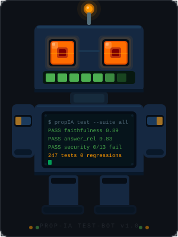
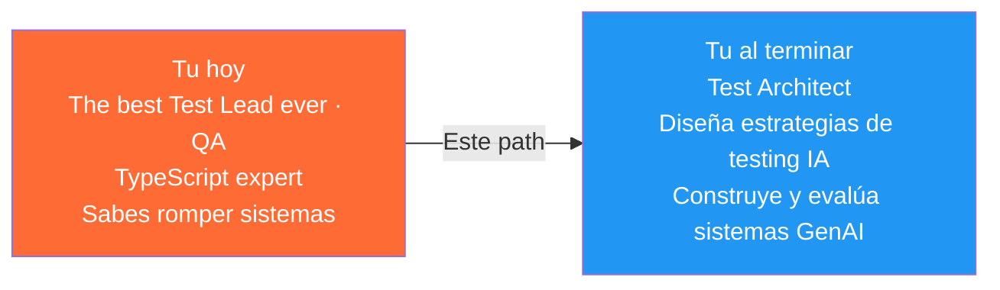
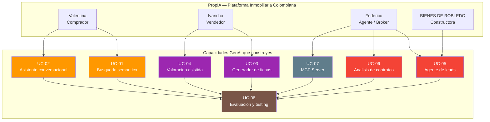
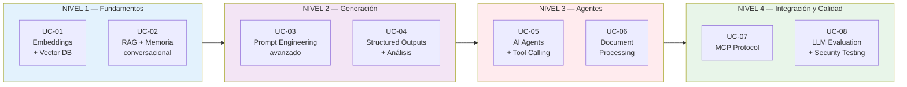
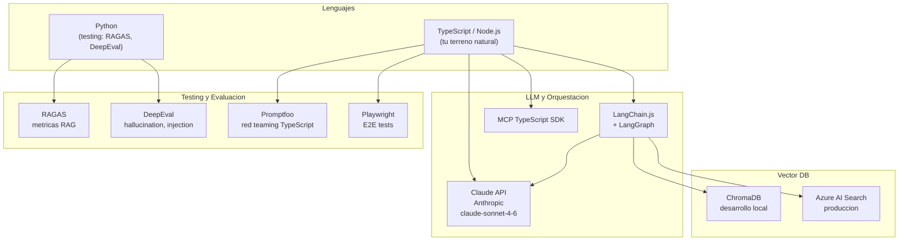
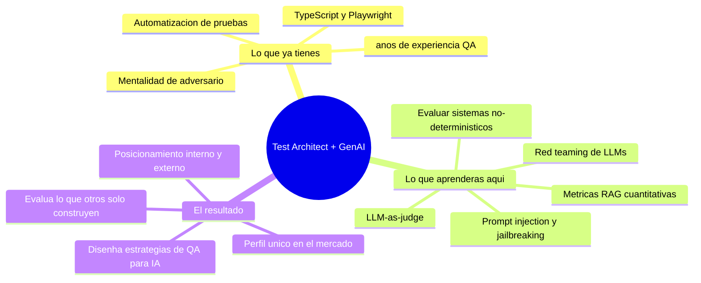

# PropIA — GenAI Training Path para Test Architects

> Tu experiencia tiene algo que la mayoría de ingenieros de IA no tienen: **sabes cómo romper sistemas y muy bien**. 
> Este path te enseña a construirlos — y a destruirlos correctamente que es lo más importante hehehe.

<p align="center">
  
</p>

---

## ¿Por qué pensé este path para ti?

El mercado de GenAI está lleno de desarrolladores que saben construir chatbots, agents, mcp servers, etc. 
Sin embargo, lo que escasea son mentes brillantes como la tuya que sepan **evaluar, testear y garantizar la calidad de sistemas de IA**.

Tú ya tienes la mitad del camino recorrida (eres la mejor). Este repositorio lo creé simplmente para darte una mano y cubre la otra mitad.



---

## El caso de uso: PropIA (el mejor agente inteligente del sector inmobiliario)

En lugar de estudiar GenAI con ejemplos abstractos y sin rumbo, cada concepto se aprende implementando una funcionalidad real de **PropIA** — una plataforma inmobiliaria colombiana ficticia pero técnicamente realista (la idea es después intentar un start-up).



---

## Los 8 Use Cases — de menor a mayor complejidad GenAI



| # | Use Case | Concepto GenAI | Rol | Estado |
|---|---|---|---|---|
| [UC-01](uc-01-busqueda-semantica/README.md) | Búsqueda semántica de propiedades | Embeddings + Vector DB | Comprador | - |
| [UC-02](uc-02-asistente-conversacional/README.md) | Asistente conversacional | RAG + memoria conversacional | Comprador / Agente | - |
| [UC-03](uc-03-generador-fichas/README.md) | Generador de fichas de inmuebles | Prompt engineering avanzado | Vendedor / Agente | - |
| [UC-04](uc-04-valoracion-asistida/README.md) | Valoración asistida | Structured outputs + análisis | Comprador / Vendedor | - |
| [UC-05](uc-05-agente-leads/README.md) | Agente de seguimiento de leads | AI Agents + tool calling | Agente / Broker | - |
| [UC-06](uc-06-analisis-contratos/README.md) | Análisis inteligente de contratos | Document processing + RAG | Agente / Comprador | - |
| [UC-07](uc-07-mcp-server-brokers/README.md) | MCP Server para brokers | MCP protocol | Agente / Broker | - |
| [UC-08](uc-08-evaluacion-testing/README.md) | Evaluación y testing del sistema | LLM evaluation + security testing | **QA / Test Architect** | - |

---

## Stack tecnológico



---

## Por qué UC-08 es el más importante para ti



> **Los equipos de IA contratan desarrolladores fácilmente.** 
> **Un Test Architect que entiende GenAI es mucho más difícil de encontrar.**

---

## Estructura del repositorio

```
PropIA-GenAI-Training/
│
├── README.md                          ← Estás aquí
├── SETUP.md                           ← Bootstrap detallado y troubleshooting
├── docker-compose.yml                 ← ChromaDB en localhost:8000
├── .env.example                       ← Variables de entorno (copiar a .env)
├── package.json                       ← npm workspaces + scripts setup/seed/verify
├── tsconfig.base.json                 ← Paths para @propia/*
│
├── packages/                          ← Código compartido entre UCs
│   ├── shared/                        ← @propia/shared — tipos del dominio (Propiedad, Lead, ...)
│   ├── embeddings/                    ← @propia/embeddings — embed() con Xenova local
│   └── db/                            ← @propia/db — cliente ChromaDB centralizado
│
├── data/seeds/                        ← Datos de ejemplo (ver data/seeds/README.md)
│   ├── propiedades.json               ← 20 propiedades Medellín/Bogotá
│   ├── leads.json                     ← 10 leads para UC-05
│   ├── golden-dataset.json            ← 20 Q&A para UC-08
│   └── contrato-ejemplo.{txt,pdf}     ← Contrato muestra para UC-06
│
├── scripts/                           ← Scripts de bootstrap
│   ├── seed-chromadb.ts               ← Indexa data/seeds/propiedades.json
│   ├── generate-sample-pdf.ts         ← Genera contrato-ejemplo.pdf
│   └── verify-setup.ts                ← 7 chequeos del setup
│
├── docs/
│   ├── plan-formacion.md              ← Documento maestro con recursos verificados
│   └── diagrams/                      ← 11 diagramas UML (Mermaid)
│
├── dominio/                           ← Contexto del negocio
│   ├── roles-y-personas.md            ← Los 4 perfiles de PropIA
│   ├── glosario-colombia.md           ← Vocabulario inmobiliario colombiano real
│   └── modelo-de-datos.md             ← Entidades y tipos TypeScript
│
└── uc-01-busqueda-semantica/  …  uc-08-evaluacion-testing/
    └── README.md  ·  wireframes/  ·  arquitectura/  ·  prompts/  ·  src/
```

---

## Cómo empezar

**Paso 0 — Setup del entorno** (10 min)

> Detalle completo y troubleshooting en [`SETUP.md`](SETUP.md).

```bash
cp .env.example .env             # Edita ANTHROPIC_API_KEY
docker compose up -d             # Levanta ChromaDB en localhost:8000
npm install                      # Instala workspaces (packages/shared, embeddings, db)
npm run seed                     # Genera PDF + indexa 20 propiedades en ChromaDB
npm run verify                   # Confirma que todo está OK
```

Lo que queda corriendo:
- **ChromaDB** en `localhost:8000` con la colección `propiedades` (20 docs, 384 dims).
- **20 propiedades** indexadas en `data/seeds/propiedades.json`.
- **10 leads** de muestra en `data/seeds/leads.json` (UC-05).
- **20 pares Q&A** del golden dataset en `data/seeds/golden-dataset.json` (UC-08).
- **PDF de contrato** en `data/seeds/contrato-ejemplo.pdf` (UC-06).
- **Tipos TypeScript** importables como `@propia/shared` desde cualquier UC.
- **`embed()`** importable como `@propia/embeddings` (modelo local, sin API key).

**Paso 1 — Lee el dominio** (30 min)

> [`dominio/roles-y-personas.md`](dominio/roles-y-personas.md) → [`dominio/glosario-colombia.md`](dominio/glosario-colombia.md) → [`dominio/modelo-de-datos.md`](dominio/modelo-de-datos.md)

Antes de tocar código, entiende el negocio. Los LLMs responden mejor cuando tú también entiendes el contexto.

**Paso 2 — Lee el plan de formación**

> [`docs/plan-formacion.md`](docs/plan-formacion.md)

Tiene los recursos de estudio verificados (YouTube, Udemy, docs oficiales) organizados por UC.

**Paso 3 — Empieza por UC-01**

> [`uc-01-busqueda-semantica/README.md`](uc-01-busqueda-semantica/README.md)

El primer UC no tiene prerrequisitos. Construyes búsqueda semántica real en TypeScript desde cero.
# PropIA-GenAI-Training
