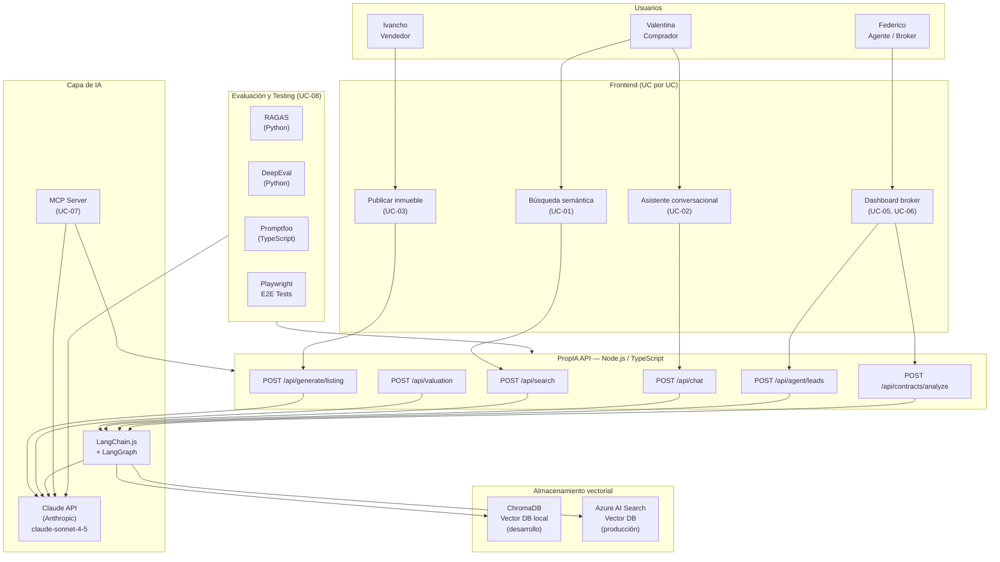
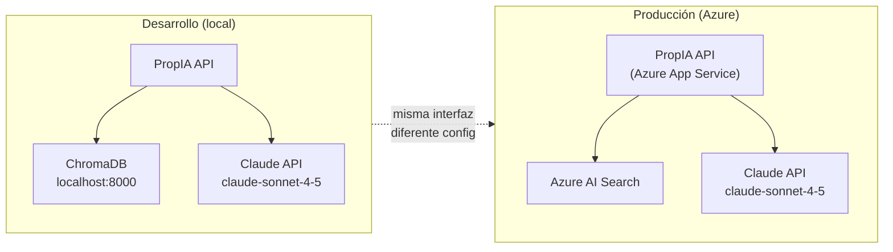
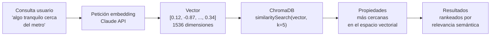

# Diagrama de Arquitectura — PropIA Platform

## Visión general del sistema

```mermaid
flowchart TB
    subgraph USUARIOS[" Usuarios"]
        VALENTINA[" Valentina<br/>Comprador"]
        Ivancho[" Ivancho<br/>Vendedor"]
        JUANFE[" Federico<br/>Agente / Broker"]
    end

    subgraph FRONTEND[" Frontend (UC por UC)"]
        SEARCH_UI[" Búsqueda semántica<br/>(UC-01)"]
        CHAT_UI[" Asistente conversacional<br/>(UC-02)"]
        FORM_UI[" Publicar inmueble<br/>(UC-03)"]
        BROKER_UI[" Dashboard broker<br/>(UC-05, UC-06)"]
    end

    subgraph API[" PropIA API — Node.js / TypeScript"]
        SEARCH_API["POST /api/search"]
        CHAT_API["POST /api/chat"]
        GEN_API["POST /api/generate/listing"]
        VAL_API["POST /api/valuation"]
        AGENT_API["POST /api/agent/leads"]
        CONTRACT_API["POST /api/contracts/analyze"]
    end

    subgraph AI_LAYER[" Capa de IA"]
        CLAUDE[" Claude API<br/>(Anthropic)<br/>claude-sonnet-4-5"]
        LANGCHAIN[" LangChain.js<br/>+ LangGraph"]
        MCP_SERVER[" MCP Server<br/>(UC-07)"]
    end

    subgraph STORAGE[" Almacenamiento vectorial"]
        CHROMADB[" ChromaDB<br/>Vector DB local<br/>(desarrollo)"]
        AZURE_SEARCH[" Azure AI Search<br/>Vector DB<br/>(producción)"]
    end

    subgraph EVALUATION[" Evaluación y Testing (UC-08)"]
        RAGAS[" RAGAS<br/>(Python)"]
        DEEPEVAL[" DeepEval<br/>(Python)"]
        PROMPTFOO[" Promptfoo<br/>(TypeScript)"]
        PLAYWRIGHT[" Playwright<br/>E2E Tests"]
    end

    VALENTINA --> SEARCH_UI
    VALENTINA --> CHAT_UI
    Ivancho --> FORM_UI
    JUANFE --> BROKER_UI

    SEARCH_UI --> SEARCH_API
    CHAT_UI --> CHAT_API
    FORM_UI --> GEN_API
    BROKER_UI --> AGENT_API
    BROKER_UI --> CONTRACT_API

    SEARCH_API --> LANGCHAIN
    CHAT_API --> LANGCHAIN
    GEN_API --> CLAUDE
    VAL_API --> CLAUDE
    AGENT_API --> LANGCHAIN
    CONTRACT_API --> LANGCHAIN

    LANGCHAIN --> CLAUDE
    LANGCHAIN --> CHROMADB
    LANGCHAIN --> AZURE_SEARCH

    MCP_SERVER --> CLAUDE
    MCP_SERVER --> API

    EVALUATION --> API
    EVALUATION --> CLAUDE
```

---

## Arquitectura por entorno

```mermaid
flowchart LR
    subgraph DEV[" Desarrollo (local)"]
        direction TB
        D_API["PropIA API"]
        D_CHROMA["ChromaDB<br/>localhost:8000"]
        D_CLAUDE["Claude API<br/>claude-sonnet-4-5"]
        D_API --> D_CHROMA
        D_API --> D_CLAUDE
    end

    subgraph PROD[" Producción (Azure)"]
        direction TB
        P_API["PropIA API<br/>(Azure App Service)"]
        P_AZURE["Azure AI Search"]
        P_CLAUDE["Claude API<br/>claude-sonnet-4-5"]
        P_API --> P_AZURE
        P_API --> P_CLAUDE
    end

    DEV -.->|"misma interfaz<br/>diferente config"| PROD
```

---

## Flujo de datos: de texto a embedding a resultado

```mermaid
flowchart LR
    QUERY[" Consulta usuario<br/>'algo tranquilo cerca<br/>del metro'"]
    EMBED_REQ[" Petición embedding<br/>Claude API"]
    VECTOR[" Vector<br/>[0.12, -0.87, ..., 0.34]<br/>1536 dimensiones"]
    CHROMA[" ChromaDB<br/>similaritySearch(vector, k=5)"]
    RESULTS[" Propiedades<br/>más cercanas<br/>en el espacio vectorial"]
    RANKED[" Resultados<br/>rankeados por<br/>relevancia semántica"]

    QUERY --> EMBED_REQ
    EMBED_REQ --> VECTOR
    VECTOR --> CHROMA
    CHROMA --> RESULTS
    RESULTS --> RANKED
```
