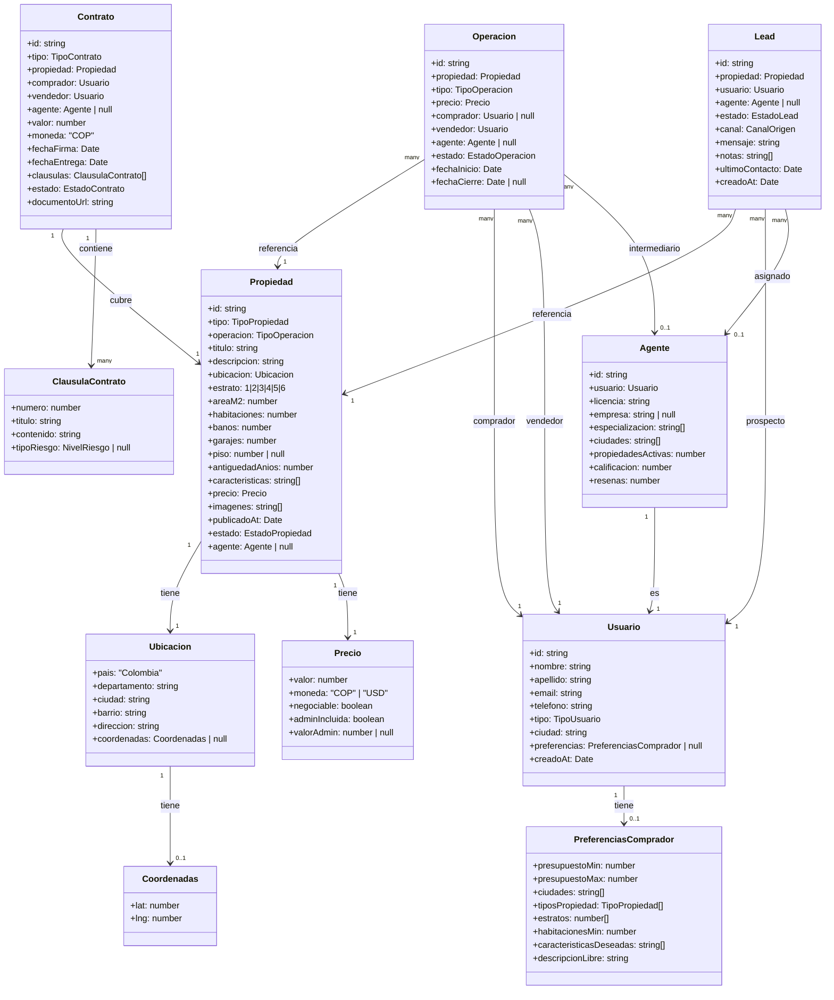
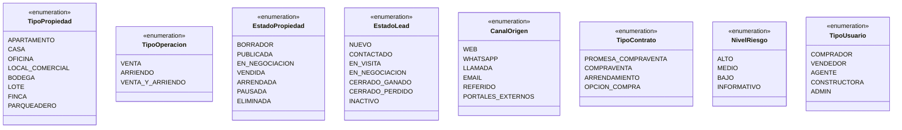

# Diagrama de Modelo de Datos — PropIA

Entidades del dominio inmobiliario colombiano con sus tipos TypeScript.

## Diagrama de clases

```mermaid
classDiagram
    class Propiedad {
        +id: string
        +tipo: TipoPropiedad
        +operacion: TipoOperacion
        +titulo: string
        +descripcion: string
        +ubicacion: Ubicacion
        +estrato: 1|2|3|4|5|6
        +areaM2: number
        +habitaciones: number
        +banos: number
        +garajes: number
        +piso: number | null
        +antiguedadAnios: number
        +caracteristicas: string[]
        +precio: Precio
        +imagenes: string[]
        +publicadoAt: Date
        +estado: EstadoPropiedad
        +agente: Agente | null
    }

    class Ubicacion {
        +pais: "Colombia"
        +departamento: string
        +ciudad: string
        +barrio: string
        +direccion: string
        +coordenadas: Coordenadas | null
    }

    class Coordenadas {
        +lat: number
        +lng: number
    }

    class Precio {
        +valor: number
        +moneda: "COP" | "USD"
        +negociable: boolean
        +adminIncluida: boolean
        +valorAdmin: number | null
    }

    class Operacion {
        +id: string
        +propiedad: Propiedad
        +tipo: TipoOperacion
        +precio: Precio
        +comprador: Usuario | null
        +vendedor: Usuario
        +agente: Agente | null
        +estado: EstadoOperacion
        +fechaInicio: Date
        +fechaCierre: Date | null
    }

    class Usuario {
        +id: string
        +nombre: string
        +apellido: string
        +email: string
        +telefono: string
        +tipo: TipoUsuario
        +ciudad: string
        +preferencias: PreferenciasComprador | null
        +creadoAt: Date
    }

    class PreferenciasComprador {
        +presupuestoMin: number
        +presupuestoMax: number
        +ciudades: string[]
        +tiposPropiedad: TipoPropiedad[]
        +estratos: number[]
        +habitacionesMin: number
        +caracteristicasDeseadas: string[]
        +descripcionLibre: string
    }

    class Agente {
        +id: string
        +usuario: Usuario
        +licencia: string
        +empresa: string | null
        +especializacion: string[]
        +ciudades: string[]
        +propiedadesActivas: number
        +calificacion: number
        +resenas: number
    }

    class Lead {
        +id: string
        +propiedad: Propiedad
        +usuario: Usuario
        +agente: Agente | null
        +estado: EstadoLead
        +canal: CanalOrigen
        +mensaje: string
        +notas: string[]
        +ultimoContacto: Date
        +creadoAt: Date
    }

    class Contrato {
        +id: string
        +tipo: TipoContrato
        +propiedad: Propiedad
        +comprador: Usuario
        +vendedor: Usuario
        +agente: Agente | null
        +valor: number
        +moneda: "COP"
        +fechaFirma: Date
        +fechaEntrega: Date
        +clausulas: ClausulaContrato[]
        +estado: EstadoContrato
        +documentoUrl: string
    }

    class ClausulaContrato {
        +numero: number
        +titulo: string
        +contenido: string
        +tipoRiesgo: NivelRiesgo | null
    }

    Propiedad "1" --> "1" Ubicacion : tiene
    Ubicacion "1" --> "0..1" Coordenadas : tiene
    Propiedad "1" --> "1" Precio : tiene
    Operacion "many" --> "1" Propiedad : referencia
    Operacion "many" --> "1" Usuario : comprador
    Operacion "many" --> "1" Usuario : vendedor
    Operacion "many" --> "0..1" Agente : intermediario
    Usuario "1" --> "0..1" PreferenciasComprador : tiene
    Agente "1" --> "1" Usuario : es
    Lead "many" --> "1" Propiedad : referencia
    Lead "many" --> "1" Usuario : prospecto
    Lead "many" --> "0..1" Agente : asignado
    Contrato "1" --> "1" Propiedad : cubre
    Contrato "1" --> "many" ClausulaContrato : contiene
```

---

## Enumeraciones

```mermaid
classDiagram
    class TipoPropiedad {
        <<enumeration>>
        APARTAMENTO
        CASA
        OFICINA
        LOCAL_COMERCIAL
        BODEGA
        LOTE
        FINCA
        PARQUEADERO
    }

    class TipoOperacion {
        <<enumeration>>
        VENTA
        ARRIENDO
        VENTA_Y_ARRIENDO
    }

    class EstadoPropiedad {
        <<enumeration>>
        BORRADOR
        PUBLICADA
        EN_NEGOCIACION
        VENDIDA
        ARRENDADA
        PAUSADA
        ELIMINADA
    }

    class EstadoLead {
        <<enumeration>>
        NUEVO
        CONTACTADO
        EN_VISITA
        EN_NEGOCIACION
        CERRADO_GANADO
        CERRADO_PERDIDO
        INACTIVO
    }

    class CanalOrigen {
        <<enumeration>>
        WEB
        WHATSAPP
        LLAMADA
        EMAIL
        REFERIDO
        PORTALES_EXTERNOS
    }

    class TipoContrato {
        <<enumeration>>
        PROMESA_COMPRAVENTA
        COMPRAVENTA
        ARRENDAMIENTO
        OPCION_COMPRA
    }

    class NivelRiesgo {
        <<enumeration>>
        ALTO
        MEDIO
        BAJO
        INFORMATIVO
    }

    class TipoUsuario {
        <<enumeration>>
        COMPRADOR
        VENDEDOR
        AGENTE
        CONSTRUCTORA
        ADMIN
    }
```
