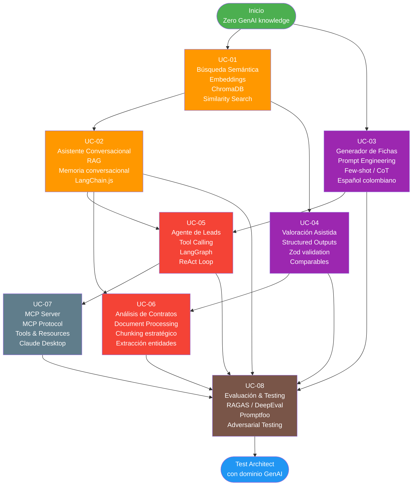

# Diagrama del Learning Path — Progresión de los 8 UCs

## Dependencias entre Use Cases

```mermaid
flowchart TD
    START([" Inicio\nZero GenAI knowledge"])

    UC01[" UC-01\nBúsqueda Semántica\n Embeddings\n ChromaDB\n Similarity Search"]

    UC02[" UC-02\nAsistente Conversacional\n RAG\n Memoria conversacional\n LangChain.js"]

    UC03[" UC-03\nGenerador de Fichas\n Prompt Engineering\n Few-shot / CoT\n Español colombiano"]

    UC04[" UC-04\nValoración Asistida\n Structured Outputs\n Zod validation\n Comparables"]

    UC05[" UC-05\nAgente de Leads\n Tool Calling\n LangGraph\n ReAct Loop"]

    UC06[" UC-06\nAnálisis de Contratos\n Document Processing\n Chunking estratégico\n Extracción entidades"]

    UC07[" UC-07\nMCP Server\n MCP Protocol\n Tools & Resources\n Claude Desktop"]

    UC08[" UC-08\nEvaluación & Testing\n RAGAS / DeepEval\n Promptfoo\n Adversarial Testing"]

    END([" Test Architect\ncon dominio GenAI"])

    START --> UC01
    START --> UC03

    UC01 --> UC02
    UC01 --> UC04

    UC02 --> UC05
    UC02 --> UC06
    UC03 --> UC05

    UC04 --> UC06
    UC05 --> UC07

    UC02 --> UC08
    UC03 --> UC08
    UC04 --> UC08
    UC05 --> UC08
    UC06 --> UC08
    UC07 --> UC08

    UC08 --> END

    style START fill:#4CAF50,color:#fff
    style END fill:#2196F3,color:#fff
    style UC01 fill:#FF9800,color:#fff
    style UC02 fill:#FF9800,color:#fff
    style UC03 fill:#9C27B0,color:#fff
    style UC04 fill:#9C27B0,color:#fff
    style UC05 fill:#F44336,color:#fff
    style UC06 fill:#F44336,color:#fff
    style UC07 fill:#607D8B,color:#fff
    style UC08 fill:#795548,color:#fff
```

---