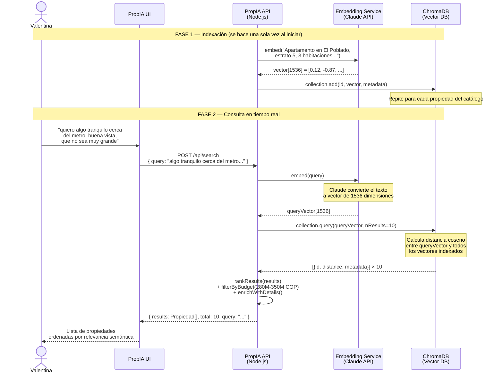
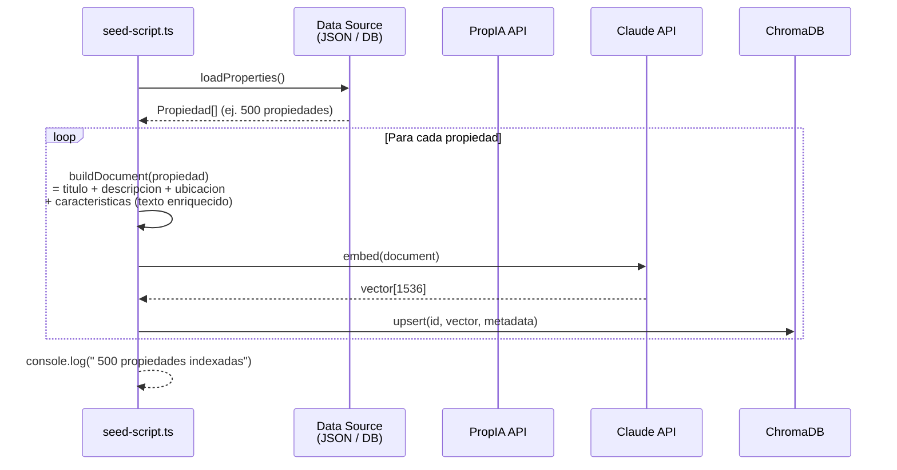
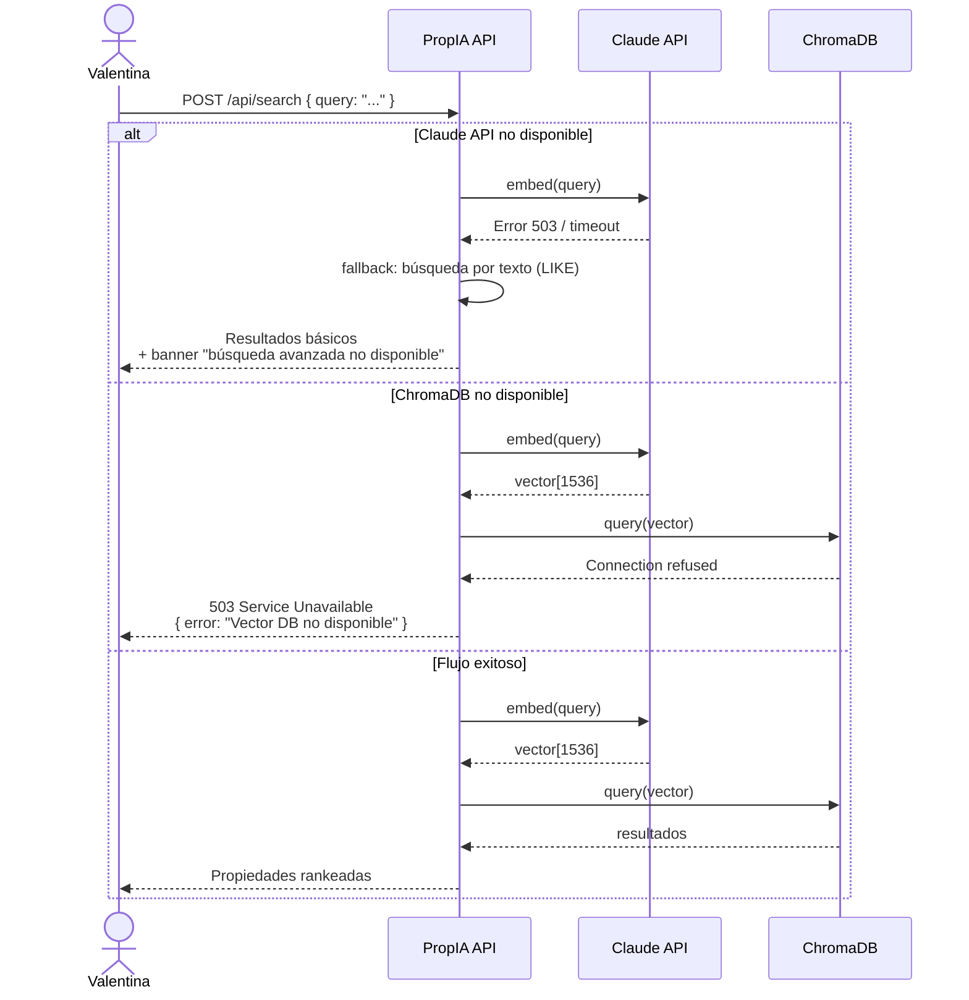

# UC-01 — Diagrama de Secuencia: Búsqueda Semántica

## Flujo completo: consulta en lenguaje natural → resultados rankeados

---

## Flujo de indexación batch (carga inicial del catálogo)

---

## Flujo de error y fallback

