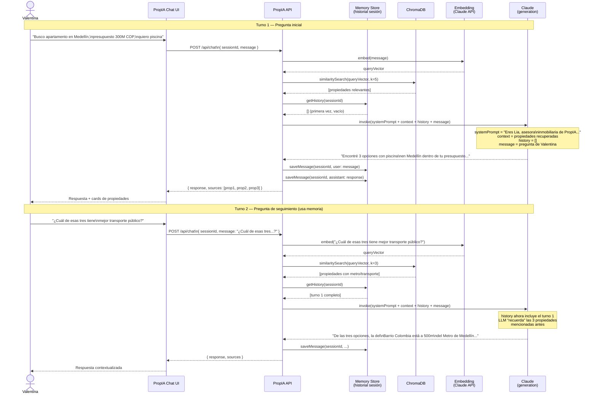
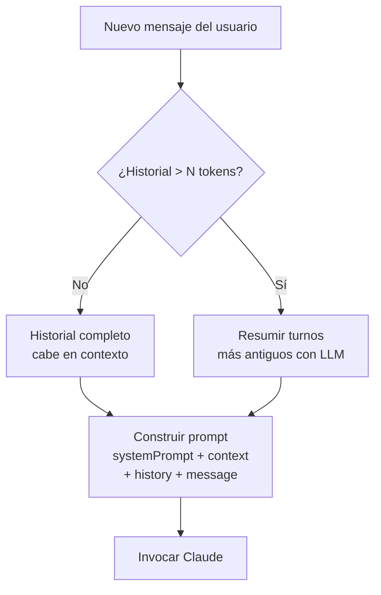
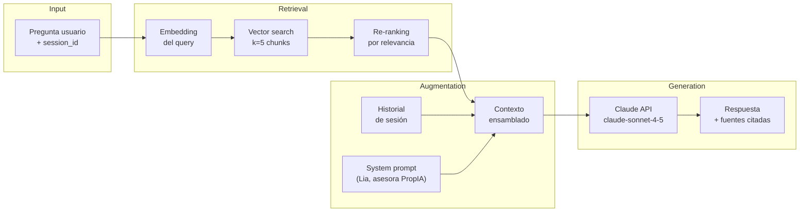

# UC-02 — Diagrama de Secuencia: Asistente Conversacional RAG

## Flujo completo: RAG con memoria de conversación

---

## Gestión del contexto: ventana y resumen

---

## Arquitectura de componentes RAG

