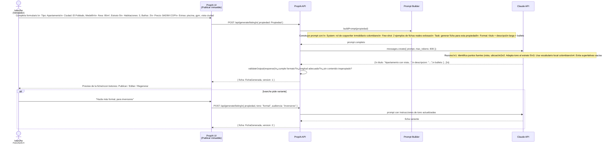

# UC-03 — Diagrama de Secuencia: Generador de Fichas

```mermaid
sequenceDiagram
    actor Ivancho as Ivancho<br/>(Vendedor)
    participant UI as PropIA UI<br/>(Publicar inmueble)
    participant API as PropIA API
    participant PROMPT as Prompt Builder
    participant CLAUDE as Claude API

    Ivancho->>UI: Completa formulario:\n- Tipo: Apartamento\n- Ciudad: El Poblado, Medellín\n- Área: 95m², Estrato 5\n- Habitaciones: 3, Baños: 2\n- Precio: $420M COP\n- Extras: piscina, gym, vista ciudad

    UI->>API: POST /api/generate/listing\n{ propiedad: Propiedad }

    API->>PROMPT: buildPrompt(propiedad)
    Note over PROMPT: Construye prompt con:\n- System: rol de copywriter inmobiliario colombiano\n- Few-shot: 2 ejemplos de fichas reales exitosas\n- Task: generar ficha para esta propiedad\n- Format: título + descripción larga + bullets
    PROMPT-->>API: prompt completo

    API->>CLAUDE: messages.create({ prompt, max_tokens: 800 })

    Note over CLAUDE: Razona:\n1. Identifica puntos fuertes (vista, ubicación)\n2. Adapta tono al estrato 5\n3. Usa vocabulario local colombiano\n4. Evita superlativas vacías

    CLAUDE-->>API: {\n  titulo: "Apartamento con vista...",\n  descripcion: "...",\n  bullets: [...]\n}

    API->>API: validateOutput(response)\n¿cumple formato?\n¿longitud adecuada?\n¿sin contenido inapropiado?

    API-->>UI: { ficha: FichaGenerada, version: 1 }
    UI-->>Ivancho: Preview de la ficha\ncon botones: Publicar /  Editar / Regenerar

    alt Ivancho pide variante
        Ivancho->>UI: "Hazla más formal, para inversores"
        UI->>API: POST /api/generate/listing\n{ propiedad, tono: "formal", audiencia: "inversores" }
        API->>CLAUDE: prompt con instrucciones de tono actualizadas
        CLAUDE-->>API: ficha variante
        API-->>UI: { ficha: FichaGenerada, version: 2 }
    end
```
