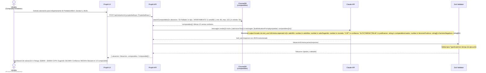

# UC-04 — Diagrama de Secuencia: Valoración Asistida

```mermaid
sequenceDiagram
    actor Usuario as  Usuario<br/>(Comprador/Vendedor)
    participant UI as  PropIA UI
    participant API as  PropIA API
    participant VDB as  ChromaDB<br/>(comparables)
    participant CLAUDE as  Claude API
    participant ZOD as  Zod Validator

    Usuario->>UI: Solicita valoración para:\nApartamento El Poblado\n95m², Estrato 5, 3h/2b
    UI->>API: POST /api/valuation\n{ propiedadInput: PropiedadInput }

    API->>VDB: searchComparables(\n  ubicacion: "El Poblado",\n  tipo: "APARTAMENTO",\n  areaM2: { min: 80, max: 110 },\n  estrato: 5\n)
    VDB-->>API: comparables[]: últimas 10 ventas similares

    API->>CLAUDE: messages.create({\n  tools: [valoracionTool],\n  messages: [buildValuationPrompt(propiedad, comparables)]\n})

    Note over CLAUDE: Structured output forzado vía tool_use:\nSchema esperado:\n{\n  valorMin: number,\n  valorMax: number,\n  valorSugerido: number,\n  moneda: "COP",\n  confianza: "ALTA"|"MEDIA"|"BAJA",\n  justificacion: string,\n  comparablesUsados: number,\n  factoresPositivos: string[],\n  factoresNegativos: string[]\n}

    CLAUDE-->>API: tool_use response con JSON estructurado

    API->>ZOD: ValuacionSchema.parse(response)
    Note over ZOD: Valida tipos TypeScript\nen tiempo de ejecución
    ZOD-->>API: Valuacion (tipada y validada)

    API-->>UI: { valuacion: Valuacion, comparables: Comparable[] }
    UI-->>Usuario: Dashboard de valoración:\n Rango: $380M – $440M COP\n Sugerido: $410M\n Confianza: MEDIA\n Basado en 10 comparables
```
