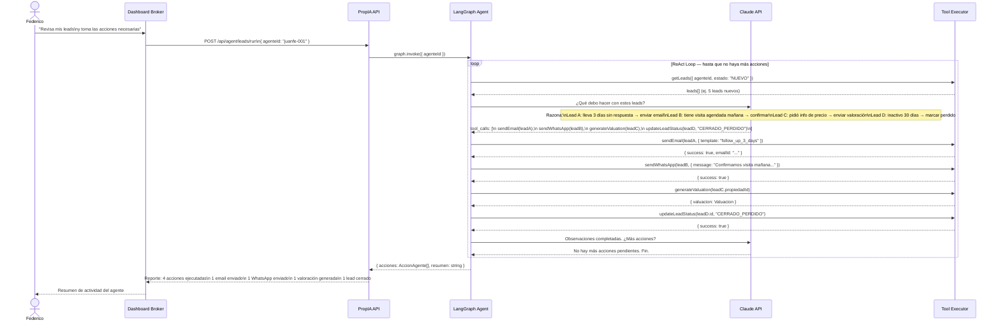
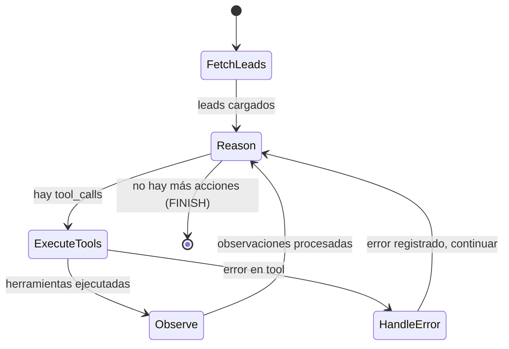

# UC-05 — Diagrama de Secuencia: Agente de Seguimiento de Leads

## Loop ReAct del agente

```mermaid
sequenceDiagram
    actor JuanFe as Federico
    participant UI as Dashboard Broker
    participant API as PropIA API
    participant AGENT as LangGraph Agent
    participant CLAUDE as Claude API
    participant TOOLS as Tool Executor

    JuanFe->>UI: "Revisa mis leads\ny toma las acciones necesarias"
    UI->>API: POST /api/agent/leads/run\n{ agenteId: "juanfe-001" }

    API->>AGENT: graph.invoke({ agenteId })

    loop ReAct Loop — hasta que no haya más acciones

        AGENT->>TOOLS: getLeads({ agenteId, estado: "NUEVO" })
        TOOLS-->>AGENT: leads[] (ej. 5 leads nuevos)

        AGENT->>CLAUDE: ¿Qué debo hacer con estos leads?
        Note over CLAUDE: Razona:\nLead A: lleva 3 días sin respuesta → enviar email\nLead B: tiene visita agendada mañana → confirmar\nLead C: pidió info de precio → enviar valoración\nLead D: inactivo 30 días → marcar perdido

        CLAUDE-->>AGENT: tool_calls: [\n  sendEmail(leadA),\n  sendWhatsApp(leadB),\n  generateValuation(leadC),\n  updateLeadStatus(leadD, "CERRADO_PERDIDO")\n]

        AGENT->>TOOLS: sendEmail(leadA, { template: "follow_up_3_days" })
        TOOLS-->>AGENT: { success: true, emailId: "..." }

        AGENT->>TOOLS: sendWhatsApp(leadB, { message: "Confirmamos visita mañana..." })
        TOOLS-->>AGENT: { success: true }

        AGENT->>TOOLS: generateValuation(leadC.propiedadId)
        TOOLS-->>AGENT: { valuacion: Valuacion }

        AGENT->>TOOLS: updateLeadStatus(leadD.id, "CERRADO_PERDIDO")
        TOOLS-->>AGENT: { success: true }

        AGENT->>CLAUDE: Observaciones completadas. ¿Más acciones?
        CLAUDE-->>AGENT: No hay más acciones pendientes. Fin.
    end

    AGENT-->>API: { acciones: AccionAgente[], resumen: string }
    API-->>UI: Reporte: 4 acciones ejecutadas\n 1 email enviado\n 1 WhatsApp enviado\n 1 valoración generada\n 1 lead cerrado
    UI-->>JuanFe: Resumen de actividad del agente
```

---

## Grafo de estados LangGraph

```mermaid
stateDiagram-v2
    [*] --> FetchLeads
    FetchLeads --> Reason : leads cargados
    Reason --> ExecuteTools : hay tool_calls
    Reason --> [*] : no hay más acciones (FINISH)
    ExecuteTools --> Observe : herramientas ejecutadas
    Observe --> Reason : observaciones procesadas
    ExecuteTools --> HandleError : error en tool
    HandleError --> Reason : error registrado, continuar
```
