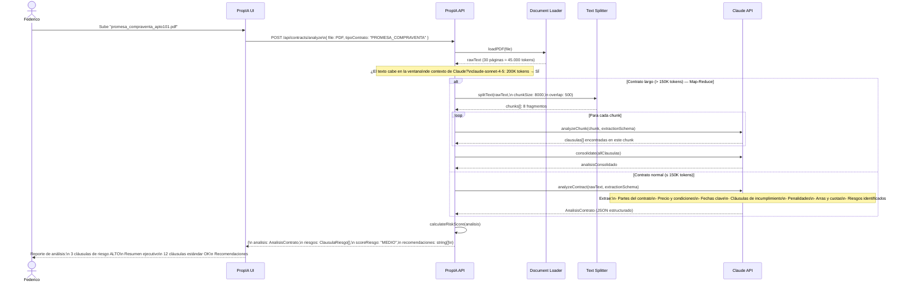

# UC-06 — Diagrama de Secuencia: Análisis Inteligente de Contratos

```mermaid
sequenceDiagram
    actor JuanFe as Federico
    participant UI as PropIA UI
    participant API as PropIA API
    participant LOADER as Document Loader
    participant CHUNKER as Text Splitter
    participant CLAUDE as Claude API

    JuanFe->>UI: Sube "promesa_compraventa_apto101.pdf"
    UI->>API: POST /api/contracts/analyze\n{ file: PDF, tipoContrato: "PROMESA_COMPRAVENTA" }

    API->>LOADER: loadPDF(file)
    LOADER-->>API: rawText (30 páginas ≈ 45.000 tokens)

    Note over API: ¿El texto cabe en la ventana\nde contexto de Claude?\nclaude-sonnet-4-5: 200K tokens → SÍ

    alt Contrato largo (> 150K tokens) — Map-Reduce
        API->>CHUNKER: splitText(rawText,\n  chunkSize: 8000,\n  overlap: 500)
        CHUNKER-->>API: chunks[]: 8 fragmentos

        loop Para cada chunk
            API->>CLAUDE: analyzeChunk(chunk, extractionSchema)
            CLAUDE-->>API: clausulas[] encontradas en este chunk
        end

        API->>CLAUDE: consolidate(allClausulas)
        CLAUDE-->>API: analisisConsolidado
    else Contrato normal (≤ 150K tokens)
        API->>CLAUDE: analyzeContract(rawText, extractionSchema)
        Note over CLAUDE: Extrae:\n- Partes del contrato\n- Precio y condiciones\n- Fechas clave\n- Cláusulas de incumplimiento\n- Penalidades\n- Arras y cuotas\n- Riesgos identificados
        CLAUDE-->>API: AnalisisContrato (JSON estructurado)
    end

    API->>API: calculateRiskScore(analisis)
    API-->>UI: {\n  analisis: AnalisisContrato,\n  riesgos: ClausulaRiesgo[],\n  scoreRiesgo: "MEDIO",\n  recomendaciones: string[]\n}

    UI-->>JuanFe: Reporte de análisis:\n 3 cláusulas de riesgo ALTO\n Resumen ejecutivo\n 12 cláusulas estándar OK\n Recomendaciones
```
