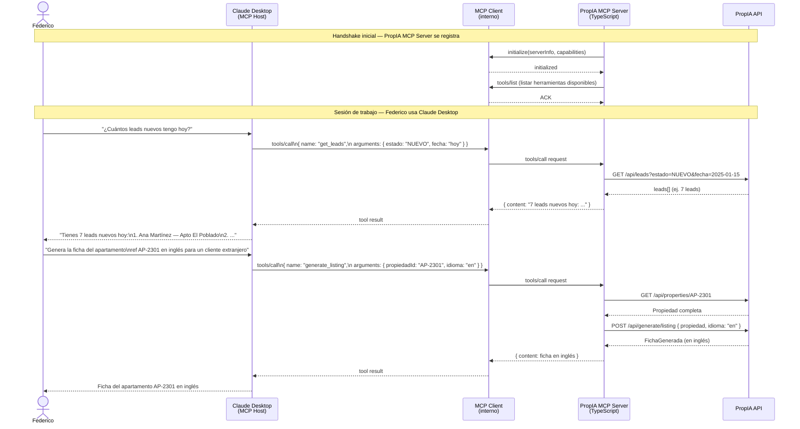
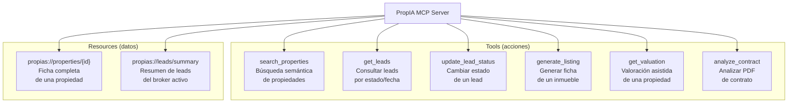

# UC-07 — Diagrama de Secuencia: MCP Server para Brokers

```mermaid
sequenceDiagram
    actor JuanFe as  Federico
    participant CLAUDE_D as  Claude Desktop<br/>(MCP Host)
    participant MCP_CLIENT as  MCP Client<br/>(interno)
    participant MCP_SERVER as  PropIA MCP Server<br/>(TypeScript)
    participant PROPIA_API as  PropIA API

    Note over JuanFe,PROPIA_API: Handshake inicial — PropIA MCP Server se registra

    MCP_SERVER->>MCP_CLIENT: initialize(serverInfo, capabilities)
    MCP_CLIENT-->>MCP_SERVER: initialized
    MCP_SERVER->>MCP_CLIENT: tools/list (listar herramientas disponibles)
    MCP_CLIENT-->>MCP_SERVER: ACK

    Note over JuanFe,PROPIA_API: Sesión de trabajo — Federico usa Claude Desktop

    JuanFe->>CLAUDE_D: "¿Cuántos leads nuevos tengo hoy?"
    CLAUDE_D->>MCP_CLIENT: tools/call\n{ name: "get_leads",\n  arguments: { estado: "NUEVO", fecha: "hoy" } }
    MCP_CLIENT->>MCP_SERVER: tools/call request
    MCP_SERVER->>PROPIA_API: GET /api/leads?estado=NUEVO&fecha=2025-01-15
    PROPIA_API-->>MCP_SERVER: leads[] (ej. 7 leads)
    MCP_SERVER-->>MCP_CLIENT: { content: "7 leads nuevos hoy: ..." }
    MCP_CLIENT-->>CLAUDE_D: tool result
    CLAUDE_D-->>JuanFe: "Tienes 7 leads nuevos hoy:\n1. Ana Martínez — Apto El Poblado\n2. ..."

    JuanFe->>CLAUDE_D: "Genera la ficha del apartamento\nref AP-2301 en inglés para un cliente extranjero"
    CLAUDE_D->>MCP_CLIENT: tools/call\n{ name: "generate_listing",\n  arguments: { propiedadId: "AP-2301", idioma: "en" } }
    MCP_CLIENT->>MCP_SERVER: tools/call request
    MCP_SERVER->>PROPIA_API: GET /api/properties/AP-2301
    PROPIA_API-->>MCP_SERVER: Propiedad completa
    MCP_SERVER->>PROPIA_API: POST /api/generate/listing { propiedad, idioma: "en" }
    PROPIA_API-->>MCP_SERVER: FichaGenerada (en inglés)
    MCP_SERVER-->>MCP_CLIENT: { content: ficha en inglés }
    MCP_CLIENT-->>CLAUDE_D: tool result
    CLAUDE_D-->>JuanFe: Ficha del apartamento AP-2301 en inglés
```

---

## Herramientas expuestas por el MCP Server

```mermaid
flowchart TD
    SERVER[" PropIA MCP Server"]

    subgraph TOOLS[" Tools (acciones)"]
        T1["search_properties\nBúsqueda semántica\nde propiedades"]
        T2["get_leads\nConsultar leads\npor estado/fecha"]
        T3["update_lead_status\nCambiar estado\nde un lead"]
        T4["generate_listing\nGenerar ficha\nde un inmueble"]
        T5["get_valuation\nValoración asistida\nde una propiedad"]
        T6["analyze_contract\nAnalizar PDF\nde contrato"]
    end

    subgraph RESOURCES[" Resources (datos)"]
        R1["propias://properties/{id}\nFicha completa\nde una propiedad"]
        R2["propias://leads/summary\nResumen de leads\ndel broker activo"]
    end

    SERVER --> T1
    SERVER --> T2
    SERVER --> T3
    SERVER --> T4
    SERVER --> T5
    SERVER --> T6
    SERVER --> R1
    SERVER --> R2
```
