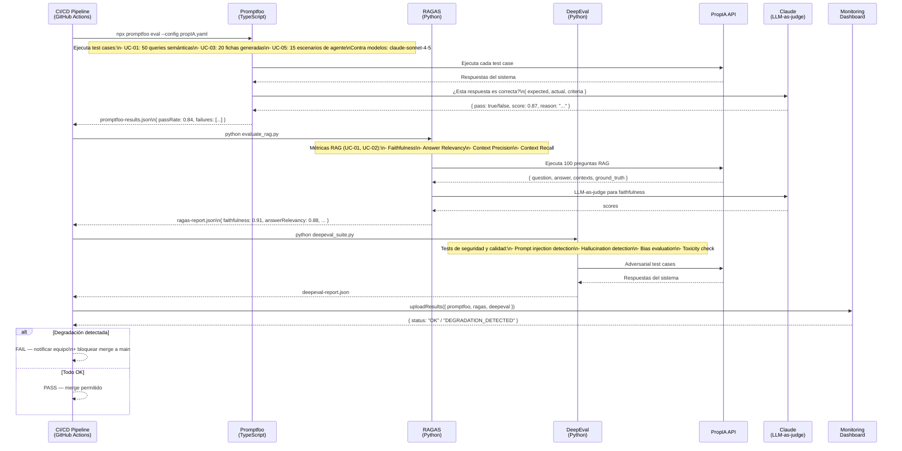
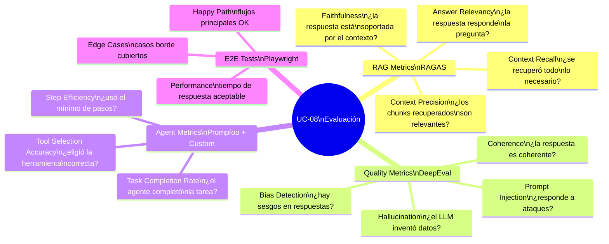

# UC-08 — Diagrama de Secuencia: Evaluación y Testing del Sistema

## Pipeline de evaluación CI/CD

```mermaid
sequenceDiagram
    participant CI as CI/CD Pipeline<br/>(GitHub Actions)
    participant PROMPTFOO as  Promptfoo<br/>(TypeScript)
    participant RAGAS as RAGAS<br/>(Python)
    participant DEEPEVAL as DeepEval<br/>(Python)
    participant PROPIAAPI as PropIA API
    participant CLAUDE_JUDGE as Claude<br/>(LLM-as-judge)
    participant DASHBOARD as Monitoring<br/>Dashboard

    CI->>PROMPTFOO: npx promptfoo eval --config propIA.yaml
    Note over PROMPTFOO: Ejecuta test cases:\n- UC-01: 50 queries semánticas\n- UC-03: 20 fichas generadas\n- UC-05: 15 escenarios de agente\nContra modelos: claude-sonnet-4-5

    PROMPTFOO->>PROPIAAPI: Ejecuta cada test case
    PROPIAAPI-->>PROMPTFOO: Respuestas del sistema

    PROMPTFOO->>CLAUDE_JUDGE: ¿Esta respuesta es correcta?\n{ expected, actual, criteria }
    CLAUDE_JUDGE-->>PROMPTFOO: { pass: true/false, score: 0.87, reason: "..." }

    PROMPTFOO-->>CI: promptfoo-results.json\n{ passRate: 0.84, failures: [...] }

    CI->>RAGAS: python evaluate_rag.py
    Note over RAGAS: Métricas RAG (UC-01, UC-02):\n- Faithfulness\n- Answer Relevancy\n- Context Precision\n- Context Recall

    RAGAS->>PROPIAAPI: Ejecuta 100 preguntas RAG
    PROPIAAPI-->>RAGAS: { question, answer, contexts, ground_truth }
    RAGAS->>CLAUDE_JUDGE: LLM-as-judge para faithfulness
    CLAUDE_JUDGE-->>RAGAS: scores

    RAGAS-->>CI: ragas-report.json\n{ faithfulness: 0.91, answerRelevancy: 0.88, ... }

    CI->>DEEPEVAL: python deepeval_suite.py
    Note over DEEPEVAL: Tests de seguridad y calidad:\n- Prompt injection detection\n- Hallucination detection\n- Bias evaluation\n- Toxicity check

    DEEPEVAL->>PROPIAAPI: Adversarial test cases
    PROPIAAPI-->>DEEPEVAL: Respuestas del sistema
    DEEPEVAL-->>CI: deepeval-report.json

    CI->>DASHBOARD: uploadResults({ promptfoo, ragas, deepeval })
    DASHBOARD-->>CI: { status: "OK" / "DEGRADATION_DETECTED" }

    alt Degradación detectada
        CI-->>CI: FAIL — notificar equipo\n+ bloquear merge a main
    else Todo OK
        CI-->>CI: PASS — merge permitido
    end
```

---

## Mapa de métricas de evaluación

```mermaid
mindmap
  root((UC-08\nEvaluación))
    RAG Metrics\nRAGAS
      Faithfulness\n¿la respuesta está\nsoportada por el contexto?
      Answer Relevancy\n¿la respuesta responde\nla pregunta?
      Context Precision\n¿los chunks recuperados\nson relevantes?
      Context Recall\n¿se recuperó todo\nlo necesario?
    Quality Metrics\nDeepEval
      Hallucination\n¿el LLM inventó datos?
      Prompt Injection\n¿responde a ataques?
      Bias Detection\n¿hay sesgos en respuestas?
      Coherence\n¿la respuesta es coherente?
    Agent Metrics\nPrompfoo + Custom
      Task Completion Rate\n¿el agente completó\nla tarea?
      Tool Selection Accuracy\n¿eligió la herramienta\ncorrecta?
      Step Efficiency\n¿usó el mínimo de pasos?
    E2E Tests\nPlaywright
      Happy Path\nflujos principales OK
      Edge Cases\ncasos borde cubiertos
      Performance\ntiempo de respuesta aceptable
```
