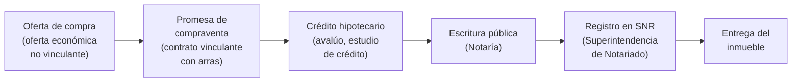

# Glosario Inmobiliario Colombiano — PropIA

Vocabulario del mercado inmobiliario colombiano que los LLMs deben conocer para generar texto correcto, responder preguntas con propiedad y no confundir términos locales con sus equivalentes de otros países hispanohablantes.

> **Para el entrenamiento de prompts:** estos términos son el vocabulario de referencia. Si un modelo genera "departamento" en lugar de "apartamento", o "precio de lista" en lugar de "precio de venta", la ficha suena extranjera y pierde credibilidad.

---

## Tipos de inmueble

| Término Colombia | Equivalente otros países | Definición |
|---|---|---|
| **Apartamento** | Departamento (Mx, AR), Piso (ES) | Unidad en edificio de propiedad horizontal |
| **Apartaestudio** | Monoambiente, estudio | Apartamento de un solo ambiente: sala-comedor-cocina-alcoba integrados |
| **Casa** | Casa, chalet | Inmueble independiente con entrada directa desde la calle |
| **Casa lote** | — | Casa antigua en lote grande, apta para demoler y construir |
| **Finca / Finca de recreo** | Quinta, chacra (AR) | Propiedad rural o suburbana de uso recreativo |
| **Local comercial** | Local | Inmueble comercial en primer piso o centro comercial |
| **Bodega** | Nave industrial, galpón | Inmueble industrial para almacenamiento o producción |
| **Oficina** | Oficina | Unidad en edificio empresarial |
| **Penthouse / PH** | Ático | Apartamento en último piso con terraza privada |
| **Parqueadero / Garaje** | Cochera, plaza de garaje | Espacio para vehículo. En Colombia: parqueadero cubierto = garaje |

---

## Estratificación socioeconómica

Sistema único de Colombia para clasificar inmuebles según las condiciones del sector. Determina las tarifas de servicios públicos (agua, luz, gas) y en parte el valor del inmueble.

```
Estrato 1 — Bajo-bajo     → Subsidio máximo en servicios
Estrato 2 — Bajo          → Subsidio en servicios
Estrato 3 — Medio-bajo    → Sin subsidio ni sobrecargo
Estrato 4 — Medio         → Tarifa base sin subsidio
Estrato 5 — Medio-alto    → Sobrecargo del 20% en servicios
Estrato 6 — Alto          → Sobrecargo máximo en servicios
```

**Importancia para PropIA:** el estrato es un filtro de búsqueda clave y un indicador de precio. Un apartamento Estrato 6 en El Poblado tiene expectativas de precio muy distintas a uno Estrato 3 en Itagüí.

**Para los LLMs:** nunca inferir el estrato solo por el barrio — dos cuadras de diferencia pueden ser estratos distintos. Usar siempre el dato del inmueble, no el del sector general.

---

## Vivienda de Interés Social (VIS/VIP)

| Tipo | Precio máximo (2025) | Requisito |
|---|---|---|
| **VIS** — Vivienda de Interés Social | Hasta 150 SMMLV (~$162M COP) | Para hogares con ingresos hasta 8 SMMLV |
| **VIP** — Vivienda de Interés Prioritario | Hasta 70 SMMLV (~$75M COP) | Para hogares con ingresos hasta 4 SMMLV |

> SMMLV = Salario Mínimo Mensual Legal Vigente. En 2025: ~$1.300.000 COP.

**Subsidios aplicables (Programas nacionales):**
- **Mi Casa Ya** — subsidio directo a la cuota inicial y a la tasa de crédito
- **Semillero de Propietarios** — subsidio para arrendamiento con opción de compra
- **Caja de compensación familiar** — subsidio complementario según afiliación

**Para los LLMs:** al hablar de proyectos VIS, siempre mencionar si aplican estos programas y cuáles son los requisitos básicos. Es información que los compradores VIS buscan activamente.

---

## Proceso de compraventa en Colombia



| Término | Definición |
|---|---|
| **Oferta de compra** | Documento informal que expresa intención de compra. No es vinculante en la mayoría de casos |
| **Promesa de compraventa** | Contrato privado que obliga a ambas partes. Incluye precio, fechas y condiciones. Se firma antes de la escritura |
| **Arras** | Suma de dinero entregada al firmar la promesa como garantía. Suele ser el 10–20% del precio. Si el comprador desiste, pierde las arras. Si el vendedor desiste, devuelve el doble |
| **Escritura pública** | Documento notarial que formaliza la compraventa. Se firma en Notaría |
| **SNR** | Superintendencia de Notariado y Registro. Entidad que registra los cambios de propietario |
| **Tradición** | Historial de propietarios del inmueble. Un inmueble con "tradición limpia" no tiene hipotecas, litigios ni embargos |
| **Certificado de tradición y libertad** | Documento del SNR que muestra el historial completo del inmueble. Esencial antes de comprar |
| **Avalúo** | Valoración técnica del inmueble realizada por un perito. El banco lo exige para otorgar crédito hipotecario |
| **Cuota inicial** | Pago inicial del comprador. Generalmente 20–30% del precio total |

---

## Crédito hipotecario

| Término | Definición |
|---|---|
| **UVR** | Unidad de Valor Real. Unidad de cuenta ajustada por inflación. Los créditos en UVR pueden tener cuotas que suben con el IPC |
| **Tasa fija / Variable** | Tasa fija: cuota constante. Variable: ajustada al DTF o IBR |
| **DTF / IBR** | Tasas de referencia del mercado colombiano (equivalentes a la Euribor o LIBOR) |
| **Leasing habitacional** | Modalidad en que el banco compra el inmueble y el comprador paga como arrendatario con opción de compra al final |
| **Crédito hipotecario** | Préstamo con garantía del inmueble. Plazo típico: 10–30 años |
| **Subsidio de tasa** | Reducción de la tasa de interés del crédito, otorgada por el Gobierno (ej. Mi Casa Ya) |

---

## Terminología de inmuebles (características)

| Término | Definición |
|---|---|
| **Alcoba / Habitación** | Cuarto o dormitorio. En Colombia: "habitación" o "alcoba", raro usar "cuarto" en fichas formales |
| **Sala-comedor** | Espacio integrado sala + comedor — muy común en apartamentos colombianos |
| **Cocina integral** | Cocina con muebles empotrados de madera o melamina, incluye mesón y gabinetes |
| **Zona de ropas** | Área para lavadora y secadora. En Colombia esta zona es separada y valorada |
| **Cuarto de servicio** | Habitación adicional para empleada del hogar, con baño propio. Frecuente en estratos 4–6 |
| **Depósito** | Cuarto de almacenamiento adicional, generalmente en el parqueadero o sótano |
| **Áreas comunes** | Zonas compartidas: lobby, piscina, gimnasio, salón comunal, etc. |
| **Salón comunal** | Espacio de eventos compartido del conjunto o edificio. Se arrienda para reuniones |
| **Pensilvania** | Término informal para el cuarto de ropas en algunas ciudades |
| **Bienes privados** | La unidad privada del propietario (el apartamento en sí) |
| **Bienes comunes** | Las zonas compartidas del edificio o conjunto |
| **Cuota de administración** | Pago mensual obligatorio para el mantenimiento de áreas comunes. En fichas siempre especificar si está incluida en el precio de arriendo |

---

## Zonas y sectores clave (ciudades principales)

### Medellín
| Zona | Características | Estrato típico |
|---|---|---|
| El Poblado | Zona premium, restaurantes, vida nocturna, expats | 5–6 |
| Laureles | Residencial, familiar, buena ubicación | 4–5 |
| Envigado | Municipio aledaño, tranquilo, asequible vs El Poblado | 3–5 |
| Sabaneta | Sur del valle, moderno, buena infraestructura | 3–5 |
| Bello | Norte del AM, popular, VIS | 1–3 |
| Itagüí | Sur industrial, mix residencial | 2–4 |
| Robledo | Occidente, tradicional, mix | 3–4 |

### Bogotá
| Zona | Características | Estrato típico |
|---|---|---|
| Chapinero / Zona Rosa | Comercial y residencial premium | 5–6 |
| Usaquén | Norte, casas y aptos premium | 5–6 |
| Chía / Cajicá | Sabana norte, casas con lote, suburbano | 4–6 |
| Suba | Norte, mix, mucho VIS | 2–4 |
| Kennedy / Bosa | Sur-occidente, popular, VIS | 1–3 |
| Modelia / Fontibon | Occidente, mix, cerca al aeropuerto | 3–4 |

### Otras ciudades
| Ciudad | Referencia clave |
|---|---|
| Cali | El norte (Chipichape, Ciudad Jardín) = premium. El sur y oriente = popular |
| Bucaramanga | Cabecera = premium. Lagos = mix. Área metropolitana = expansión VIS |
| Barranquilla | El Golf, Alto Prado = premium. Suroccidente = popular |
| Cartagena | Bocagrande, Castillogrande = turístico-premium. Manga, Pie de la Popa = residencial |

---

## Entidades y organismos regulatorios

| Entidad | Rol |
|---|---|
| **SNR** — Superintendencia de Notariado y Registro | Registro de propiedades, tradición y libertad |
| **Lonja de Propiedad Raíz** | Agremiación de profesionales inmobiliarios por ciudad (Lonja de Bogotá, Lonja de Medellín, etc.) |
| **Finca Raíz** | También el portal inmobiliario más importante de Colombia (fincaiz.com) — diferente a "finca raíz" el sector |
| **Metrocuadrado** | Segundo portal inmobiliario más importante |
| **CAMACOL** | Cámara Colombiana de la Construcción. Gremio de constructoras |
| **Ministerio de Vivienda** | Ente rector de política de vivienda, VIS, y programas como Mi Casa Ya |
| **Notaría** | Entidad que formaliza las escrituras. En Colombia hay notarías privadas con función pública |

---

## Términos de arriendo

| Término | Definición |
|---|---|
| **Canon de arrendamiento** | La cuota mensual del arriendo. Equivale a "renta" en otros países |
| **Depósito / Seguro de arrendamiento** | Garantía que pide el arrendador. Puede ser depósito en efectivo (hasta 2 meses de canon) o un codeudor |
| **Codeudor** | Persona que garantiza el pago del arriendo con sus bienes. Requisito habitual en Colombia |
| **Póliza de arrendamiento** | Seguro que reemplaza al codeudor. Lo expide una aseguradora. Paga entre 50–80% de un canon mensual |
| **Arrendador** | El dueño que arrienda |
| **Arrendatario** | El inquilino |
| **Fiducia** | Instrumento legal para manejo de recursos en proyectos sobre planos (el comprador consigna en una fiduciaria, no directo al constructor) |
