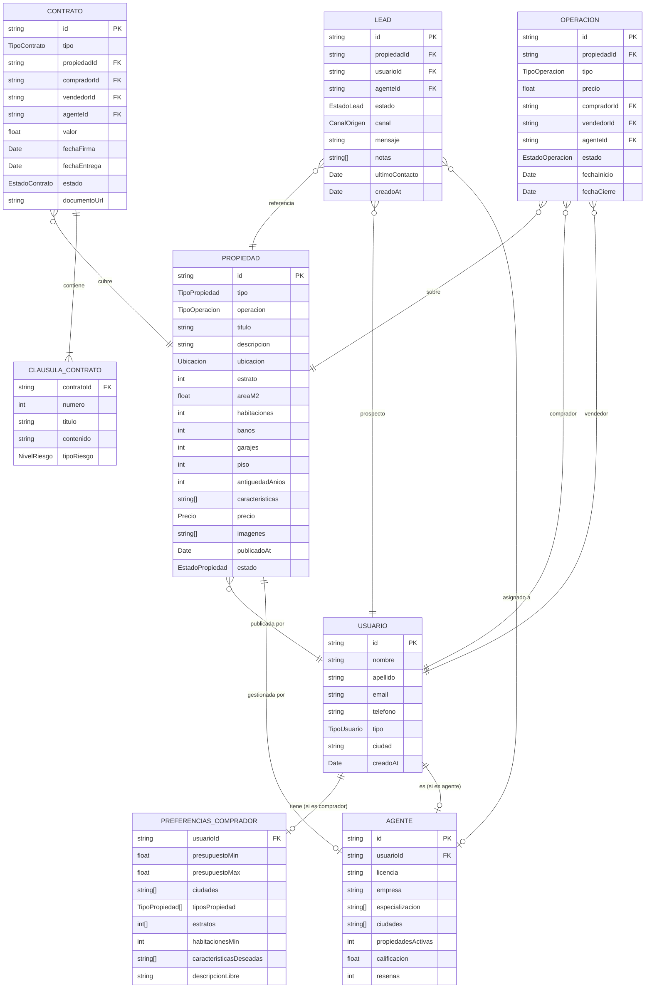
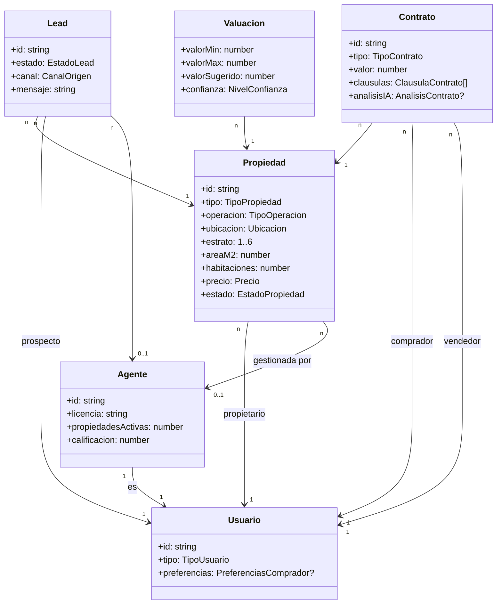

# Modelo de Datos — PropIA

Entidades del dominio inmobiliario colombiano con sus tipos TypeScript. Este modelo es la base de todos los Use Cases — el código siempre trabaja con estas interfaces.

---

## Diagrama de entidades y relaciones



---

## Tipos TypeScript completos

### Enumeraciones

```typescript
export type TipoPropiedad =
  | 'APARTAMENTO'
  | 'APARTAESTUDIO'
  | 'CASA'
  | 'CASA_LOTE'
  | 'OFICINA'
  | 'LOCAL_COMERCIAL'
  | 'BODEGA'
  | 'LOTE'
  | 'FINCA'
  | 'PARQUEADERO';

export type TipoOperacion =
  | 'VENTA'
  | 'ARRIENDO'
  | 'VENTA_Y_ARRIENDO';

export type EstadoPropiedad =
  | 'BORRADOR'
  | 'PUBLICADA'
  | 'EN_NEGOCIACION'
  | 'VENDIDA'
  | 'ARRENDADA'
  | 'PAUSADA'
  | 'ELIMINADA';

export type TipoUsuario =
  | 'COMPRADOR'
  | 'VENDEDOR'
  | 'AGENTE'
  | 'CONSTRUCTORA'
  | 'ADMIN';

export type EstadoLead =
  | 'NUEVO'
  | 'CONTACTADO'
  | 'EN_VISITA'
  | 'EN_NEGOCIACION'
  | 'CERRADO_GANADO'
  | 'CERRADO_PERDIDO'
  | 'INACTIVO';

export type CanalOrigen =
  | 'WEB'
  | 'WHATSAPP'
  | 'LLAMADA'
  | 'EMAIL'
  | 'REFERIDO'
  | 'PORTALES_EXTERNOS';

export type TipoContrato =
  | 'PROMESA_COMPRAVENTA'
  | 'COMPRAVENTA'
  | 'ARRENDAMIENTO'
  | 'OPCION_COMPRA';

export type EstadoContrato =
  | 'BORRADOR'
  | 'EN_FIRMA'
  | 'FIRMADO'
  | 'EN_REGISTRO'
  | 'REGISTRADO'
  | 'CANCELADO';

export type EstadoOperacion =
  | 'ACTIVA'
  | 'EN_NEGOCIACION'
  | 'CERRADA'
  | 'CANCELADA';

export type NivelRiesgo =
  | 'ALTO'
  | 'MEDIO'
  | 'BAJO'
  | 'INFORMATIVO';
```

### Tipos auxiliares

```typescript
export interface Coordenadas {
  lat: number;
  lng: number;
}

export interface Ubicacion {
  pais: 'Colombia';
  departamento: string;          // Ej: 'Antioquia', 'Cundinamarca'
  ciudad: string;                // Ej: 'Medellín', 'Bogotá'
  barrio: string;                // Ej: 'El Poblado', 'Laureles'
  direccion: string;             // Ej: 'Cra. 43A #18-47'
  coordenadas?: Coordenadas;
}

export interface Precio {
  valor: number;                 // En COP. Ej: 285000000 = $285M COP
  moneda: 'COP' | 'USD';
  negociable: boolean;
  adminIncluida: boolean;        // ¿El canon de administración está incluido?
  valorAdmin?: number;           // Valor mensual de administración en COP
}
```

### Entidad central: Propiedad

```typescript
export interface Propiedad {
  id: string;
  tipo: TipoPropiedad;
  operacion: TipoOperacion;

  // Texto
  titulo: string;
  descripcion: string;

  // Ubicación
  ubicacion: Ubicacion;
  estrato: 1 | 2 | 3 | 4 | 5 | 6;

  // Características físicas
  areaM2: number;
  areaConstruidaM2?: number;     // Para casas: área construida vs área del lote
  habitaciones: number;
  banos: number;
  garajes: number;
  piso?: number;                 // null para casas
  pisosTotalesEdificio?: number;
  antiguedadAnios: number;

  // Características adicionales
  caracteristicas: string[];     // Ej: ['piscina', 'gimnasio', 'pet-friendly', 'zona de ropas']
  amoblado?: boolean;            // Aplica para arriendos

  // Precio
  precio: Precio;

  // Media
  imagenes: string[];            // URLs de imágenes

  // Metadatos
  publicadoAt: Date;
  actualizadoAt: Date;
  estado: EstadoPropiedad;

  // Relaciones
  propietarioId: string;
  agenteId?: string;

  // Para VIS/VIP
  esVIS?: boolean;
  esVIP?: boolean;
  subsidiosAplicables?: string[]; // Ej: ['Mi Casa Ya', 'Caja Compensación']
}
```

### Usuario

```typescript
export interface PreferenciasComprador {
  presupuestoMin: number;        // COP
  presupuestoMax: number;        // COP
  ciudades: string[];
  barrios?: string[];
  tiposPropiedad: TipoPropiedad[];
  estratos: number[];            // [4, 5] = solo estrato 4 y 5
  habitacionesMin: number;
  areaMinM2?: number;
  caracteristicasDeseadas: string[];
  descripcionLibre?: string;     // "quiero algo tranquilo cerca del metro..."
}

export interface Usuario {
  id: string;
  nombre: string;
  apellido: string;
  email: string;
  telefono: string;
  tipo: TipoUsuario;
  ciudad: string;
  preferencias?: PreferenciasComprador;   // Solo para compradores
  creadoAt: Date;
  activo: boolean;
}
```

### Agente

```typescript
export interface Agente {
  id: string;
  usuario: Usuario;
  licencia: string;              // Número de licencia Lonja o Finca Raíz
  empresa?: string;              // null si es independiente
  especializacion: string[];     // Ej: ['VIS', 'apartamentos', 'El Poblado']
  ciudades: string[];            // Ciudades donde opera
  propiedadesActivas: number;
  calificacion: number;          // 1.0 – 5.0
  resenas: number;
}
```

### Lead

```typescript
export interface Lead {
  id: string;
  propiedad: Propiedad;
  usuario: Usuario;
  agente?: Agente;
  estado: EstadoLead;
  canal: CanalOrigen;
  mensaje: string;               // Mensaje inicial del prospecto
  notas: string[];               // Notas de seguimiento del agente
  ultimoContacto: Date;
  proximaAccion?: string;        // "Agendar visita", "Enviar valoración", etc.
  creadoAt: Date;
}
```

### Contrato

```typescript
export interface ClausulaContrato {
  numero: number;
  titulo: string;
  contenido: string;
  tipoRiesgo?: NivelRiesgo;      // Asignado por el análisis AI en UC-06
  notaRiesgo?: string;           // Explicación del riesgo detectado
}

export interface Contrato {
  id: string;
  tipo: TipoContrato;
  propiedad: Propiedad;
  comprador: Usuario;
  vendedor: Usuario;
  agente?: Agente;
  valor: number;                 // COP
  moneda: 'COP';
  arras?: number;                // Valor de arras en COP
  fechaFirma: Date;
  fechaEntrega: Date;
  clausulas: ClausulaContrato[];
  estado: EstadoContrato;
  documentoUrl: string;          // URL al PDF del contrato
  analisisIA?: AnalisisContrato; // Resultado del UC-06
}
```

### Tipos para UC-04 (Valoración)

```typescript
export interface Comparable {
  propiedadId: string;
  titulo: string;
  ubicacion: Ubicacion;
  areaM2: number;
  habitaciones: number;
  estrato: number;
  precioVenta: number;           // COP — precio real de venta/arriendo reciente
  fechaOperacion: Date;
  scoreSimilititud: number;      // 0–1 — qué tan similar es al inmueble consultado
}

export type NivelConfianza = 'ALTA' | 'MEDIA' | 'BAJA';

export interface Valuacion {
  valorMin: number;              // COP
  valorMax: number;              // COP
  valorSugerido: number;         // COP
  moneda: 'COP';
  confianza: NivelConfianza;
  comparablesUsados: number;
  justificacion: string;
  factoresPositivos: string[];
  factoresNegativos: string[];
  fechaValuacion: Date;
}
```

### Tipos para UC-06 (Análisis de contratos)

```typescript
export interface PartesContrato {
  vendedor: string;
  comprador: string;
  agente?: string;
  notaria?: string;
}

export interface AnalisisContrato {
  contratoId: string;
  tipo: TipoContrato;
  partes: PartesContrato;
  valorTotal: number;            // COP
  arras?: number;
  fechaFirma?: Date;
  fechaEntrega?: Date;
  clausulasRiesgo: ClausulaContrato[];
  scoreRiesgoGeneral: NivelRiesgo;
  resumenEjecutivo: string;
  recomendaciones: string[];
  limitacionLegal: string;       // Siempre incluir disclaimer
  fechaAnalisis: Date;
}
```

---

## Datos de ejemplo (para tests y seeds)

```typescript
export const propiedadEjemplo: Propiedad = {
  id: 'prop-mde-001',
  tipo: 'APARTAMENTO',
  operacion: 'VENTA',
  titulo: 'Apartamento con vista panorámica al Valle de Aburrá — Barrio Colombia',
  descripcion: 'Hermoso apartamento en Barrio Colombia, zona tranquila con excelente ' +
    'acceso al Metro de Medellín. El inmueble cuenta con vista despejada al Valle de ' +
    'Aburrá desde el piso 8, cocina integral y zona de ropas independiente.',
  ubicacion: {
    pais: 'Colombia',
    departamento: 'Antioquia',
    ciudad: 'Medellín',
    barrio: 'Barrio Colombia',
    direccion: 'Cra. 70 #44B-15',
    coordenadas: { lat: 6.2518, lng: -75.5636 }
  },
  estrato: 4,
  areaM2: 72,
  habitaciones: 2,
  banos: 1,
  garajes: 1,
  piso: 8,
  pisosTotalesEdificio: 12,
  antiguedadAnios: 8,
  caracteristicas: [
    'vista panorámica',
    'zona tranquila',
    'cerca metro',
    'cocina integral',
    'zona de ropas',
    'vigilancia 24h',
    'zonas verdes',
    'pet-friendly'
  ],
  precio: {
    valor: 290_000_000,
    moneda: 'COP',
    negociable: true,
    adminIncluida: false,
    valorAdmin: 280_000
  },
  imagenes: [],
  publicadoAt: new Date('2025-01-10'),
  actualizadoAt: new Date('2025-01-10'),
  estado: 'PUBLICADA',
  propietarioId: 'user-Ivancho-001',
  agenteId: 'agente-juanfe-001'
};
```

---

## Diagrama de clases simplificado


