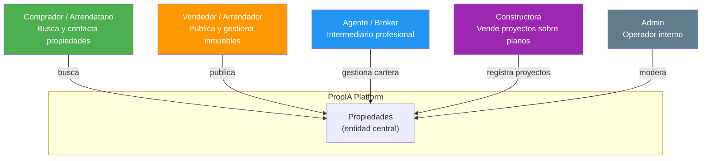
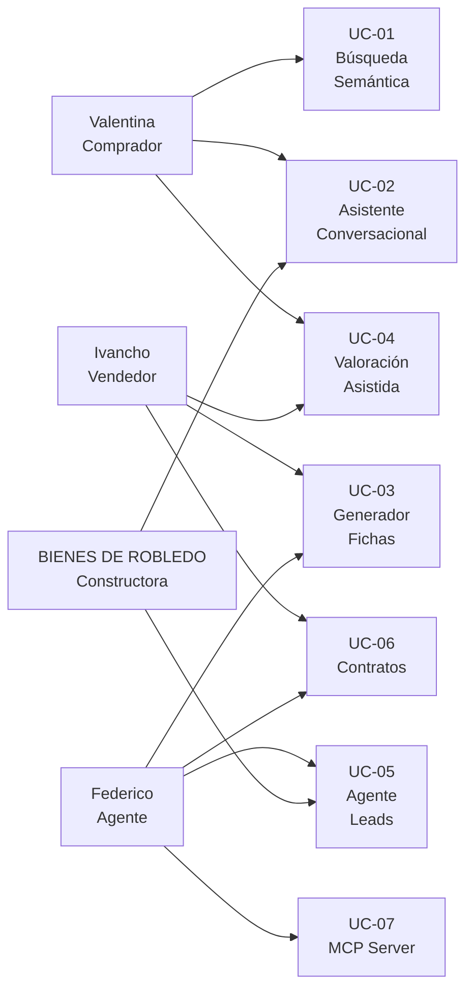

# Roles y Personas — PropIA

El dominio inmobiliario colombiano tiene actores bien diferenciados. Entender sus objetivos, frustraciones y vocabulario es clave para diseñar prompts y sistemas que respondan a necesidades reales — no a casos de uso genéricos.

---

## Diagrama de roles del sistema



---

## Persona 1 — Valentina Alzate

**Comprador / Arrendatario**

```
┌─────────────────────────────────────────────────────────────┐
│    Valentina Alzate                                         │
│  31 años · Diseñadora UX · Medellín                         │
├─────────────────────────────────────────────────────────────┤
│  SITUACIÓN                                                   │
│  Lleva 3 años arrendando en Laureles. Quiere comprar su     │
│  primer apartamento. Tiene ahorros + crédito aprobado.      │
│                                                              │
│  PRESUPUESTO                                                 │
│  $280M – $350M COP (El Poblado / Envigado preferiblemente)  │
│                                                              │
│  OBJETIVOS                                                   │
│   Encontrar algo que "se sienta bien" sin filtros rígidos  │
│   Entender si el precio es justo para la zona              │
│   Hacer preguntas al sistema como lo haría con un agente   │
│                                                              │
│  FRUSTRACIONES                                               │
│   Los filtros de los portales son demasiado específicos    │
│   No sabe el vocabulario exacto (¿cuántas alcobas? ¿apto?) │
│   Recibe listados que no entiende por qué le aparecen      │
│   No tiene referencias de precio en zonas nuevas para ella │
│                                                              │
│  CITA REAL                                                   │
│  "Quiero algo tranquilo cerca del metro,                     │
│   con buena vista, que no sea muy grande"                    │
└─────────────────────────────────────────────────────────────┘
```

**Use Cases donde aparece:** UC-01, UC-02, UC-04

**Por qué importa para GenAI:** Valentina habla en lenguaje natural. No sabe los términos exactos del formulario. Es el caso de uso clásico de búsqueda semántica — sus palabras no coinciden con los campos de la base de datos pero su intención es clara.

---

## Persona 2 — Ivan Hidalgo

**Vendedor / Arrendador**

```
┌─────────────────────────────────────────────────────────────┐
│    IVAN HIDALGO                                          │
│  50 años · Empresario · Popayán                              │
├─────────────────────────────────────────────────────────────┤
│  SITUACIÓN                                                   │
│  Heredó un apartamento en El Poblado, Medellín. Vive en     │
│  Bogotá y no conoce bien el mercado paisa. Quiere           │
│  arrendarlo o venderlo — aún no ha decidido.                │
│                                                              │
│  PROPIEDAD                                                   │
│  Apto 95m², Estrato 5, El Poblado, 3 hab / 2 baños         │
│  Sin administrar desde hace 8 meses                         │
│                                                              │
│  OBJETIVOS                                                   │
│   Saber si su precio estimado ($420M) es razonable         │
│   Publicar sin saber escribir una buena ficha              │
│   Entender qué documentos necesita para vender             │
│                                                              │
│  FRUSTRACIONES                                               │
│   No sabe los precios actuales del mercado en El Poblado   │
│   Escribió "apartamento en buen estado, cerca de todo"     │
│    — y sabe que eso no vende                                │
│   Le da miedo firmar algo que no entiende bien             │
│                                                              │
│  CITA REAL                                                   │
│  "Necesito que alguien me ayude a publicarlo bien           │
│   y me diga si el precio está bien"                         │
└─────────────────────────────────────────────────────────────┘
```

**Use Cases donde aparece:** UC-03, UC-04, UC-06

**Por qué importa para GenAI:** Ivancho tiene datos estructurados (tipo, área, estrato, habitaciones) pero no sabe convertirlos en texto atractivo. Es el caso de uso de generación de texto estructurado: datos → narrativa. También necesita valoración y análisis de contrato.

---

## Persona 3 — Federico Alzate

**Agente / Broker independiente**

```
┌─────────────────────────────────────────────────────────────┐
│    Federico Alzate                                      │
│  29 años · Agente inmobiliario independiente · Medellín     │
├─────────────────────────────────────────────────────────────┤
│  SITUACIÓN                                                   │
│  Opera solo — sin empresa, sin asistente. Maneja su         │
│  cartera con WhatsApp, Excel y algo de memoria.             │
│  Certificado Finca Raíz (Lonja de Medellín).                │
│                                                              │
│  VOLUMEN                                                     │
│  40 propiedades activas · ~25 leads activos · 1 persona     │
│                                                              │
│  OBJETIVOS                                                   │
│   Automatizar fichas para no escribir la misma             │
│    descripción variada 40 veces                             │
│   Hacer seguimiento sin perder ningún lead                 │
│   Revisar contratos antes de firmarlos con el cliente      │
│   Consultar su cartera desde cualquier herramienta de IA   │
│                                                              │
│  FRUSTRACIONES                                               │
│   Pierde leads por no responder a tiempo (trabaja solo)    │
│   Escribe la misma ficha genérica para apartamentos        │
│    similares — los clientes lo notan                        │
│   Ha firmado cláusulas que no entendió bien                │
│   Cambia de herramienta constantemente: CRM, portal,       │
│    WhatsApp, Excel — nada está integrado                    │
│                                                              │
│  CITA REAL                                                   │
│  "Si pudiera automatizar el seguimiento de leads y la       │
│   generación de fichas, duplicaría mi cartera sin           │
│   contratar a nadie"                                        │
└─────────────────────────────────────────────────────────────┘
```

**Use Cases donde aparece:** UC-03, UC-05, UC-06, UC-07

**Por qué importa para GenAI:** Federico es el usuario de mayor impacto del sistema. Necesita automatización real: agentes que actúen, generación de texto consistente, análisis de documentos y un MCP Server que le permita consultar PropIA desde su asistente de IA favorito.

---

## Persona 4 — BIENES DE ROBLEDO S.A.S.

**Constructora**

```
┌─────────────────────────────────────────────────────────────┐
│    BIENES DE ROBLEDO S.A.S.                                 │
│  Constructora · Medellin / Envigado, Itagui                │
├─────────────────────────────────────────────────────────────┤
│  SITUACIÓN                                                   │
│  Empresa familiar fundada en 2025. Especializada en         │
│  proyectos VIS (Vivienda de Interés Social) en Medallo.        │
│  Actualmente: 2 proyectos activos, 180 unidades.            │
│                                                              │
│  PROYECTOS ACTIVOS                                           │
│  "Portal del Río" — 120 aptos VIS, Medallo · 80% vendido      │
│  "Villa Nueva Etapa 2" — 60 casas VIS, Medallo · 40% vendido  │
│                                                              │
│  OBJETIVOS                                                   │
│   Calificar prospectos automáticamente (¿cumple el         │
│    perfil VIS? ¿tiene crédito viable?)                      │
│   Responder preguntas frecuentes sobre los proyectos       │
│    sin saturar al equipo de ventas                          │
│   Gestionar leads que llegan por portales externos         │
│                                                              │
│  FRUSTRACIONES                                               │
│   El 60% de los leads no cumplen el perfil VIS             │
│    (filtrarlos manualmente cuesta tiempo)                   │
│   Las preguntas frecuentes son siempre las mismas          │
│    (¿cuándo entrega? ¿qué subsidios aplican? ¿cómo aplico?)│
│   Los datos del proyecto están en PDF y Excel — no en      │
│    ningún sistema consultable                               │
└─────────────────────────────────────────────────────────────┘
```

**Use Cases donde aparece:** UC-02, UC-05

**Por qué importa para GenAI:** BIENES DE ROBLEDO representa el caso de uso B2B — una empresa que necesita automatizar calificación de leads y soporte de ventas a escala. Sus documentos de proyecto (PDFs con planos, especificaciones, preguntas frecuentes) son el input natural de un sistema RAG.

---

## Relación entre personas y Use Cases


