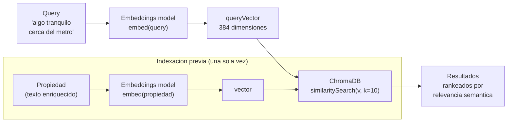

# UC-01 — Búsqueda Semántica de Propiedades

> **Concepto GenAI:** Embeddings + Vector DB
> **Rol beneficiado:** Comprador — Valentina Alzate
> **Prerrequisito:** Ninguno — es el punto de entrada al path

---

## El problema

Valentina escribe en PropIA:

> *"quiero algo tranquilo cerca del metro, con buena vista, que no sea muy grande"*

El buscador de filtros retorna **cero resultados**. No existe ninguna propiedad donde todos esos campos coincidan exactamente con esas palabras.

```
Búsqueda tradicional (SQL)
──────────────────────────
WHERE descripcion LIKE '%tranquilo%'
  AND descripcion LIKE '%metro%'
  AND descripcion LIKE '%buena vista%'
→ 0 resultados

Búsqueda semántica (embeddings)
────────────────────────────────
query → vector → similitud coseno contra 500 propiedades indexadas
→ 12 resultados ordenados por relevancia real
```

---

## La solución

Un pipeline que convierte texto en vectores numéricos y busca por **similitud de significado**, no por igualdad de strings.



---

## Diseño de referencia

Antes de implementar el Paso 1, revisa estos artefactos para tener el panorama completo del UC. Cada uno responde una pregunta distinta:

| Referencia | Qué responde | Cuándo consultarla |
|---|---|---|
| [Wireframes de UI](wireframes/busqueda-semantica.md) | **Qué ven los usuarios** — 5 pantallas: home con búsqueda, resultados con score de similitud, detalle de propiedad, estado de carga del pipeline de embeddings, fallback cuando no hay resultados | Antes del Paso 3: define el contrato del API que vas a construir y los campos que el frontend espera |
| [Diagrama de secuencia](../docs/diagrams/uc-01-secuencia.md) | **Cómo fluyen las llamadas entre componentes** — el pipeline texto → embedding → ChromaDB query → ranking, con tiempos esperados de cada paso | Cuando diseñes los handlers: muestra qué llama a qué y en qué orden |
| [Arquitectura del UC](arquitectura/) | **Tus propios diagramas y decisiones de diseño** mientras implementas | Espacio tuyo para agregar `componentes.md` o ADRs cuando tomes decisiones |

---

## Qué aprenderás

| Concepto | Qué es | Cómo se aplica |
|---|---|---|
| **Embedding** | Representacion numerica del significado de un texto en N dimensiones | Convertir fichas de propiedades y queries a vectores de 384 dims (MiniLM) o 1024 dims (Voyage) |
| **Vector DB** | Base de datos especializada en búsqueda por similitud vectorial | ChromaDB almacena y consulta los vectores de propiedades |
| **Distancia coseno** | Métrica de similitud entre vectores (0 = idénticos, 1 = opuestos) | Encontrar las propiedades más "cercanas" en significado a la query |
| **Similarity search** | Algoritmo que encuentra los k vectores más cercanos | `collection.query(queryVector, nResults=10)` |
| **Precision@k** | % de resultados relevantes entre los primeros k retornados | Medir si los 5 primeros resultados son útiles para Valentina |

---

## Recursos de formación para este UC

Estudia estos recursos **antes de escribir código**:

| Recurso | Tipo | Tiempo est. | Por qué |
|---|---|---|---|
| [Neural Networks — 3Blue1Brown](https://www.youtube.com/playlist?list=PLZHQObOWTQDNU6R1_67000Dx_ZCJB-3pi) | YouTube · Gratuito | 1h | Intuición visual de cómo las redes aprenden representaciones |
| [Word Embedding and Word2Vec, Clearly Explained — StatQuest](https://www.youtube.com/watch?v=viZrOnJclY0) | YouTube · Gratuito | 16 min | Entiende cómo texto → números con significado antes de tocar código |
| [ChromaDB — Introducción oficial](https://docs.trychroma.com/docs/overview/introduction) | Docs · Gratuito | 30 min | El vector DB que usarás: colecciones, upsert, query |
| [LangChain.js — Documentación](https://docs.langchain.com/oss/javascript/langchain/overview) | Docs · Gratuito | 45 min | Framework TypeScript que orquesta embeddings y retrieval |
| [Mastering Vector Databases & Embedding Models — Udemy](https://www.udemy.com/course/mastering-vector-databases-embedding-models-in-2025/) | Udemy | ~6h | Profundidad completa: ChromaDB, Pinecone, Weaviate con código |

**Preguntas que debes poder responder antes del Paso 3:**
- ¿Por qué "rey" y "monarca" tienen vectores cercanos aunque no comparten letras?
- ¿Qué es la distancia coseno y por qué se prefiere sobre la euclidiana?
- ¿Cuantas dimensiones tiene un embedding de `all-MiniLM-L6-v2` vs. `voyage-3`?

---

## Pasos de implementación

### Paso 0 — Setup global (ya hecho)

Si seguiste el bootstrap en [`SETUP.md`](../SETUP.md), ya tienes todo lo necesario:

- **ChromaDB** corriendo en `localhost:8000` (vía `docker compose up -d`)
- **20 propiedades indexadas** en la colección `propiedades` (vía `npm run seed:chromadb`)
- **`@propia/embeddings`** disponible (modelo `Xenova/all-MiniLM-L6-v2` local, 384 dims)
- **`@propia/db`** disponible (cliente ChromaDB centralizado)
- **`@propia/shared`** con la interface `Propiedad` y todos los tipos

Verifica con:
```bash
npm run verify
```

Para este UC necesitas además `express`. Si seguiste el SETUP.md ya están en la raíz, pero por si acaso:
```bash
npm install express
npm install --save-dev @types/express
```

> **Importante**: instala desde la **raíz** del repo (donde está el `package.json` con `"workspaces"`). NO hagas `cd uc-01-busqueda-semantica/src && npm init`; eso rompe la resolución de `@propia/*`.

### Paso 1 — Entender los datos

Las 20 propiedades viven en [`data/seeds/propiedades.json`](../data/seeds/propiedades.json) — variedad de estratos (3–6), tipos (apartamento, casa, apartaestudio, oficina, local comercial), barrios reales de Medellín, Envigado, Sabaneta, Rionegro y Bogotá. Cada propiedad cumple con la interface `Propiedad` de [`@propia/shared`](../packages/shared/src/propiedad.ts).

Inspecciónalas rápidamente:
```bash
cat data/seeds/propiedades.json | jq '.[] | { id, titulo, ciudad: .ubicacion.ciudad, estrato }'
```

### Paso 2 — El indexador (ya implementado)

[`scripts/seed-chromadb.ts`](../scripts/seed-chromadb.ts) hace todo el trabajo del indexado: lee el JSON, construye un texto descriptivo por propiedad, calcula el embedding con `@xenova/transformers` y lo hace `upsert` a ChromaDB. Léelo para entender el flujo. El núcleo:

```typescript
import { embed } from '@propia/embeddings';
import { getOrCreateCollection, COLECCION_PROPIEDADES } from '@propia/db';
import type { Propiedad } from '@propia/shared';

function buildDocument(p: Propiedad): string {
  return [
    p.titulo,
    p.descripcion,
    `${p.tipo} en ${p.ubicacion.barrio}, ${p.ubicacion.ciudad}`,
    `Estrato ${p.estrato}, ${p.areaM2}m², ${p.habitaciones} habitaciones`,
    `Características: ${p.caracteristicas.join(', ')}`,
  ].join('. ');
}

const collection = await getOrCreateCollection(COLECCION_PROPIEDADES);
for (const p of propiedades) {
  const doc = buildDocument(p);
  const vector = await embed(doc);   // 384 dims, modelo local
  await collection.upsert({
    ids: [p.id],
    embeddings: [vector],
    documents: [doc],
    metadatas: [{ ciudad: p.ubicacion.ciudad, estrato: p.estrato, precio: p.precio.valor }],
  });
}
```

Para reindexar (idempotente, por ejemplo si editas las descripciones):
```bash
npm run seed:chromadb
```

> **Sobre embeddings:** Anthropic no expone un endpoint de embeddings — este path usa `@xenova/transformers` con `Xenova/all-MiniLM-L6-v2` (384 dims, local, sin API key, gratis). Si quisieras producción podrías cambiar a Voyage AI (`voyage-3`, 1024 dims, partner de Anthropic) o `text-embedding-3-small` de OpenAI — basta con reescribir `packages/embeddings/src/embed.ts` manteniendo la misma firma `(text: string) => Promise<number[]>` y luego correr `npm run seed:chromadb` para reindexar con el nuevo modelo.
>
> **Importante:** usa el MISMO modelo para indexar y para buscar. Los vectores de modelos distintos no son comparables.

### Paso 3 — Motor de búsqueda semántica

Crea `uc-01-busqueda-semantica/src/search.ts`:

```typescript
import { embed } from '@propia/embeddings';
import { getOrCreateCollection, COLECCION_PROPIEDADES } from '@propia/db';

export interface SearchResult {
  propiedadId: string;
  documento: string;
  score: number;                // relativo: mayor = más similar (ver nota abajo)
  metadata: Record<string, unknown>;
}

export async function semanticSearch(
  query: string,
  filters?: { ciudad?: string; precioMax?: number },
  k = 10,
): Promise<SearchResult[]> {
  const collection = await getOrCreateCollection(COLECCION_PROPIEDADES);
  const queryVector = await embed(query);

  const conditions: Record<string, unknown>[] = [];
  if (filters?.ciudad) conditions.push({ ciudad: filters.ciudad });
  if (filters?.precioMax) conditions.push({ precio: { $lte: filters.precioMax } });

  // ChromaDB requiere $and cuando hay mas de un filtro
  const where =
    conditions.length > 1
      ? { $and: conditions }
      : conditions.length === 1
        ? conditions[0]
        : undefined;

  const results = await collection.query({
    queryEmbeddings: [queryVector],
    nResults: k,
    where,
  });

  return (results.ids[0] ?? []).map((id, i) => ({
    propiedadId: id,
    documento: results.documents[0]?.[i] ?? '',
    score: 1 - (results.distances?.[0]?.[i] ?? 1),
    metadata: (results.metadatas[0]?.[i] ?? {}) as Record<string, unknown>,
  }));
}
```

> **Sobre el score**: ChromaDB por defecto usa distancia L2 sobre los embeddings normalizados. Calculamos `score = 1 - distancia` para que **mayor = más similar**. Con L2 los valores típicos están entre `-1` y `1`, pero no los interpretes como porcentaje — úsalos como ranking relativo (la propiedad con `score 0.15` es más similar que la de `score 0.05`). Si necesitas similitud coseno explícita, especifica `{ "hnsw": { "space": "cosine" } }` al crear la colección.

Prueba rápida desde la raíz:
```bash
npx tsx -e "import('./uc-01-busqueda-semantica/src/search.ts').then(async m => { const r = await m.semanticSearch('algo tranquilo cerca del metro', undefined, 3); console.log(r.map(x => ({ id: x.propiedadId, score: x.score.toFixed(3) }))); })"
```

Resultado esperado (orden importa, los scores absolutos varían un poco):
```
[
  { id: 'prop-bog-011', score: '0.096' },   // Chapinero Alto — vista a cerros, cerca TransMilenio
  { id: 'prop-mde-001', score: '0.067' },   // Barrio Colombia — cerca metro Industriales, zona tranquila
  { id: 'prop-bog-015', score: '0.052' }    // Salitre — cerca TransMilenio Salitre El Greco
]
```

### Paso 4 — API endpoint

Crea `uc-01-busqueda-semantica/src/api.ts`:

```typescript
import express, { type Request, type Response } from 'express';
import { semanticSearch } from './search.js';

const app = express();
app.use(express.json());

interface SearchBody {
  query?: string;
  ciudad?: string;
  precioMax?: number;
}

app.post('/api/search', async (req: Request<unknown, unknown, SearchBody>, res: Response) => {
  const { query, ciudad, precioMax } = req.body;
  if (!query) {
    return res.status(400).json({ error: 'query requerida' });
  }

  try {
    const results = await semanticSearch(query, { ciudad, precioMax });
    return res.json({ results, total: results.length, query });
  } catch (err) {
    console.error(err);
    return res.status(500).json({ error: 'Error en la búsqueda' });
  }
});

const PORT = Number(process.env.PORT ?? 3000);
app.listen(PORT, () => {
  console.log(`PropIA Search API en http://localhost:${PORT}`);
});
```

Levántalo y prueba con `curl`:

```bash
# Terminal 1 — arranca el API
npx tsx uc-01-busqueda-semantica/src/api.ts

# Terminal 2 — query semántica
curl -s -X POST http://localhost:3000/api/search \
  -H "Content-Type: application/json" \
  -d '{"query":"algo tranquilo cerca del metro"}' | jq '.results[0:3] | .[] | { propiedadId, score }'

# Con filtros
curl -s -X POST http://localhost:3000/api/search \
  -H "Content-Type: application/json" \
  -d '{"query":"apartamento pet-friendly","ciudad":"Medellín","precioMax":800000000}' | jq
```

### Paso 5 -- Evaluar calidad

`src/evaluation/evaluate.ts`:

El objetivo es medir si tu busqueda semantica realmente funciona mejor que un `ILIKE` de SQL. Sin esta evaluacion, no tienes forma de saber si un cambio en `buildDocument()` o en el modelo de embeddings mejora o empeora los resultados.

```typescript
import { semanticSearch, type SearchResult } from '../search.js';

// -----------------------------------------------------------------------
// Golden dataset: 10 queries con las propiedades que DEBERIAN aparecer.
// Te sugiero crearlo ANTES de escribir el indexer -- asi no hay sesgo.
// -----------------------------------------------------------------------
interface EvalPair {
  query: string;
  expectedIds: string[];   // propiedades relevantes para esta query
  description: string;     // para el log -- que esperas encontrar
}

const GOLDEN: EvalPair[] = [
  {
    query: 'algo tranquilo cerca del metro',
    expectedIds: ['prop-mde-001', 'prop-bog-011'],
    description: 'Propiedades cerca a estaciones de transporte, zonas tranquilas',
  },
  {
    query: 'espacio para trabajar desde casa con buena luz',
    expectedIds: ['prop-mde-003', 'prop-bog-012'],
    description: 'Propiedades con estudio / home office / buena iluminacion',
  },
  {
    query: 'apartamento familiar estrato alto con parqueadero',
    expectedIds: ['prop-mde-002', 'prop-env-006'],
    description: 'Apto estrato 5-6 con parqueadero incluido',
  },
  {
    query: 'local comercial en zona de alto trafico',
    expectedIds: ['prop-mde-005'],
    description: 'Locales comerciales en zonas concurridas',
  },
  {
    query: 'apartaestudio economico para estudiante',
    expectedIds: ['prop-sab-008', 'prop-bog-013'],
    description: 'Apartaestudios estrato 3 o menor, precio bajo',
  },
  {
    query: 'casa campestre con vista a montanas y naturaleza',
    expectedIds: ['prop-rio-009'],
    description: 'Casas rurales / campestres con vista panoramica',
  },
  {
    query: 'oficina moderna en zona empresarial',
    expectedIds: ['prop-mde-004', 'prop-bog-014'],
    description: 'Oficinas en zonas corporativas',
  },
  {
    query: 'algo pet-friendly con zonas verdes',
    expectedIds: ['prop-env-006', 'prop-env-007'],
    description: 'Propiedades que aceptan mascotas, con areas verdes',
  },
  {
    query: 'inversion para renta corta tipo Airbnb',
    expectedIds: ['prop-mde-002', 'prop-bog-011'],
    description: 'Aptos en zonas turisticas aptos para renta corta',
  },
  {
    query: 'primer piso accesible para persona mayor',
    expectedIds: ['prop-sab-008', 'prop-env-007'],
    description: 'Propiedades en primer piso o con ascensor, accesibles',
  },
];

// -----------------------------------------------------------------------
// Metricas: Precision@k y MRR
// Quizas quieras agregar Recall@k despues -- por ahora estas dos bastan.
// -----------------------------------------------------------------------
function precisionAtK(retrieved: string[], expected: string[], k: number): number {
  const topK = retrieved.slice(0, k);
  const hits = topK.filter(id => expected.includes(id)).length;
  return hits / k;
}

function reciprocalRank(retrieved: string[], expected: string[]): number {
  for (let i = 0; i < retrieved.length; i++) {
    if (expected.includes(retrieved[i])) {
      return 1 / (i + 1);
    }
  }
  return 0; // ningun resultado esperado encontrado
}

// -----------------------------------------------------------------------
// Baseline SQL simulado (ILIKE): busca substring en los documentos.
// Te sugiero implementar esto para ver la diferencia real vs semantica.
// -----------------------------------------------------------------------
function sqlBaseline(query: string, documents: Map<string, string>): string[] {
  const keywords = query.toLowerCase().split(/\s+/).filter(w => w.length > 3);
  const scored: { id: string; hits: number }[] = [];

  for (const [id, doc] of documents) {
    const docLower = doc.toLowerCase();
    const hits = keywords.filter(kw => docLower.includes(kw)).length;
    if (hits > 0) scored.push({ id, hits });
  }

  return scored.sort((a, b) => b.hits - a.hits).map(s => s.id);
}

// -----------------------------------------------------------------------
// Runner principal
// -----------------------------------------------------------------------
async function runEvaluation() {
  const K = 5;
  let totalPrecision = 0;
  let totalMRR = 0;
  let semanticWins = 0;

  // Podrias cargar los documentos de propiedades.json para la baseline SQL.
  // Aqui se asume que semanticSearch retorna el campo 'documento'.
  const allDocs = new Map<string, string>();

  console.log(`Evaluacion de busqueda semantica -- ${GOLDEN.length} queries, k=${K}\n`);
  console.log('Query'.padEnd(50), 'P@5'.padEnd(8), 'RR'.padEnd(8), 'vs SQL');
  console.log('-'.repeat(80));

  for (const pair of GOLDEN) {
    // --- Busqueda semantica ---
    const results: SearchResult[] = await semanticSearch(pair.query, undefined, K);
    const retrievedIds = results.map(r => r.propiedadId);

    // Guardar documentos para la baseline
    for (const r of results) {
      if (!allDocs.has(r.propiedadId)) {
        allDocs.set(r.propiedadId, r.documento);
      }
    }

    const p5 = precisionAtK(retrievedIds, pair.expectedIds, K);
    const rr = reciprocalRank(retrievedIds, pair.expectedIds);
    totalPrecision += p5;
    totalMRR += rr;

    // --- Baseline SQL ---
    const sqlResults = sqlBaseline(pair.query, allDocs);
    const sqlP5 = precisionAtK(sqlResults, pair.expectedIds, K);
    const comparison = p5 > sqlP5 ? 'SEMANTIC' : p5 === sqlP5 ? 'EMPATE' : 'SQL';
    if (p5 > sqlP5) semanticWins++;

    console.log(
      pair.query.substring(0, 48).padEnd(50),
      p5.toFixed(2).padEnd(8),
      rr.toFixed(2).padEnd(8),
      comparison,
    );
  }

  const avgPrecision = totalPrecision / GOLDEN.length;
  const avgMRR = totalMRR / GOLDEN.length;

  console.log('-'.repeat(80));
  console.log(`\nResultados globales:`);
  console.log(`  Precision@${K} promedio:  ${avgPrecision.toFixed(3)}`);
  console.log(`  MRR promedio:           ${avgMRR.toFixed(3)}`);
  console.log(`  Semantic wins vs SQL:   ${semanticWins}/${GOLDEN.length}`);

  // --- Assertions para CI ---
  const PRECISION_THRESHOLD = 0.70;
  const SEMANTIC_WIN_THRESHOLD = 3;

  if (avgPrecision < PRECISION_THRESHOLD) {
    console.error(`\nFAIL: Precision@${K} ${avgPrecision.toFixed(3)} < ${PRECISION_THRESHOLD}`);
    console.error('  Te sugiero revisar buildDocument() -- quizas no esta enriqueciendo suficiente.');
    process.exit(1);
  }

  if (semanticWins < SEMANTIC_WIN_THRESHOLD) {
    console.error(`\nFAIL: Semantic wins ${semanticWins} < ${SEMANTIC_WIN_THRESHOLD}`);
    console.error('  Deberias tener en cuenta que el modelo podria necesitar mas contexto en los documentos.');
    process.exit(1);
  }

  console.log(`\nPASS: Busqueda semantica supera los umbrales.`);
}

runEvaluation().catch(err => {
  console.error('Error en evaluacion:', err);
  process.exit(1);
});
```

Para ejecutarlo:

```bash
npx tsx uc-01-busqueda-semantica/src/evaluation/evaluate.ts
```

> **Ten en cuenta**: los `expectedIds` del golden dataset son un punto de partida. Te sugiero ajustarlos despues de revisar tus 20 propiedades en `data/seeds/propiedades.json` -- quizas algunos IDs no coincidan con tu seed. Lo importante es que definas el ground truth ANTES de iterar sobre el codigo, no despues.
>
> **Sobre la baseline SQL**: la funcion `sqlBaseline` es una simulacion simplificada (busca keywords por substring). En produccion podrias compararla contra un `SELECT ... WHERE descripcion ILIKE` real en PostgreSQL. El punto es demostrar que la busqueda semantica encuentra resultados que el keyword matching no puede.

---

## Estructura de archivos

```
uc-01-busqueda-semantica/
├── README.md
├── wireframes/
│   └── busqueda-semantica.md      ← 5 pantallas con iconos
├── arquitectura/
│   └── diagrama.md                ← Diagrama de componentes Mermaid
├── prompts/
│   └── (no aplica — no hay generación LLM, solo embeddings)
└── src/                           ← Implementas tú siguiendo los Pasos 3-5
    ├── search.ts                  ← semanticSearch() — Paso 3
    ├── api.ts                     ← POST /api/search — Paso 4
    └── evaluation/
        └── evaluate.ts            ← Precision@k, MRR vs baseline SQL — Paso 5
```

**Lo compartido con otros UCs (no lo escribes en este UC):**

| Archivo | Qué hace | UC que lo provee |
|---|---|---|
| [`packages/embeddings/src/embed.ts`](../packages/embeddings/src/embed.ts) | `embed(text)` con Xenova local | global |
| [`packages/db/src/chroma.ts`](../packages/db/src/chroma.ts) | Cliente ChromaDB + `getOrCreateCollection` | global |
| [`packages/shared/src/propiedad.ts`](../packages/shared/src/propiedad.ts) | Interface `Propiedad`, `Ubicacion`, etc. | global |
| [`scripts/seed-chromadb.ts`](../scripts/seed-chromadb.ts) | Indexer de las 20 propiedades | global |
| [`data/seeds/propiedades.json`](../data/seeds/propiedades.json) | 20 propiedades reales | global |

---

## Criterios de éxito

- [ ] "algo tranquilo cerca del metro" retorna propiedades cerca a estaciones de metro — no solo las que tienen la palabra "metro" en la descripción
- [ ] "espacio para trabajar desde casa" retorna propiedades con estudio / home office
- [ ] Precision@5 > 0.70 sobre el conjunto de evaluación de 10 queries
- [ ] La búsqueda semántica supera al `ILIKE` SQL en al menos 3 de cada 5 queries de prueba
- [ ] Tiempo de respuesta < 2 segundos por query

---

## Errores comunes (leelos antes de empezar)

| Error | Por que pasa | Como evitarlo |
|---|---|---|
| Usar un modelo de embeddings para indexar y otro para buscar | Los vectores de modelos distintos no son comparables — dimensiones y espacio semantico diferentes | Elige UN modelo y usalo siempre. Si cambias, re-indexa todo |
| No enriquecer el texto antes de generar embeddings | Si solo indexas el titulo, pierdes contexto valioso (barrio, estrato, caracteristicas) | Usa `buildDocument()` para concatenar campos relevantes |
| Comparar scores entre queries distintas | La distancia coseno solo es comparativa DENTRO de una misma query, no entre queries | No digas "esta query tuvo score 0.3 y la otra 0.5, luego la segunda es mejor" |
| No tener datos de evaluacion antes de construir | Sin ground truth no puedes medir si tu busqueda mejora o empeora | Crea los 10 pares query/resultados esperados ANTES de escribir el indexer |
| Usar ChromaDB sin Docker (instalacion nativa) | Problemas de dependencias C++ en macOS | Usa siempre `docker run -d -p 8000:8000 chromadb/chroma:latest` |

---

## Ejercicio de validacion (hazlo al terminar)

Antes de pasar a UC-02, verifica que entiendes lo que construiste:

1. **Cambia el texto de una propiedad** (por ejemplo, agrega "cerca al metro" a una propiedad) y vuelve a indexar. Busca "algo cerca del metro" y verifica que esa propiedad sube en el ranking. Si no sube, tu pipeline de enriquecimiento no funciona.

2. **Prueba una query en ingles** (ej: "quiet apartment near public transport"). Observa los resultados. El modelo `all-MiniLM-L6-v2` es multilingue pero con sesgo al ingles. Anota la diferencia en scores vs. la misma query en espanol.

3. **Mide Precision@5 manualmente** para 3 queries: anota cuantos de los 5 primeros resultados son realmente relevantes. Si Precision < 0.50, tu `buildDocument()` necesita mas contexto.

4. **Compara contra SQL**: para las mismas 3 queries, haz `WHERE descripcion ILIKE '%keyword%'`. Cuenta cuantos resultados relevantes obtiene cada metodo. Documenta la diferencia.

---

## Siguiente UC

[UC-02 — Asistente Conversacional](../uc-02-asistente-conversacional/README.md) usa el vector DB que construiste aquí para implementar RAG con memoria conversacional.
