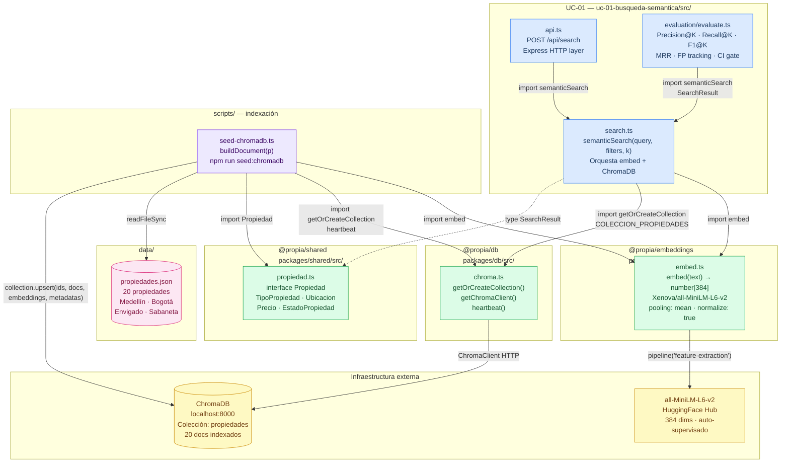
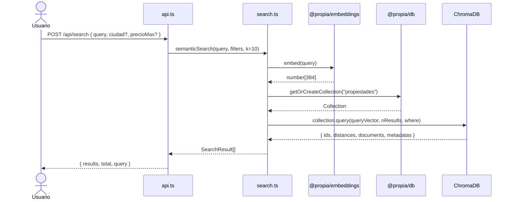
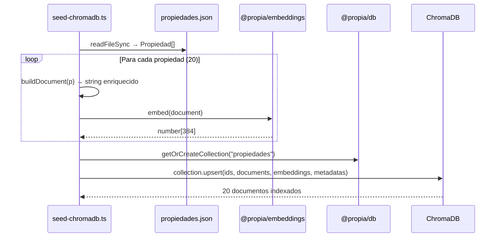

# Componentes — UC-01 Búsqueda Semántica

## Diagrama de componentes y dependencias

---

## Responsabilidad de cada componente

### UC-01 (azul)

| Archivo | Responsabilidad | Exporta |
|---|---|---|
| `api.ts` | Recibe `POST /api/search` vía HTTP, valida el body, delega a `semanticSearch` y serializa la respuesta JSON | — (punto de entrada HTTP) |
| `search.ts` | Convierte la query en vector, consulta ChromaDB con filtros opcionales, normaliza el score (`1 - distancia`) | `semanticSearch()`, `SearchResult` |
| `evaluation/evaluate.ts` | Corre el golden dataset de 10 queries, calcula P@K / R@K / F1 / MRR / FPs, y hace `process.exit(1)` si falla un threshold | — (script CI) |

### @propia/embeddings (verde)

| Archivo | Responsabilidad |
|---|---|
| `embed.ts` | Carga `all-MiniLM-L6-v2` una sola vez (singleton con `embedderPromise`), aplica `pooling: mean` + `normalize: true`, devuelve `number[384]` |

### @propia/db (verde)

| Archivo | Responsabilidad |
|---|---|
| `chroma.ts` | Gestiona el singleton del `ChromaClient`, conecta a `localhost:8000`, expone `getOrCreateCollection()` y `heartbeat()` |

### @propia/shared (verde)

| Archivo | Responsabilidad |
|---|---|
| `propiedad.ts` | Interface `Propiedad` y sus tipos auxiliares: `Ubicacion`, `Precio`, `TipoPropiedad`, `EstadoPropiedad`, `Estrato` |

---

## Flujo de datos — búsqueda en tiempo real

---

## Flujo de datos — indexación (solo al ejecutar seed)

---

## Decisiones de diseño relevantes

| Decisión | Valor | Alternativa descartada |
|---|---|---|
| Modelo de embeddings | `all-MiniLM-L6-v2` (384 dims, local) | `voyage-3` (1024 dims, requiere API key) |
| Singleton del cliente ChromaDB | `clientSingleton` en `chroma.ts` | Nueva instancia por llamada (overhead de conexión) |
| Singleton del modelo | `embedderPromise` en `embed.ts` | Recargar modelo cada vez (30-60s por carga) |
| Score normalizado | `1 - distancia` | Distancia L2 cruda (menos intuitiva para el frontend) |
| `pooling: mean` | Promedia tokens del texto completo | `pooling: cls` — solo usa el token [CLS], menos representativo para párrafos largos |

> Ver razonamiento extendido de cada decisión en [`decisiones.md`](./decisiones.md).
