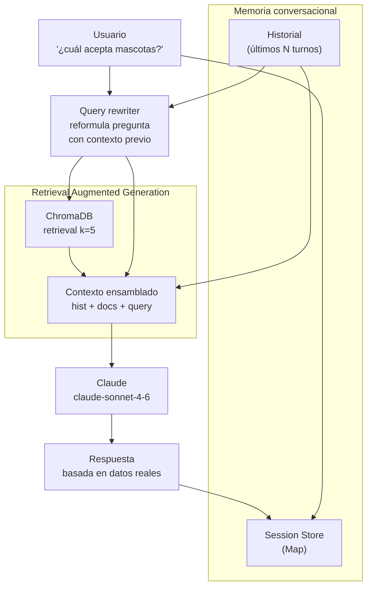

# UC-02 — Asistente Conversacional de PropIA

> **Concepto GenAI:** RAG + Memoria conversacional
> **Rol beneficiado:** Comprador — Valentina Alzate / Agente — Federico Alzate
> **Prerrequisito:** UC-01 completado (ChromaDB con 20 propiedades indexadas)

---

## El problema

Valentina encontró 12 propiedades con la búsqueda semántica de UC-01. Ahora tiene preguntas específicas sobre esas propiedades:

> *"¿Cuál de estas tres está más cerca del metro?"*
> *"¿Hay alguna que acepte mascotas y tenga parqueadero?"*
> *"Me puedes explicar qué es el estrato y cómo afecta los servicios?"*
> *"Volviendo a la del Poblado que me mostraste antes — ¿cuánto sería la cuota mensual con un crédito a 15 años?"*

Un buscador no puede responder esto. Necesitas un asistente que:
1. **Recupere datos reales** de propiedades antes de responder (RAG)
2. **Recuerde el historial** de la conversación (memoria)
3. **No invente** valores que no están en los datos

```
Sin RAG                              Con RAG + Memoria
──────────────────────────────       ──────────────────────────────────────
LLM genera desde entrenamiento   →   LLM recibe: historial + datos reales
Inventa precios y ubicaciones    →   Solo habla de propiedades reales
Pierde hilo al 3er mensaje       →   Mantiene contexto de 10+ turnos
```

---

## La solución

Un pipeline de **RAG con ventana de memoria deslizante**: cada turno recupera el contexto relevante del vector DB y lo combina con el historial reciente para generar respuestas fundamentadas.



---

## Diseño de referencia

Antes de implementar el Paso 1, revisa estos artefactos para tener el panorama completo del UC. Cada uno responde una pregunta distinta:

| Referencia | Qué responde | Cuándo consultarla |
|---|---|---|
| [Wireframes de UI](wireframes/asistente-conversacional.md) | **Qué ven los usuarios** — 5 pantallas: estado inicial del chat, conversación con RAG respondiendo con datos reales, respuesta usando contexto de turnos previos (query rewriting), caso "no tengo datos suficientes", historial de sesión | Antes del Paso 3: define el contrato del API que vas a construir y los campos que el frontend espera |
| [Diagrama de secuencia](../docs/diagrams/uc-02-secuencia.md) | **Cómo fluyen las llamadas entre componentes** — el flujo RAG completo: query rewrite → retrieve → augment → generate, más cómo se mantiene el historial entre turnos | Cuando diseñes los handlers: muestra qué llama a qué y en qué orden |
| [Arquitectura del UC](arquitectura/) | **Tus propios diagramas y decisiones de diseño** mientras implementas | Espacio tuyo para agregar `componentes.md` o ADRs cuando tomes decisiones |

---

## Qué aprenderás

| Concepto | Qué es | Cómo se aplica |
|---|---|---|
| **RAG** | Retrieval Augmented Generation: recuperar datos reales antes de generar | Cada mensaje busca propiedades relevantes en ChromaDB y las inyecta en el prompt |
| **Chunking** | División de textos largos en trozos recuperables | Fichas de propiedades largas se dividen en chunks semánticos |
| **Memoria de ventana** | Guardar los últimos N turnos de conversación | Límite de 10 turnos para controlar tamaño del contexto |
| **Query rewriting** | Reformular la pregunta usando el historial para hacerla autocontenida | "¿y la del Poblado?" → "¿cuál es el precio del apartamento en El Poblado de Medellín?" |
| **Faithfulness** | Métrica: ¿la respuesta está soportada por los documentos recuperados? | Medida con RAGAS — objetivo > 0.85 |
| **Answer Relevancy** | Métrica: ¿la respuesta es relevante para la pregunta? | Medida con RAGAS — objetivo > 0.80 |

---

## Recursos de formación para este UC

Estudia estos recursos **antes de escribir código**:

| Recurso | Tipo | Tiempo est. | Por qué |
|---|---|---|---|
| [LangChain.js RAG — Documentación oficial](https://docs.langchain.com/oss/javascript/langchain/overview) | Docs · Gratuito | 45 min | Aprende ConversationalRetrievalChain y BufferMemory en TypeScript |
| [RAG From Scratch — LangChain YouTube](https://www.youtube.com/watch?v=sVcwVQRHIc8) | YouTube · Gratuito | 20 min | Intuición de cómo funciona RAG antes de implementarlo |
| [LangChain: Chat with Your Data — DeepLearning.AI](https://www.deeplearning.ai/short-courses/langchain-chat-with-your-data/) | Curso online · Gratuito | 1h | Retrieval, chunking y Q&A sobre documentos propios |
| [Build LLM Apps with LangChain.js — Udemy](https://www.udemy.com/course/build-llm-apps-with-langchain-js/) | Udemy | ~8h | TypeScript completo: retrieval, memory, chains, agents |
| [RAGAS — Evaluación de RAG](https://docs.ragas.io/en/latest/concepts/metrics/index.html) | Docs · Gratuito | 30 min | Faithfulness, Answer Relevancy, Context Precision — las métricas que medirás |

**Preguntas que debes poder responder antes del Paso 3:**
- ¿Por qué el LLM puede "alucinar" si no tiene RAG?
- ¿Qué es el "context window" y por qué limitas el historial?
- ¿En qué se diferencia `BufferMemory` de `SummaryMemory` en LangChain?

---

## Pasos de implementación

### Paso 0 — Setup global (ya hecho)

Si seguiste el bootstrap en [`SETUP.md`](../SETUP.md):

- **ChromaDB** con las 20 propiedades de [`data/seeds/propiedades.json`](../data/seeds/propiedades.json) indexadas
- **`@propia/embeddings`** disponible — `embed()` reusable para el retrieval
- **`@propia/db`** disponible — `getOrCreateCollection` centralizado
- **`ANTHROPIC_API_KEY`** configurada en `.env` (este UC sí la usa, a diferencia de UC-01)

Verifica:
```bash
npm run verify
```

Dependencias adicionales que necesitas para este UC:
```bash
npm install @anthropic-ai/sdk express
npm install --save-dev @types/express
```

> **No instales `uuid`** — usaremos `randomUUID` de `node:crypto` (nativo, sin dependencias). Si el README de versiones anteriores te decía instalarlo, ignóralo.

### Paso 1 — Tipos y gestión de sesiones

`src/session/sessionManager.ts`:

```typescript
export interface Turn {
  role: 'user' | 'assistant';
  content: string;
  timestamp: string;          // ISO string, no Date — serializa bien en JSON
  sourceDocIds?: string[];    // propiedades usadas como contexto en este turno
}

export interface Session {
  id: string;
  turns: Turn[];
  createdAt: string;
  lastActivity: string;
}

const MAX_TURNS = 10;
const sessions = new Map<string, Session>();

export function getOrCreateSession(sessionId: string): Session {
  const existing = sessions.get(sessionId);
  if (existing) return existing;

  const now = new Date().toISOString();
  const created: Session = {
    id: sessionId,
    turns: [],
    createdAt: now,
    lastActivity: now,
  };
  sessions.set(sessionId, created);
  return created;
}

export function addTurn(sessionId: string, turn: Turn): void {
  const session = getOrCreateSession(sessionId);
  session.turns.push(turn);
  session.lastActivity = new Date().toISOString();

  // Ventana deslizante — mantener solo los últimos MAX_TURNS turnos
  if (session.turns.length > MAX_TURNS) {
    session.turns = session.turns.slice(-MAX_TURNS);
  }
}

export function getHistory(sessionId: string): Turn[] {
  return sessions.get(sessionId)?.turns ?? [];
}
```

### Paso 2 — Query rewriter con contexto

`src/rag/queryRewriter.ts`:

```typescript
import Anthropic from '@anthropic-ai/sdk';

const anthropic = new Anthropic();

export async function rewriteQuery(
  query: string,
  history: { role: 'user' | 'assistant'; content: string }[],
): Promise<string> {
  if (history.length === 0) return query;

  const response = await anthropic.messages.create({
    model: 'claude-haiku-4-5-20251001',
    max_tokens: 150,
    system: `Reformula la pregunta del usuario para que sea autocontenida y clara,
usando el historial de conversación como contexto.
SOLO retorna la pregunta reformulada, sin explicaciones, sin comillas.
Si la pregunta ya es autocontenida, retórnala sin cambios.`,
    messages: [
      ...history.slice(-4).map((t) => ({ role: t.role, content: t.content })),
      { role: 'user', content: `Reformula esta pregunta: "${query}"` },
    ],
  });

  const block = response.content[0];
  return block.type === 'text' ? block.text.trim() : query;
}
```

### Paso 3 — Pipeline RAG + memoria

`src/rag/ragChain.ts`:

```typescript
import Anthropic from '@anthropic-ai/sdk';
import { embed } from '@propia/embeddings';
import { getOrCreateCollection, COLECCION_PROPIEDADES } from '@propia/db';
import { getOrCreateSession, addTurn, getHistory } from '../session/sessionManager.js';
import { rewriteQuery } from './queryRewriter.js';

const anthropic = new Anthropic();

const SYSTEM_PROMPT = `Eres PropIA, el asistente inmobiliario de la plataforma PropIA Colombia.

REGLAS CRÍTICAS:
1. SOLO usa información de las propiedades que te proporcionan en el contexto
2. Si no tienes datos suficientes para responder, dilo explícitamente
3. Usa vocabulario inmobiliario colombiano (apartamento, alcoba, canon, estrato, etc.)
4. Cuando menciones precios, usa formato colombiano: $285.000.000 o $285M COP
5. Sé conciso — máximo 3 párrafos por respuesta`;

async function retrieveContext(query: string): Promise<{ docs: string[]; ids: string[] }> {
  const collection = await getOrCreateCollection(COLECCION_PROPIEDADES);
  const queryVector = await embed(query);

  const results = await collection.query({
    queryEmbeddings: [queryVector],
    nResults: 5,
  });

  return {
    docs: (results.documents[0]?.filter(Boolean) as string[]) ?? [],
    ids: results.ids[0] ?? [],
  };
}

export interface ChatResponse {
  reply: string;
  sourceDocIds: string[];
  rewrittenQuery: string;
}

export async function chat(sessionId: string, userMessage: string): Promise<ChatResponse> {
  const history = getHistory(sessionId);

  // 1. Reformular la query con contexto del historial
  const rewrittenQuery = await rewriteQuery(
    userMessage,
    history.map((t) => ({ role: t.role, content: t.content })),
  );

  // 2. Recuperar propiedades relevantes
  const { docs, ids } = await retrieveContext(rewrittenQuery);

  // 3. Armar contexto de propiedades
  const propiedadesCtx =
    docs.length > 0
      ? `PROPIEDADES DISPONIBLES:\n${docs.map((d, i) => `[${i + 1}] ${d}`).join('\n\n')}`
      : 'No se encontraron propiedades relevantes para esta consulta.';

  // 4. Construir mensajes con historial + contexto
  const messages: Anthropic.MessageParam[] = [
    ...history.slice(-6).map((t) => ({
      role: t.role,
      content: t.content,
    })),
    {
      role: 'user',
      content: `${propiedadesCtx}\n\nPregunta del usuario: ${userMessage}`,
    },
  ];

  // 5. Llamar al LLM
  const response = await anthropic.messages.create({
    model: 'claude-sonnet-4-6',
    max_tokens: 1024,
    system: SYSTEM_PROMPT,
    messages,
  });

  const firstBlock = response.content[0];
  const reply = firstBlock.type === 'text' ? firstBlock.text : '';

  // 6. Guardar turnos en sesión
  const now = new Date().toISOString();
  addTurn(sessionId, { role: 'user', content: userMessage, timestamp: now });
  addTurn(sessionId, {
    role: 'assistant',
    content: reply,
    timestamp: now,
    sourceDocIds: ids,
  });

  return { reply, sourceDocIds: ids, rewrittenQuery };
}
```

> **Por qué retornar `ChatResponse` y no solo `string`**: tener `sourceDocIds` y `rewrittenQuery` expuestos al cliente es crucial para debugging y para UC-08 (evaluación con RAGAS necesita los `contexts` recuperados). Pagas un costo nulo y ganas observabilidad.

### Paso 4 — API con gestión de sesiones

`src/api.ts`:

```typescript
import 'dotenv/config';        // CRÍTICO — debe ser el primer import
import express, { type Request, type Response } from 'express';
import { randomUUID } from 'node:crypto';
import { chat } from './rag/ragChain.js';
import { getHistory } from './session/sessionManager.js';

const app = express();
app.use(express.json());

interface ChatBody {
  message?: string;
  sessionId?: string;
}

// POST /api/chat — turno de conversación
app.post('/api/chat', async (req: Request<unknown, unknown, ChatBody>, res: Response) => {
  const { message, sessionId } = req.body;
  if (!message) {
    return res.status(400).json({ error: 'message requerido' });
  }

  const sid = sessionId ?? randomUUID();

  try {
    const result = await chat(sid, message);
    return res.json({
      reply: result.reply,
      sessionId: sid,
      sourceDocIds: result.sourceDocIds,
      rewrittenQuery: result.rewrittenQuery,
    });
  } catch (err) {
    console.error('Error en chat:', err);
    return res.status(500).json({ error: 'Error en el asistente' });
  }
});

// GET /api/chat/:sessionId/history — historial de una sesión
app.get('/api/chat/:sessionId/history', (req: Request<{ sessionId: string }>, res: Response) => {
  const history = getHistory(req.params.sessionId);
  return res.json({ history, total: history.length });
});

const PORT = Number(process.env.PORT ?? 3000);
app.listen(PORT, () => {
  console.log(`PropIA Chat API en http://localhost:${PORT}`);
});
```

> **3 detalles que te van a doler si no los tienes**:
> 1. **`import 'dotenv/config'` como primer import** — sin esto, `process.env.ANTHROPIC_API_KEY` está vacío y el SDK falla con `Could not resolve authentication method`. `tsx` NO carga `.env` automáticamente.
> 2. **`randomUUID` de `node:crypto`** en vez de `uuid` (paquete) — viene con Node 14+, una dependencia menos.
> 3. **`Request<{ sessionId: string }>`** en el handler de `/history` — Express 5 tipa `req.params` como `string | string[]` por defecto, lo cual rompe `getHistory(string)`. El generic lo arregla.

### Paso 5 — Probar el chat end-to-end con `curl`

Levanta el API en una terminal:

```bash
npx tsx uc-02-asistente-conversacional/src/api.ts
# → PropIA Chat API en http://localhost:3000
```

En otra terminal, simula una conversación de 4 turnos:

```bash
# Turno 1: pregunta inicial (guardamos el sessionId)
SID=$(curl -s -X POST http://localhost:3000/api/chat \
  -H "Content-Type: application/json" \
  -d '{"message":"¿Qué apartamentos pet-friendly tienes en Medellín bajo 800M?"}' | jq -r .sessionId)
echo "Session: $SID"

# Turno 2: referencia anafórica — el query rewriter debe resolverla
curl -s -X POST http://localhost:3000/api/chat \
  -H "Content-Type: application/json" \
  -d "{\"sessionId\":\"$SID\",\"message\":\"¿la primera tiene jardín?\"}" | jq

# Turno 3: fuera de rango — el asistente debe reconocerlo
curl -s -X POST http://localhost:3000/api/chat \
  -H "Content-Type: application/json" \
  -d "{\"sessionId\":\"$SID\",\"message\":\"¿tienes casas de playa en Cartagena?\"}" | jq

# Turno 4: pregunta conceptual sin propiedades específicas
curl -s -X POST http://localhost:3000/api/chat \
  -H "Content-Type: application/json" \
  -d "{\"sessionId\":\"$SID\",\"message\":\"¿qué significa estrato 6 vs estrato 3?\"}" | jq

# Verifica el historial completo
curl -s "http://localhost:3000/api/chat/$SID/history" | jq '.total'
# → 8  (4 user + 4 assistant)
```

**Qué deberías observar en cada turno**:

| Turno | Qué validar | Resultado esperado |
|---|---|---|
| 1 | Recupera y filtra correctamente por pet-friendly + Medellín + precio | Debe devolver propiedades pet-friendly de Medellín dentro del rango (por ejemplo Barrio Colombia y El Poblado) |
| 2 | Query rewriter resuelve "la primera" → "Barrio Colombia" | La reformulación debe ser autocontenida; sin embargo, ten cuidado con el sesgo del retrieval (ver "Limitación arquitectónica" más abajo) |
| 3 | Reconoce que no tiene Cartagena, ofrece alternativa | Debe responder defensivamente sin inventar propiedades; puede sugerir lo más cercano que tenga (ej. Llanogrande como alternativa de descanso) |
| 4 | Usa conocimiento general sobre estratos colombianos | Debe explicar con vocabulario colombiano correcto y, si tiene sentido, referenciar propiedades del catálogo como ejemplos |

### Paso 6 — Evaluar calidad con RAGAS

`src/evaluation/evaluate.py` (Python — RAGAS requiere Python):

```python
from ragas import evaluate
from ragas.metrics import faithfulness, answer_relevancy, context_precision
from datasets import Dataset

# Pares de evaluación: pregunta, respuesta del sistema, contextos usados, respuesta ideal
eval_data = [
    {
        "question": "¿cuál de los apartamentos acepta mascotas y tiene parqueadero?",
        "answer": "...",           # respuesta real del sistema
        "contexts": ["..."],       # documentos recuperados por el RAG
        "ground_truth": "..."      # respuesta correcta según los datos
    },
    # ... 9 pares más
]

dataset = Dataset.from_list(eval_data)
result = evaluate(
    dataset,
    metrics=[faithfulness, answer_relevancy, context_precision]
)
print(result)
# Expected: faithfulness > 0.85, answer_relevancy > 0.80
```

---

## Estructura de archivos

```
uc-02-asistente-conversacional/
├── README.md
├── wireframes/
│   └── asistente-conversacional.md    ← 5 pantallas del chat
├── arquitectura/
│   └── diagrama.md                    ← Diagrama de componentes RAG
├── prompts/
│   └── system-prompt.md               ← System prompt del asistente
└── src/                                ← Implementas tú siguiendo los Pasos 1-4
    ├── session/
    │   └── sessionManager.ts           ← Paso 1: Store de sesiones en memoria
    ├── rag/
    │   ├── queryRewriter.ts            ← Paso 2: Reformulación de queries con contexto
    │   └── ragChain.ts                 ← Paso 3: Pipeline RAG + memoria (importa @propia/*)
    ├── api.ts                          ← Paso 4: Express POST /api/chat + GET /:sid/history
    └── evaluation/
        └── evaluate.py                 ← Paso 6: RAGAS (consume golden-dataset.json — UC-08)
```

**Lo que consume de otros módulos:**

| Recurso | Origen | Uso |
|---|---|---|
| `embed(text)` | `@propia/embeddings` | Vectoriza la query del usuario antes del retrieval |
| `getOrCreateCollection` | `@propia/db` | Obtiene la colección `propiedades` indexada por UC-01 |
| Colección `propiedades` | `data/seeds/propiedades.json` + `npm run seed:chromadb` | El contexto recuperado por RAG |
| `golden-dataset.json` | [`data/seeds/golden-dataset.json`](../data/seeds/golden-dataset.json) | UC-08 evalúa este UC con estos pares Q&A |

---

## Criterios de éxito

- [ ] "¿Cuál acepta mascotas?" retorna solo propiedades que tienen 'pet-friendly' en sus características
- [ ] Mantiene coherencia en conversaciones de 10+ turnos sin perder el hilo
- [ ] "¿y la del Poblado?" entiende la referencia al contexto previo (query rewriting)
- [ ] Faithfulness > 0.85 — las respuestas están soportadas por los documentos recuperados
- [ ] Answer Relevancy > 0.80 — las respuestas responden lo que se preguntó
- [ ] Tiempo de respuesta < 5 segundos por turno

---

## Errores comunes (leelos antes de empezar)

| Error | Por que pasa | Como evitarlo |
|---|---|---|
| **Olvidar `import 'dotenv/config'`** | `tsx` no carga `.env` automaticamente; el SDK falla con `Could not resolve authentication method` | Pon `import 'dotenv/config'` como PRIMER import de `api.ts`. Si ves ese error, casi siempre es esto. |
| **`req.params.sessionId` da error de typecheck** | Express 5 tipa params como `string \| string[]` | Usa `Request<{ sessionId: string }>` en el handler |
| Pasar todo el historial al LLM sin limite | El contexto se llena, la calidad baja y el costo sube | Usa ventana deslizante: `.slice(-6)` turnos maximos |
| No reformular la query antes del retrieval | "¿y esa?" no tiene significado para el vector DB sin contexto | `queryRewriter` convierte "¿y esa?" en una pregunta autocontenida |
| Mezclar datos de sesiones distintas | Sin aislamiento de sesion, un usuario ve contexto de otro | Cada `sessionId` tiene su propio historial en `sessionManager` |
| Usar el mismo modelo para todo | Claude Sonnet para reformular queries es desperdicio | Usa `claude-haiku` para rewriting (rapido y barato) y `claude-sonnet` para respuestas (mejor calidad) |
| No evaluar con RAGAS desde el principio | Construyes todo y al final descubres que el RAG alucina | Crea el `golden_dataset` de 10 pares ANTES de implementar el pipeline |

---

## Limitación arquitectónica conocida — RAG sin "session state"

Este UC implementa el patrón RAG estándar: `query → embed → retrieve top-k → augment prompt → generate`. Funciona muy bien para preguntas auto-contenidas, pero tiene una limitación que debes conocer:

**Síntoma**: en un turno N, el usuario hace referencia anafórica ("la primera", "esa del Poblado", "la que tiene piscina"). El query rewriter resuelve la referencia correctamente, pero el retrieval semántico de la query reformulada puede traer propiedades distintas a las que el usuario menciona, porque busca por similitud de texto, no por "propiedades mencionadas antes en esta sesión".

**Escenario que probablemente vas a encontrar**:

```
Turno 1: "¿Apartamentos pet-friendly en Medellín bajo 800M?"
  → reply menciona, por ejemplo, prop-mde-001 (Barrio Colombia) y prop-mde-007 (El Poblado)

Turno 2: "¿la primera tiene jardín?"
  → rewrittenQuery: "¿El apartamento pet-friendly en Barrio Colombia de $290M tiene jardín?"
  → sourceDocIds: [prop-bog-014, prop-mde-001, prop-mde-004, ...]    ← una Casa con jardín de Bogotá puede colarse como top match
  → el LLM podría responder sobre la Casa de Bogotá, no sobre Barrio Colombia
```

**Causa**: el embedding de la query reformulada contiene la palabra "jardín", que puede tener más afinidad semántica con una casa cuyo seed menciona "jardín" que con el apartamento de Barrio Colombia (que no lo tiene). El retrieval no sabe que en el contexto de esta sesión "la primera" se refiere a una propiedad específica ya mencionada.

**Cómo mitigarlo** (opcional para este UC, recomendado en producción):

1. **Session state**: mantener en `Session` un array `activePropertyIds` con los IDs mencionados en los últimos N turnos. En cada nuevo turno, inyectar primero esos documentos al prompt antes del retrieval semántico nuevo.
2. **Hybrid retrieval**: combinar búsqueda vectorial con filtro por IDs ya vistos en la sesión.
3. **Instrucción explícita en el system prompt**: agregar regla que diga "Si el usuario hace referencia ('la primera', 'esa'), prioriza propiedades del historial sobre nuevos resultados del retrieval".

**Cuándo te importa**: en producción, cuando el usuario tenga conversaciones largas que comparen propiedades específicas. Para el path didáctico de este UC, es suficiente reconocer el problema y documentarlo — es exactamente el tipo de **bug sutil de IA** que un Test Architect detecta y un developer puro pasa por alto.

---

## Ejercicio de validacion (hazlo al terminar)

1. **Test de memoria**: Envia 3 mensajes en secuencia: "Busco algo en El Poblado", "Que sea de 3 alcobas", "¿Cual tiene parqueadero?". Verifica que la tercera pregunta considera las restricciones de las dos anteriores.

2. **Test de query rewriting**: Envia "Busco apto en Laureles" y luego "¿y en Envigado?". Imprime el `rewrittenQuery` — debe ser algo como "Busco apartamento en Envigado" (no solo "¿y en Envigado?").

3. **Test de groundedness**: Pregunta algo que NO esta en los datos (ej: "¿Tienen propiedades en Cartagena?"). El sistema debe responder que no tiene informacion, NO inventar propiedades.

4. **Corre RAGAS** con tu golden dataset de 10 pares. Anota faithfulness y answer_relevancy. Si faithfulness < 0.70, tu system prompt necesita ser mas restrictivo.

---

## Siguiente UC

[UC-03 — Generador de Fichas](../uc-03-generador-fichas/README.md) usa prompt engineering avanzado para convertir los datos estructurados de una propiedad en una ficha de venta atractiva.
