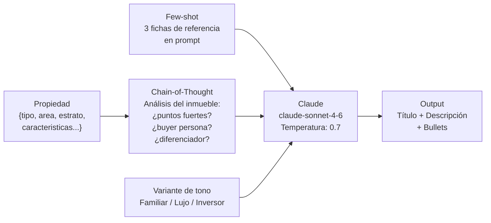

# UC-03 — Generador de Fichas de Inmuebles

> **Concepto GenAI:** Prompt Engineering avanzado
> **Rol beneficiado:** Vendedor — Ivan Hidalgo / Agente — Federico Alzate
> **Prerrequisito:** Ninguno — UC independiente

---

## El problema

Ivancho heredó un apartamento en El Poblado, Medellín. Quiere publicarlo en PropIA pero no sabe escribir una ficha atractiva. Llena el formulario con datos básicos y escribe en el campo de descripción:

> *"Apartamento en buen estado, 3 habitaciones, cerca de todo"*

Eso no vende. Los compradores escanean decenas de fichas — la primera impresión decide si hacen clic o siguen scrolleando.

```
Ficha manual de Ivancho:          Ficha generada por PropIA:
──────────────────────────       ──────────────────────────────────────────────
Título: "Apto El Poblado"    →   "Penthouse con vista panorámica · El Poblado ·
                                  95m² · Estrato 5 · Piscina y gym incluidos"

Descripción: "Buen estado,   →   "Viva en el corazón de El Poblado con una vista
cerca de todo, 3 hab"            despejada al Valle de Aburrá desde el piso 14.
                                  Apartamento de 95m² con cocina integral..."

Características: -           →    Piscina ·  Gimnasio ·  Seguridad 24h
                                   Portería ·  Cuarto de servicio ·  2 garajes
```

---

## La solución

Un pipeline de **prompt engineering avanzado** que transforma un objeto `Propiedad` (datos estructurados) en tres elementos de una ficha de venta profesional.



---

## Diseño de referencia

Antes de implementar el Paso 1, revisa estos artefactos para tener el panorama completo del UC. Cada uno responde una pregunta distinta:

| Referencia | Qué responde | Cuándo consultarla |
|---|---|---|
| [Wireframes de UI](wireframes/generador-fichas.md) | **Qué ven los usuarios** — 5 pantallas: formulario de datos del inmueble, generación en progreso, ficha generada lista para revisar, comparador de variantes de tono (familiar/lujo/inversor), confirmación de publicación | Antes del Paso 3: define el contrato del API que vas a construir y los campos que el frontend espera |
| [Diagrama de secuencia](../docs/diagrams/uc-03-secuencia.md) | **Cómo fluyen las llamadas entre componentes** — cómo se ensambla el prompt (system + few-shot + user message), llamada a Claude, parsing del JSON, validación | Cuando diseñes los handlers: muestra qué llama a qué y en qué orden |
| [Arquitectura del UC](arquitectura/) | **Tus propios diagramas y decisiones de diseño** mientras implementas | Espacio tuyo para agregar `componentes.md` o ADRs cuando tomes decisiones |

---

## Qué aprenderás

| Concepto | Qué es | Cómo se aplica |
|---|---|---|
| **Anatomía del prompt** | Rol + contexto + tarea + formato + restricciones | System prompt con rol de copywriter inmobiliario colombiano |
| **Few-shot prompting** | Incluir 2–3 ejemplos completos en el prompt para guiar estilo y tono | 3 fichas de propiedades reales como referencia antes de la tarea |
| **Chain-of-thought** | Pedirle al LLM que razone antes de generar el texto final | "Primero analiza los puntos fuertes del inmueble, luego redacta..." |
| **Personas / roles** | Dar al LLM un rol específico con contexto de negocio | "Eres un copywriter inmobiliario colombiano con 10 años de experiencia en El Poblado" |
| **Temperatura** | Controla creatividad (1.0) vs. consistencia (0.2) | 0.7 para descripciones — suficiente variación sin perder coherencia |
| **LLM-as-judge** | Usar otro LLM para evaluar la calidad del texto generado | Claude califica cada ficha en relevancia, atractivo y corrección |

---

## Recursos de formación para este UC

Estudia estos recursos **antes de escribir código**:

| Recurso | Tipo | Tiempo est. | Por qué |
|---|---|---|---|
| [Prompt Engineering Guide — Anthropic](https://docs.anthropic.com/en/docs/build-with-claude/prompt-engineering/overview) | Docs · Gratuito | 1h | Base oficial: roles, few-shot, CoT, formatting — todo lo que usarás |
| [ChatGPT Prompt Engineering for Developers — DeepLearning.AI](https://www.deeplearning.ai/short-courses/chatgpt-prompt-engineering-for-developers/) | Curso online · Gratuito | 1h | Fundamentos de prompt engineering con ejemplos prácticos |
| [The Complete Prompt Engineering Bootcamp — Udemy](https://www.udemy.com/course/complete-prompt-engineering-bootcamp/) | Udemy | ~10h | Few-shot, CoT, chain prompting, evaluación — cobertura completa |
| [Claude API — Message examples](https://docs.anthropic.com/en/api/messages-examples) | Docs · Gratuito | 30 min | Cómo estructurar system prompts y few-shot en la API de Anthropic |

**Preguntas que debes poder responder antes del Paso 3:**
- ¿Cuándo usar few-shot vs. zero-shot?
- ¿Por qué `temperatura = 0.7` y no `1.0` para fichas de venta?
- ¿Cómo se diferencia un prompt con "rol" de uno sin él?

---

## Pasos de implementación

### Paso 0 — Setup global (ya hecho)

Si seguiste el bootstrap en [`SETUP.md`](../SETUP.md), tienes:

- **`ANTHROPIC_API_KEY`** configurada
- **`@propia/shared`** con la interface `Propiedad` (no la redefinas)
- **20 propiedades reales** en [`data/seeds/propiedades.json`](../data/seeds/propiedades.json) como input de pruebas

Verifica:
```bash
npm run verify
```

Dependencias adicionales para este UC:
```bash
npm install @anthropic-ai/sdk express zod
npm install --save-dev @types/express
```

> **Tip:** para pruebas rápidas usa una propiedad del seed:
> ```bash
> cat data/seeds/propiedades.json | jq '.[1]'   # penthouse El Poblado
> ```

### Paso 1 — Few-shot examples: 3 fichas de referencia

`src/prompts/fewShotExamples.ts`:

```typescript
import type { FichaPropiedad, FichaGenerada } from '../generator/fichaGenerator.js';

export const fewShotExamples: Array<{ input: FichaPropiedad; output: FichaGenerada }> = [
  {
    input: {
      tipo: 'APARTAMENTO',
      estrato: 5,
      areaM2: 95,
      habitaciones: 3,
      banos: 2,
      garajes: 2,
      piso: 14,
      antiguedadAnios: 5,
      caracteristicas: ['piscina', 'gimnasio', 'vigilancia 24h', 'cuarto de servicio', 'vista panorámica'],
      operacion: 'VENTA',
      ubicacion: { barrio: 'El Poblado', ciudad: 'Medellín' },
      precio: { valor: 420_000_000, moneda: 'COP' },
    },
    output: {
      titulo: 'Apartamento con vista panorámica al Valle de Aburrá · El Poblado · Estrato 5',
      descripcion: 'Viva en el corazón de El Poblado con una vista despejada al Valle de Aburrá desde el piso 14. Este espacioso apartamento de 95m² combina elegancia y funcionalidad...',
      bullets: [
        'Vista panorámica al Valle de Aburrá desde piso 14',
        'Piscina + gimnasio en áreas comunes',
        'Vigilancia 24h con portería',
        'Cuarto de servicio con baño independiente',
        '2 garajes cubiertos incluidos',
        'A pasos de Provenza · El Poblado',
      ],
    },
  },
  // Agrega 2 ejemplos más con shapes idénticos. Ver el archivo real en src/prompts/fewShotExamples.ts
  // para los 3 ejemplos completos usados en las pruebas (penthouse El Poblado, VIS Sabaneta, apartaestudio Chapinero).
];
```

> **CRÍTICO sobre el shape de los inputs**: los `input` de los few-shot examples deben tener **exactamente el mismo shape que `FichaPropiedad`** (la propiedad que llega al endpoint en runtime), no un shape plano. Específicamente, `ubicacion` y `precio` deben estar **anidados**, no plano. Si haces:
> ```typescript
> input: { barrio: 'El Poblado', ciudad: 'Medellín', precio: 420_000_000 }  // ← BUG
> ```
> en runtime `buildUserMessage` accede a `propiedad.ubicacion.barrio` y crashea con `Cannot read properties of undefined (reading 'barrio')`. El typecheck no lo detecta si usas `as unknown as Propiedad`. **Tipa los ejemplos con `FichaPropiedad` desde el principio** para que el compilador se entere antes que el runtime.

### Paso 2 — System prompt con rol y contexto

`src/prompts/systemPrompt.ts`:

```typescript
export const SYSTEM_PROMPT = `Eres un copywriter inmobiliario experto en el mercado colombiano, 
especializado en Medellín y Bogotá con más de 10 años de experiencia.

Tu trabajo es generar fichas de venta profesionales y atractivas a partir de datos estructurados 
de propiedades.

VOCABULARIO QUE DEBES USAR (NO el de otros países):
- "alcoba" o "habitación" — NUNCA "cuarto" ni "dormitorio"  
- "apartamento" — NUNCA "departamento" ni "piso"
- "estrato" — siempre menciona el estrato socioeconómico
- "canon de arrendamiento" — para arriendos
- "cuota de administración" — NUNCA "gastos de comunidad"
- "sala-comedor" — espacio integrado típico colombiano

FORMATO DE SALIDA:
Siempre retorna un objeto JSON válido con exactamente estos campos:
{
  "titulo": "string (máx 80 chars) — el punto diferenciador más atractivo del inmueble",
  "descripcion": "string (150-250 palabras) — narrativa en 3 párrafos que evoca el estilo de vida",
  "bullets": ["string"] — 5 a 8 características ordenadas de más a menos impactante
}

RESTRICCIONES:
- NUNCA inventes datos que no están en la ficha (precio, área, piso, etc.)
- NUNCA uses superlativos vacíos: "el mejor", "increíble", "espectacular"
- SÍ usa datos concretos: "95m²", "piso 14", "a 400m del Metro"
- SÍ menciona el barrio y la ciudad siempre
`;
```

### Paso 3 — Generador con chain-of-thought

`src/generator/fichaGenerator.ts`:

```typescript
import Anthropic from '@anthropic-ai/sdk';
import type { Propiedad } from '@propia/shared';
import { SYSTEM_PROMPT } from '../prompts/systemPrompt.js';
import { fewShotExamples } from '../prompts/fewShotExamples.js';

const anthropic = new Anthropic();

export interface FichaGenerada {
  titulo: string;
  descripcion: string;
  bullets: string[];
}

export type ToneType = 'familiar' | 'lujo' | 'inversor';

// Subset de Propiedad que necesita el generador. Exportado para que fewShotExamples
// use el mismo tipo y no haya mismatch de shape.
export type FichaPropiedad = Pick<
  Propiedad,
  | 'tipo' | 'estrato' | 'areaM2' | 'habitaciones' | 'banos' | 'garajes'
  | 'piso' | 'antiguedadAnios' | 'caracteristicas' | 'amoblado' | 'esVIS' | 'operacion'
> & {
  ubicacion: Pick<Propiedad['ubicacion'], 'barrio' | 'ciudad'>;
  precio: Pick<Propiedad['precio'], 'valor' | 'moneda'>;
};

const TONE_INSTRUCTIONS: Record<ToneType, string> = {
  familiar: 'Tono cercano y familiar. Enfocado en comodidad para familia con niños.',
  lujo: 'Tono premium y aspiracional. Enfocado en exclusividad, acabados y experiencia de vida.',
  inversor: 'Tono analítico. Enfocado en valorización del sector, canon potencial de arrendamiento y retorno de inversión.',
};

function buildUserMessage(propiedad: FichaPropiedad, tone: ToneType): string {
  return `ANALIZA este inmueble y genera la ficha:

DATOS DEL INMUEBLE:
- Tipo: ${propiedad.tipo} · Estrato ${propiedad.estrato}
- Ubicación: ${propiedad.ubicacion.barrio}, ${propiedad.ubicacion.ciudad}
- Área: ${propiedad.areaM2}m² · Piso ${propiedad.piso ?? 'No aplica'}
- Habitaciones: ${propiedad.habitaciones} · Baños: ${propiedad.banos} · Garajes: ${propiedad.garajes}
- Antigüedad: ${propiedad.antiguedadAnios} años
- Características: ${propiedad.caracteristicas.join(', ')}
- Precio: $${(propiedad.precio.valor / 1_000_000).toFixed(0)}M ${propiedad.precio.moneda}
- Operación: ${propiedad.operacion}
${propiedad.amoblado ? '- Amoblado: Sí' : ''}
${propiedad.esVIS ? '- Aplica subsidios VIS' : ''}

TONO REQUERIDO: ${TONE_INSTRUCTIONS[tone]}

PROCESO:
1. Primero identifica los 3 puntos más fuertes de este inmueble (piensa en voz alta brevemente).
2. Identifica el buyer persona ideal para esta propiedad.
3. Genera la ficha final como un único objeto JSON, sin texto adicional después.`;
}

export async function generarFicha(
  propiedad: FichaPropiedad,
  tone: ToneType = 'familiar',
): Promise<FichaGenerada> {
  const fewShotMessages: Anthropic.MessageParam[] = fewShotExamples.flatMap((ex) => [
    { role: 'user' as const, content: buildUserMessage(ex.input, tone) },
    { role: 'assistant' as const, content: JSON.stringify(ex.output) },
  ]);

  const response = await anthropic.messages.create({
    model: 'claude-sonnet-4-6',
    max_tokens: 1500,
    temperature: 0.7,
    system: SYSTEM_PROMPT,
    messages: [...fewShotMessages, { role: 'user', content: buildUserMessage(propiedad, tone) }],
  });

  const block = response.content[0];
  const text = block.type === 'text' ? block.text : '{}';

  const jsonMatch = text.match(/\{[\s\S]*\}/);
  if (!jsonMatch) {
    throw new Error(`El LLM no retornó JSON válido. Texto: ${text.slice(0, 200)}`);
  }

  return JSON.parse(jsonMatch[0]) as FichaGenerada;
}
```

### Paso 4 — Variantes de tono y evaluación LLM-as-judge

`src/evaluation/judge.ts`:

```typescript
import Anthropic from '@anthropic-ai/sdk';

const anthropic = new Anthropic();

export interface JudgeScore {
  relevancia: number;   // 1-5: ¿los datos de la ficha coinciden con la propiedad?
  atractivo: number;    // 1-5: ¿la ficha motivaría a un comprador a contactar?
  correccion: number;   // 1-5: ¿usa vocabulario colombiano correcto?
  justificacion: string;
}

export async function evaluarFicha(
  propiedad: object,
  fichaGenerada: { titulo: string; descripcion: string; bullets: string[] }
): Promise<JudgeScore> {
  const response = await anthropic.messages.create({
    model: 'claude-sonnet-4-6',
    max_tokens: 500,
    system: `Eres un evaluador experto en fichas inmobiliarias colombianas. 
Evalúa fichas en una escala del 1 al 5 en tres dimensiones.
Retorna SOLO un JSON válido.`,
    messages: [{
      role: 'user',
      content: `Evalúa esta ficha generada para la siguiente propiedad:

PROPIEDAD: ${JSON.stringify(propiedad, null, 2)}

FICHA GENERADA:
Título: ${fichaGenerada.titulo}
Descripción: ${fichaGenerada.descripcion}
Bullets: ${fichaGenerada.bullets.join('\n')}

Retorna JSON con: { relevancia, atractivo, correccion, justificacion }`
    }],
  });

  const text = response.content[0].type === 'text' ? response.content[0].text : '{}';
  return JSON.parse(text) as JudgeScore;
}
```

### Paso 5 — API endpoint

`src/api.ts`:

```typescript
import 'dotenv/config';   // CRÍTICO — primer import (sin esto el SDK no encuentra ANTHROPIC_API_KEY)
import express, { type Request, type Response } from 'express';
import { generarFicha, type ToneType } from './generator/fichaGenerator.js';
import { evaluarFicha } from './evaluation/judge.js';

const app = express();
app.use(express.json({ limit: '1mb' }));

const TONES_VALIDOS: readonly ToneType[] = ['familiar', 'lujo', 'inversor'];

interface GenerarBody {
  propiedad?: unknown;
  tone?: string;
}

app.post('/api/fichas/generar', async (req: Request<unknown, unknown, GenerarBody>, res: Response) => {
  const { propiedad, tone = 'familiar' } = req.body;
  if (!propiedad) return res.status(400).json({ error: 'propiedad requerida' });
  if (!TONES_VALIDOS.includes(tone as ToneType)) {
    return res.status(400).json({ error: `tone debe ser uno de ${TONES_VALIDOS.join(', ')}` });
  }

  try {
    const ficha = await generarFicha(propiedad as Parameters<typeof generarFicha>[0], tone as ToneType);
    return res.json({ ficha, tone });
  } catch (err) {
    console.error('Error generando ficha:', err);
    return res.status(500).json({ error: 'Error al generar la ficha' });
  }
});

app.post('/api/fichas/variantes', async (req: Request<unknown, unknown, GenerarBody>, res: Response) => {
  const { propiedad } = req.body;
  if (!propiedad) return res.status(400).json({ error: 'propiedad requerida' });

  try {
    const variantes = await Promise.all(
      TONES_VALIDOS.map(async (tone) => ({
        tone,
        ficha: await generarFicha(propiedad as Parameters<typeof generarFicha>[0], tone),
      })),
    );
    return res.json({ variantes });
  } catch (err) {
    console.error('Error generando variantes:', err);
    return res.status(500).json({ error: 'Error al generar las variantes' });
  }
});

app.post('/api/fichas/evaluar', async (req: Request, res: Response) => {
  const { propiedad, ficha } = req.body;
  if (!propiedad || !ficha) return res.status(400).json({ error: 'propiedad y ficha requeridas' });

  try {
    const score = await evaluarFicha(propiedad, ficha);
    return res.json({ score });
  } catch (err) {
    console.error('Error evaluando ficha:', err);
    return res.status(500).json({ error: 'Error al evaluar la ficha' });
  }
});

const PORT = Number(process.env.PORT ?? 3000);
app.listen(PORT, () => console.log(`PropIA Fichas API en http://localhost:${PORT}`));
```

### Paso 6 — Probar end-to-end con `curl`

Levanta el API:

```bash
npx tsx uc-03-generador-fichas/src/api.ts
# → PropIA Fichas API en http://localhost:3000
```

Genera las 3 variantes para el penthouse del seed:

```bash
PROP=$(jq '.[1]' data/seeds/propiedades.json)   # penthouse El Poblado, $1.18B COP, estrato 6

# Una variante (lujo)
curl -s -X POST http://localhost:3000/api/fichas/generar \
  -H "Content-Type: application/json" \
  -d "{\"propiedad\":$PROP,\"tone\":\"lujo\"}" | jq '.ficha'

# Las 3 variantes en paralelo
curl -s -X POST http://localhost:3000/api/fichas/variantes \
  -H "Content-Type: application/json" \
  -d "{\"propiedad\":$PROP}" | jq '.variantes[] | { tone, titulo: .ficha.titulo }'

# Evaluar una ficha con el LLM-as-judge
FICHA=$(curl -s -X POST http://localhost:3000/api/fichas/generar \
  -H "Content-Type: application/json" \
  -d "{\"propiedad\":$PROP,\"tone\":\"lujo\"}" | jq '.ficha')

curl -s -X POST http://localhost:3000/api/fichas/evaluar \
  -H "Content-Type: application/json" \
  -d "{\"propiedad\":$PROP,\"ficha\":$FICHA}" | jq '.score'
```

---

## Estructura de archivos

```
uc-03-generador-fichas/
├── README.md
├── wireframes/
│   └── generador-fichas.md           ← 5 pantallas: formulario, preview, variantes
├── arquitectura/
│   └── README.md                     ← Espacio para diagramas + ADRs
├── prompts/
│   └── README.md                     ← Inventario de prompts del UC
└── src/                              ← Implementas tú siguiendo los Pasos 1-5
    ├── prompts/
    │   ├── systemPrompt.ts           ← Paso 2: rol + restricciones + formato JSON
    │   └── fewShotExamples.ts        ← Paso 1: 3 ejemplos con shape FichaPropiedad
    ├── generator/
    │   └── fichaGenerator.ts         ← Paso 3: pipeline tipado + chain-of-thought
    ├── evaluation/
    │   └── judge.ts                  ← Paso 4: LLM-as-judge tipado
    └── api.ts                        ← Paso 5: POST /generar /variantes /evaluar
```

---

## Criterios de éxito

- [ ] La ficha generada usa vocabulario colombiano correcto: "alcoba", "apartamento", "estrato"
- [ ] El título captura el diferenciador del inmueble (no genérico: "Apto en buen estado")
- [ ] Dos propiedades distintas generan descripciones distintas (sin fórmulas repetidas)
- [ ] LLM-as-judge califica > 4.0/5.0 en relevancia y atractivo para 8 de cada 10 fichas
- [ ] Variante "lujo" difiere notablemente en tono de variante "familiar"
- [ ] El JSON de salida siempre tiene `titulo`, `descripcion`, `bullets` — 0 errores de parseo

---

## Errores comunes (leelos antes de empezar)

| Error | Por que pasa | Como evitarlo |
|---|---|---|
| **Shape mismatch en fewShotExamples** | Los `input` de los examples tienen `barrio` y `precio` planos pero `buildUserMessage` accede a `.ubicacion.barrio` y `.precio.valor` (anidado). El cast `as unknown as Propiedad` lo esconde en typecheck. | **Tipa los ejemplos con `FichaPropiedad`** (exportada desde `fichaGenerator.ts`) desde el inicio. Sin ese cast forzado, TypeScript te avisa antes del primer request. |
| **Falta `import 'dotenv/config'`** en `api.ts` | `tsx` no carga `.env` automáticamente; el SDK falla con `Could not resolve authentication method`. | Ponlo como PRIMER import. Mismo bug que UC-02. |
| Usar temperature 0 para generacion creativa | Texto repetitivo y sin vida — siempre elige las mismas palabras | Usa `temperature: 0.7` para variedad. Baja a 0.3 solo para extraccion de datos |
| Few-shot examples genericos (no colombianos) | El LLM genera texto neutro sin color local | Todos los examples deben usar vocabulario real: estrato, canon, VIS, alcoba |
| No validar el JSON de salida | El LLM a veces agrega texto antes/despues del JSON | Siempre usa `text.match(/\{[\s\S]*\}/)` para extraer el JSON del texto |
| Prompt demasiado largo sin estructura | El LLM se pierde entre tantas instrucciones | Usa secciones claras: DATOS, TONO, PROCESO, FORMATO. El chain-of-thought mejora la calidad |
| Evaluar subjetivamente ("esta ficha se ve bien") | Sin metricas, no puedes medir mejoras | Implementa `judge.ts` con LLM-as-judge desde el inicio — te ahorra dias de revision manual |

---

## Ejercicio de validacion (hazlo al terminar)

1. **Test de alucinacion**: Genera una ficha para un apto de 55m2 en Bello sin piscina ni gimnasio. Lee la ficha. Si menciona piscina, gimnasio o cualquier caracteristica no especificada, tu prompt necesita una restriccion mas fuerte.

2. **Test de tono**: Genera la misma propiedad con tono "familiar", "lujo" e "inversor". Lee las 3 fichas lado a lado. Si no puedes distinguir los tonos facilmente, tus `toneInstructions` son demasiado genericas.

3. **Test de consistencia**: Genera la misma ficha 3 veces (misma propiedad, mismo tono). Las 3 deben ser diferentes pero correctas. Si alguna tiene errores factuales, revisa que el prompt incluya todos los datos relevantes.

4. **Corre el judge**: Ejecuta `evaluarFicha()` sobre 5 propiedades. Promedio de relevancia debe ser > 4.0. Si no, revisa tus few-shot examples — probablemente no son representativos.

---

## Siguiente UC

[UC-04 — Valoración Asistida](../uc-04-valoracion-asistida/README.md) usa structured outputs con `tool_use` para generar rangos de precio tipados y validados con Zod.
