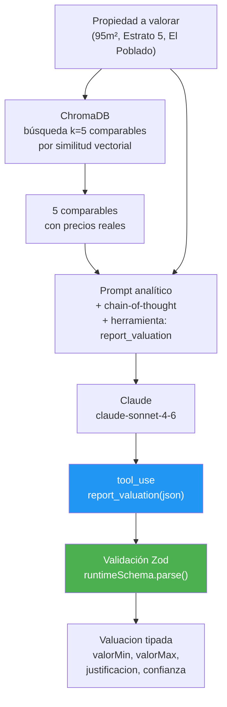

# UC-04 — Valoración Asistida de Propiedades

> **Concepto GenAI:** Structured Outputs + análisis con razonamiento
> **Rol beneficiado:** Comprador — Valentina Alzate / Vendedor — Ivan Hidalgo
> **Prerrequisito:** UC-01 completado (ChromaDB con propiedades como comparables)

---

## El problema

Ivancho quiere saber si $420M COP es un precio justo para su apartamento de 95m² en El Poblado. Valentina quiere saber si la propiedad que le gusta está sobrevaluada.

Ninguno tiene acceso a datos de mercado. El agente tradicional tarda días en conseguir comparables. Y cuando lo hace, entrega un número sin justificación.

```
Valoración tradicional:             Valoración asistida PropIA:
──────────────────────────────      ──────────────────────────
"Más o menos $400–450M"         →   {
Sin respaldo de datos                 valorMin: 395_000_000,
Sin justificación                     valorMax: 435_000_000,
Demora 2–3 días                       valorSugerido: 410_000_000,
Sin confianza calibrada               confianza: "ALTA",
                                      comparablesUsados: 5,
                                      factoresPositivos: [...],
                                      factoresNegativos: [...],
                                      justificacion: "..."
                                    }
```

---

## La solución

El LLM analiza los comparables recuperados del vector DB de UC-01, aplica factores de ajuste (piso, antigüedad, características) y devuelve un rango de valoración en JSON estrictamente tipado con Zod.



---

## Diseño de referencia

Antes de implementar el Paso 1, revisa estos artefactos para tener el panorama completo del UC. Cada uno responde una pregunta distinta:

| Referencia | Qué responde | Cuándo consultarla |
|---|---|---|
| [Wireframes de UI](wireframes/valoracion-asistida.md) | **Qué ven los usuarios** — 5 pantallas: formulario de solicitud, búsqueda de comparables en progreso, resultado con rango y nivel de confianza, detalle de los comparables usados, comparación precio pedido vs. valoración | Antes del Paso 3: define el contrato del API que vas a construir y los campos que el frontend espera |
| [Diagrama de secuencia](../docs/diagrams/uc-04-secuencia.md) | **Cómo fluyen las llamadas entre componentes** — el pipeline propiedad → ChromaDB → comparables → Claude con tool_use → JSON validado por Zod | Cuando diseñes los handlers: muestra qué llama a qué y en qué orden |
| [Arquitectura del UC](arquitectura/) | **Tus propios diagramas y decisiones de diseño** mientras implementas | Espacio tuyo para agregar `componentes.md` o ADRs cuando tomes decisiones |

---

## Qué aprenderás

| Concepto | Qué es | Cómo se aplica |
|---|---|---|
| **Structured outputs** | Forzar al LLM a responder en un schema JSON específico | `tool_use` con `input_schema` obliga al LLM a producir JSON válido |
| **Zod** | Librería de validación de schemas en TypeScript | Valida en runtime que el JSON del LLM cumple exactamente el tipo `Valuacion` |
| **Chain-of-thought analítico** | Razonamiento explícito antes de concluir | "Paso 1: listar comparables. Paso 2: ajustar por diferencias. Paso 3: calcular rango." |
| **Confianza calibrada** | El modelo debe expresar incertidumbre cuando los datos son insuficientes | `confianza: 'BAJA'` si solo hay 1 comparable, `'ALTA'` si hay 5+ |
| **Comparable scoring** | Qué tan similar es un comparable al inmueble a valorar | `scoreSimilititud: 0.92` — calculado por distancia coseno de ChromaDB |

---

## Recursos de formación para este UC

Estudia estos recursos **antes de escribir código**:

| Recurso | Tipo | Tiempo est. | Por qué |
|---|---|---|---|
| [Tool use — Documentación Anthropic](https://docs.anthropic.com/en/docs/build-with-claude/tool-use) | Docs · Gratuito | 45 min | Cómo usar `tools` y `tool_use` para structured outputs en Claude API |
| [Zod — Documentación oficial](https://zod.dev/) | Docs · Gratuito | 30 min | Validación de schemas TypeScript en runtime — el estándar actual |
| [LangChain Framework: Build AI Systems + RAG — Udemy](https://www.udemy.com/course/langchain-framework-for-beginners-build-ai-systems-rag/) | Udemy | ~6.5h | Cubre RAG, tool calling, structured outputs y agentes en TypeScript con LangChain 1.0 |
| [Chain of Thought Prompting — DeepLearning.AI](https://www.deeplearning.ai/short-courses/chatgpt-prompt-engineering-for-developers/) | Curso online · Gratuito | 30 min | Módulo sobre CoT prompting aplicado a razonamiento analítico |

**Preguntas que debes poder responder antes del Paso 3:**
- ¿Por qué `tool_use` garantiza JSON válido mejor que pedirle al LLM "responde en JSON"?
- ¿Qué hace `z.parse()` vs. `z.safeParse()` en Zod?
- ¿Cuándo marcar confianza `BAJA` aunque el modelo tenga algún comparable?

---

## Pasos de implementación

### Paso 0 — Setup global (ya hecho)

Si seguiste el bootstrap en [`SETUP.md`](../SETUP.md):

- **ChromaDB** con las 20 propiedades indexadas (de aquí salen los comparables)
- **`@propia/embeddings`**, **`@propia/db`**, **`@propia/shared`** disponibles
- **`ANTHROPIC_API_KEY`** configurada

`@propia/shared` ya exporta `Comparable`, `Valuacion`, `NivelConfianza` — no los redefinas. Si necesitas el schema runtime de Zod, créalo en `src/schemas/valuacionSchema.ts` y haz que infiera del tipo de `@propia/shared` con `z.ZodType<Valuacion>` para mantener sincronía.

Verifica:
```bash
npm run verify
```

Dependencias adicionales:
```bash
npm install @anthropic-ai/sdk express zod
npm install --save-dev @types/express
```

### Paso 1 — Schema de valoración con Zod

`src/schemas/valuacionSchema.ts`:

```typescript
import type Anthropic from '@anthropic-ai/sdk';
import type { Valuacion } from '@propia/shared';
import { z } from 'zod';

export const NivelConfianzaSchema = z.enum(['ALTA', 'MEDIA', 'BAJA']);

export const ValuacionSchema = z.object({
  valorMin: z.number().positive(),
  valorMax: z.number().positive(),
  valorSugerido: z.number().positive(),
  moneda: z.literal('COP'),
  confianza: NivelConfianzaSchema,
  comparablesUsados: z.number().int().min(0),
  justificacion: z.string().min(50),
  factoresPositivos: z.array(z.string()).min(1),
  factoresNegativos: z.array(z.string()),
  fechaValuacion: z.string().datetime(),
}) satisfies z.ZodType<Valuacion>;

// `satisfies z.ZodType<Valuacion>` garantiza que el schema runtime concuerda con el tipo
// del dominio en @propia/shared. Si el shape diverge, el typecheck falla — exactamente lo
// que un Test Architect quiere que pase en CI antes del runtime.

// Tool definition para la API de Claude
export const VALUATION_TOOL: Anthropic.Tool = {
  name: 'report_valuation',
  description: 'Reporta el resultado del análisis de valoración de la propiedad',
  input_schema: {
    type: 'object',
    properties: {
      valorMin: { type: 'number', description: 'Valor mínimo estimado en COP' },
      valorMax: { type: 'number', description: 'Valor máximo estimado en COP' },
      valorSugerido: { type: 'number', description: 'Valor sugerido de publicación en COP' },
      moneda: { type: 'string', enum: ['COP'] },
      confianza: { type: 'string', enum: ['ALTA', 'MEDIA', 'BAJA'],
        description: 'ALTA: 4+ comparables muy similares. MEDIA: 2-3 comparables. BAJA: <2 comparables' },
      comparablesUsados: { type: 'integer', description: 'Número de comparables analizados' },
      justificacion: { type: 'string', description: 'Explicación del rango en 2-3 párrafos' },
      factoresPositivos: { type: 'array', items: { type: 'string' }, description: 'Factores que suben el precio' },
      factoresNegativos: { type: 'array', items: { type: 'string' }, description: 'Factores que bajan el precio' },
      fechaValuacion: { type: 'string', format: 'date-time' },
    },
    required: ['valorMin', 'valorMax', 'valorSugerido', 'moneda', 'confianza',
               'comparablesUsados', 'justificacion', 'factoresPositivos',
               'factoresNegativos', 'fechaValuacion'],
  },
};
```

### Paso 2 — Búsqueda de comparables en ChromaDB

`src/comparables/comparablesSearch.ts`:

```typescript
import { embed } from '@propia/embeddings';
import { getOrCreateCollection, COLECCION_PROPIEDADES } from '@propia/db';

export interface ComparableRetrieval {
  propiedadId: string;
  documento: string;
  scoreSimilititud: number;
  metadata: Record<string, unknown>;
}

export interface ComparablesFilters {
  ciudad?: string;
  estratoMin?: number;
  estratoMax?: number;
  excluirId?: string; // útil para no usar la propiedad como su propio comparable
}

export async function buscarComparables(
  propiedadQuery: string,
  filters?: ComparablesFilters,
  k = 5,
): Promise<ComparableRetrieval[]> {
  const collection = await getOrCreateCollection(COLECCION_PROPIEDADES);
  const queryVector = await embed(propiedadQuery);

  // ChromaDB v2 NO acepta `{ $gte: N, $lte: M }` juntos en un mismo objeto.
  // Convertimos el rango de estratos a lista discreta con $in (estratos son 1..6).
  // Para combinar varios filtros usamos $and explícito.
  const conditions: Record<string, unknown>[] = [];
  if (filters?.ciudad) conditions.push({ ciudad: filters.ciudad });
  if (filters?.estratoMin !== undefined && filters?.estratoMax !== undefined) {
    const estratos: number[] = [];
    for (let e = filters.estratoMin; e <= filters.estratoMax; e++) estratos.push(e);
    conditions.push({ estrato: { $in: estratos } });
  }
  const whereClause =
    conditions.length === 0
      ? undefined
      : conditions.length === 1
        ? conditions[0]
        : { $and: conditions };

  // Pedimos k+1 si vamos a filtrar la propia propiedad después
  const results = await collection.query({
    queryEmbeddings: [queryVector],
    nResults: filters?.excluirId ? k + 1 : k,
    where: whereClause,
  });

  const items: ComparableRetrieval[] = (results.ids[0] ?? []).map((id, i) => ({
    propiedadId: id,
    documento: results.documents[0]?.[i] ?? '',
    scoreSimilititud: 1 - (results.distances?.[0]?.[i] ?? 1),
    metadata: (results.metadatas[0]?.[i] ?? {}) as Record<string, unknown>,
  }));

  return (filters?.excluirId ? items.filter((c) => c.propiedadId !== filters.excluirId) : items).slice(0, k);
}
```

### Paso 3 — Motor de valoración con tool_use

`src/valuation/valuationEngine.ts`:

```typescript
import Anthropic from '@anthropic-ai/sdk';
import type { Propiedad, Valuacion } from '@propia/shared';
import { buscarComparables } from '../comparables/comparablesSearch.js';
import { VALUATION_TOOL, ValuacionSchema } from '../schemas/valuacionSchema.js';

const anthropic = new Anthropic();

const SYSTEM_PROMPT = `Eres un perito inmobiliario colombiano certificado, especializado en 
valoración de propiedades en Medellín y Bogotá.

Tu proceso de valoración SIEMPRE sigue estos pasos:
1. Analiza las características del inmueble a valorar
2. Revisa los comparables disponibles y evalúa su similitud
3. Aplica ajustes por: piso, antigüedad, características diferenciales, estado del mercado
4. Calcula un rango conservador (±10-15% del valor central)
5. Determina el nivel de confianza según la cantidad y calidad de comparables
6. Usa la herramienta report_valuation para reportar el resultado

REGLAS CRÍTICAS:
- Valores siempre en COP (pesos colombianos)
- Si tienes menos de 2 comparables, la confianza es BAJA siempre
- Si el inmueble está en zona sin comparables directos, amplía el rango
- NUNCA inventes comparables — solo usa los que te proporcionan`;

// Subset de Propiedad que necesita el motor — no requiere imágenes, propietarioId, etc.
type ValuationInput = Pick<
  Propiedad,
  | 'id' | 'tipo' | 'operacion' | 'estrato' | 'areaM2' | 'habitaciones'
  | 'banos' | 'garajes' | 'piso' | 'antiguedadAnios' | 'caracteristicas'
> & {
  ubicacion: Pick<Propiedad['ubicacion'], 'barrio' | 'ciudad'>;
};

export async function valorarPropiedad(propiedad: ValuationInput): Promise<Valuacion> {
  // 1. Construir query de búsqueda
  const query =
    `${propiedad.tipo} ${propiedad.areaM2}m² Estrato ${propiedad.estrato} ` +
    `${propiedad.ubicacion.barrio} ${propiedad.ubicacion.ciudad} ` +
    `${propiedad.habitaciones} habitaciones`;

  // 2. Recuperar comparables (excluyendo la propia propiedad si está indexada)
  const comparables = await buscarComparables(query, {
    ciudad: propiedad.ubicacion.ciudad,
    estratoMin: Math.max(1, propiedad.estrato - 1),
    estratoMax: Math.min(6, propiedad.estrato + 1),
    excluirId: propiedad.id,
  });

  // 3. Construir mensaje con datos + comparables.
  //    IMPORTANTE: incluir `operacion` para que el LLM sepa si valorar como
  //    precio de venta o canon mensual de arriendo.
  const comparablesTexto = comparables.length === 0
    ? 'NO HAY COMPARABLES DISPONIBLES — la confianza debe ser BAJA y el rango muy amplio.'
    : comparables.map((c, i) => {
        const precio = typeof c.metadata['precio'] === 'number' ? c.metadata['precio'] : 0;
        return `[${i + 1}] Similitud: ${(c.scoreSimilititud * 100).toFixed(0)}%
  ${c.documento}
  Precio: $${(precio / 1_000_000).toFixed(0)}M COP`;
      }).join('\n\n');

  const userMessage = `PROPIEDAD A VALORAR:
Tipo: ${propiedad.tipo} · Operación: ${propiedad.operacion} · Estrato ${propiedad.estrato}
Ubicación: ${propiedad.ubicacion.barrio}, ${propiedad.ubicacion.ciudad}
Área: ${propiedad.areaM2}m² · Piso ${propiedad.piso ?? 'Casa'}
Habitaciones: ${propiedad.habitaciones} · Baños: ${propiedad.banos} · Garajes: ${propiedad.garajes}
Antigüedad: ${propiedad.antiguedadAnios} años
Características: ${propiedad.caracteristicas.join(', ')}

NOTA: Si la operación es ARRIENDO, el valor reportado debe ser el canon mensual (no precio de venta).

COMPARABLES DISPONIBLES (${comparables.length}):
${comparablesTexto}

Analiza y usa la herramienta report_valuation con el resultado.`;

  // 4. Llamar al LLM con tool_use
  const response = await anthropic.messages.create({
    model: 'claude-sonnet-4-6',
    max_tokens: 2000,
    system: SYSTEM_PROMPT,
    tools: [VALUATION_TOOL],
    tool_choice: { type: 'any' },
    messages: [{ role: 'user', content: userMessage }],
  });

  // 5. Extraer el tool_use del response
  const toolUse = response.content.find((b) => b.type === 'tool_use');
  if (!toolUse || toolUse.type !== 'tool_use') {
    throw new Error('El LLM no usó la herramienta de valoración');
  }

  // 6. Validar con Zod — el tool no pide fechaValuacion, la pone el servidor
  return ValuacionSchema.parse({
    ...(toolUse.input as object),
    fechaValuacion: new Date().toISOString(),
  });
}
```

### Paso 4 — API endpoint

`src/api.ts`:

```typescript
import 'dotenv/config'; // CRÍTICO — primer import para que el SDK encuentre ANTHROPIC_API_KEY
import express, { type Request, type Response } from 'express';
import { ZodError } from 'zod';
import { valorarPropiedad } from './valuation/valuationEngine.js';

const app = express();
app.use(express.json({ limit: '1mb' }));

interface ValoracionBody {
  propiedad?: unknown;
}

app.post('/api/valoracion', async (req: Request<unknown, unknown, ValoracionBody>, res: Response) => {
  const { propiedad } = req.body;
  if (!propiedad) return res.status(400).json({ error: 'propiedad requerida' });

  try {
    const valuacion = await valorarPropiedad(propiedad as Parameters<typeof valorarPropiedad>[0]);
    return res.json({ valuacion });
  } catch (err) {
    if (err instanceof ZodError) {
      // El LLM devolvió JSON inválido — raro con tool_use pero posible
      return res.status(422).json({
        error: 'Respuesta de valoración inválida',
        details: err.issues,
      });
    }
    console.error('Error en valoración:', err);
    return res.status(500).json({ error: 'Error en el motor de valoración' });
  }
});

const PORT = Number(process.env.PORT ?? 3000);
app.listen(PORT, () => console.log(`PropIA Valoración API en http://localhost:${PORT}`));
```

### Paso 5 — Probar end-to-end con `curl`

```bash
# Arrancar el API
npx tsx uc-04-valoracion-asistida/src/api.ts

# Test 1: apto Laureles (precio listado $485M) — esperamos rango cercano
PROP=$(jq '.[4]' data/seeds/propiedades.json)   # prop-mde-005
curl -s -X POST http://localhost:3000/api/valoracion \
  -H "Content-Type: application/json" \
  -d "{\"propiedad\":$PROP}" | jq '.valuacion | { valorMin, valorSugerido, valorMax, confianza, comparablesUsados }'

# Test 2: local comercial en arriendo (precio listado $9.5M/mes)
PROP=$(jq '.[19]' data/seeds/propiedades.json)   # prop-bog-020
curl -s -X POST http://localhost:3000/api/valoracion \
  -H "Content-Type: application/json" \
  -d "{\"propiedad\":$PROP}" | jq '.valuacion | { valorMin, valorSugerido, valorMax, confianza }'
```

---

## Estructura de archivos

```
uc-04-valoracion-asistida/
├── README.md
├── wireframes/
│   └── valoracion-asistida.md         ← 5 pantallas: formulario, análisis, resultado
├── arquitectura/
│   └── README.md                      ← Espacio para diagramas + ADRs
├── prompts/
│   └── README.md                      ← Inventario de prompts del UC
└── src/                                ← Implementas tú siguiendo los Pasos 1-4
    ├── schemas/
    │   └── valuacionSchema.ts          ← Paso 1: Zod schema satisfies Valuacion + tool def
    ├── comparables/
    │   └── comparablesSearch.ts        ← Paso 2: búsqueda vectorial con $and + $in para ChromaDB v2
    ├── valuation/
    │   └── valuationEngine.ts          ← Paso 3: pipeline con tool_use; incluye operacion en prompt
    └── api.ts                          ← Paso 4: POST /api/valoracion (con dotenv/config)
```

---

## Criterios de éxito

- [ ] El JSON retornado siempre pasa `ValuacionSchema.parse()` — 0 errores de Zod en 50 intentos
- [ ] La valoración sugerida está dentro del ±15% del precio de los comparables para propiedades conocidas
- [ ] `confianza: 'ALTA'` solo cuando hay 4+ comparables con similitud > 0.7
- [ ] `confianza: 'BAJA'` cuando hay menos de 2 comparables — nunca subestimado
- [ ] La justificación menciona específicamente los comparables usados y los ajustes aplicados
- [ ] Tiempo de respuesta < 8 segundos (incluye búsqueda en ChromaDB + llamada al LLM)

---

## Errores comunes (leelos antes de empezar)

| Error | Por que pasa | Como evitarlo |
|---|---|---|
| **ChromaDB v2: `where: { field: { $gte: N, $lte: M } }`** | La versión v2 NO acepta dos operadores juntos. Falla con `Invalid where clause`. | Usa `{ $in: [a, b, c] }` para listas, o `{ $and: [{ field: { $gte: N } }, { field: { $lte: M } }] }`. |
| **`Where` con varios campos sin `$and`** | `{ ciudad: 'X', estrato: ... }` también falla en v2. | Envuélvelo: `{ $and: [{ ciudad: 'X' }, { estrato: { $in: [...] } }] }` |
| **No pasar `operacion` al LLM** | El LLM no sabe si valorar como venta ($) o canon mensual ($/mes); valora todo como venta por defecto. Vas a notarlo si pruebas un inmueble en arriendo y obtienes un precio de venta. | Incluye `Operación: ${propiedad.operacion}` en el prompt + nota explícita "si es ARRIENDO el valor es canon mensual". |
| **No excluir la propia propiedad** del retrieval | Si valoras una propiedad ya indexada, sale como su propio comparable con 100% similitud. | Pasa `excluirId: propiedad.id` a `buscarComparables`. |
| **Falta `import 'dotenv/config'`** en `api.ts` | El SDK falla con `Could not resolve authentication method`. Si nunca configuraste dotenv en el entry point, este error es casi seguro. | Pon `import 'dotenv/config'` como PRIMER import. |
| Usar `z.parse()` en producción sin catch | Si el LLM retorna JSON inválido, tu app crashea | Usa `z.safeParse()` y maneja el error con un retry o mensaje al usuario |
| No definir `tool_choice: { type: 'any' }` | Sin esto, el LLM puede responder en texto libre en vez de usar la tool | Siempre fuerza `tool_choice` cuando necesitas structured output |
| Confiar en la confianza del LLM | El LLM tiende a decir "ALTA" confianza aunque tenga pocos comparables | Refuerza en el system prompt: "Si tienes menos de 2 comparables, la confianza es BAJA siempre" |
| Schema Zod demasiado permisivo | `z.string()` sin `.min()` acepta strings vacíos | Agrega validaciones: `.min(50)` para justificación, `.positive()` para valores monetarios, `.array().min(1)` para factoresPositivos |
| No testear edge cases | ¿Qué pasa si ChromaDB retorna 0 comparables? | Tu código debe manejar el caso sin comparables: confianza BAJA, rango amplio. Pruébalo con un tipo de inmueble que no aparezca en el seed (un local comercial, una finca, una bodega). |

---

## Ejercicio de validacion (hazlo al terminar)

1. **Test de schema**: Envia la misma propiedad 10 veces. Las 10 deben pasar `ValuacionSchema.parse()`. Si alguna falla, tu tool definition tiene ambiguedades.

2. **Test de confianza**: Valorar una propiedad en una zona con 0 comparables en ChromaDB. La confianza debe ser BAJA. Si el LLM dice MEDIA o ALTA, refuerza la regla en el system prompt.

3. **Compara `z.parse()` vs `z.safeParse()`**: Haz que el LLM retorne un JSON con un campo faltante. Observa como `parse()` lanza error y `safeParse()` retorna `{ success: false, error }`. Decide cual usar en tu API.

4. **Mide consistencia**: Valora la misma propiedad 3 veces. Los rangos deben solaparse. Si uno dice $280M-$320M y otro $400M-$450M, tu set de comparables es inconsistente.

---

## Siguiente UC

[UC-05 — Agente de Leads](../uc-05-agente-leads/README.md) usa AI Agents con tool calling y LangGraph para automatizar el seguimiento de leads de Federico.
