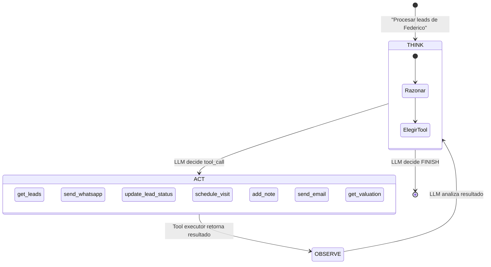

# UC-05 — Agente de Seguimiento de Leads

> **Concepto GenAI:** AI Agents + Tool Calling
> **Rol beneficiado:** Agente / Broker — Federico Alzate
> **Prerrequisito:** UC-02 (memoria conversacional), UC-03 (generación de texto para mensajes)

---

## El problema

Federico tiene 40 propiedades activas y 25 leads en distintos estados. El seguimiento manual es imposible:

- Leads "NUEVO" llevan 3 días sin respuesta — el cliente ya contactó a otro agente
- Leads "EN_VISITA" necesitan follow-up post-visita, pero Federico olvidó
- Leads "CONTACTADO" pidieron info adicional hace una semana y nunca recibieron respuesta
- No hay un sistema — todo vive en WhatsApp, Excel y la memoria de Federico

> *"Si pudiera automatizar el seguimiento de leads y la generación de fichas, duplicaría mi cartera sin contratar a nadie"* — Federico

```
Gestión manual de Federico:     Agente autónomo PropIA:
──────────────────────────────      ──────────────────────────────────────
WhatsApp + Excel + memoria      →   Loop ReAct con 7 herramientas
Responde cuando recuerda        →   Procesa 25 leads en < 2 minutos
Sin trazabilidad de acciones    →   Cada acción registrada con justificación
3 leads perdidos por semana     →   0 leads sin respuesta > 24h
```

---

## La solución

Un agente basado en el patrón **ReAct** (Reason → Act → Observe) implementado con LangGraph que:

1. Lee el estado actual de todos los leads de Federico
2. Razona qué acción corresponde a cada lead
3. Ejecuta las acciones: envía mensajes, actualiza estados, agenda visitas
4. Observa los resultados y decide si hay más acciones necesarias



---

## Diseño de referencia

Antes de implementar el Paso 1, revisa estos artefactos para tener el panorama completo del UC. Cada uno responde una pregunta distinta:

| Referencia | Qué responde | Cuándo consultarla |
|---|---|---|
| [Wireframes de UI](wireframes/agente-leads.md) | **Qué ven los usuarios** — 5 pantallas: dashboard de leads por estado, log en tiempo real del agente (think → act → observe), resumen de ejecución con acciones tomadas, detalle de lead con historial de tools, panel de configuración del agente | Antes del Paso 3: define el contrato del API que vas a construir y los campos que el frontend espera |
| [Diagrama de secuencia](../docs/diagrams/uc-05-secuencia.md) | **Cómo fluyen las llamadas entre componentes** — el loop ReAct completo: cada iteración con tool_use → executor → tool_result → siguiente decisión, con condición de parada | Cuando diseñes los handlers: muestra qué llama a qué y en qué orden |
| [Arquitectura del UC](arquitectura/) | **Tus propios diagramas y decisiones de diseño** mientras implementas | Espacio tuyo para agregar `componentes.md` o ADRs cuando tomes decisiones |

---

## Qué aprenderás

| Concepto | Qué es | Cómo se aplica |
|---|---|---|
| **Tool Calling** | El LLM decide qué herramienta usar y con qué parámetros | Claude recibe 7 tool schemas y elige cuál ejecutar en cada paso |
| **ReAct pattern** | Loop de razonamiento: Thought → Action → Observation | El agente razona en texto antes de elegir cada acción |
| **LangGraph** | Framework para modelar agentes como grafos de estados con LangChain.js | Nodos: THINK, ACT, OBSERVE. Edges: condicionales según output del LLM |
| **Observabilidad** | Registro de cada paso del agente para debugging | Cada tool call, resultado y razonamiento se persiste en DB |
| **Testing de agentes** | Cómo testear comportamiento no-determinístico | Tests de escenario con mock de tools + assertions sobre patrones de acción |

---

## Recursos de formación para este UC

Estudia estos recursos **antes de escribir código**:

| Recurso | Tipo | Tiempo est. | Por qué |
|---|---|---|---|
| [Tool use con Claude — Anthropic Docs](https://docs.anthropic.com/en/docs/build-with-claude/tool-use) | Docs · Gratuito | 45 min | Cómo definir tools, manejar `tool_use` y `tool_result` en el loop |
| [LangGraph.js — Documentación oficial](https://langchain-ai.github.io/langgraphjs/) | Docs · Gratuito | 1h | StateGraph, Nodes, Edges — el framework del agente |
| [Building Agents with LangGraph — DeepLearning.AI](https://www.deeplearning.ai/short-courses/ai-agents-in-langgraph/) | Curso · Gratuito | 2h | ReAct, tool calling y ciclos de agente con LangGraph en Python (los conceptos aplican a JS) |
| [LangChain Framework: Build AI Systems + RAG — Udemy](https://www.udemy.com/course/langchain-framework-for-beginners-build-ai-systems-rag/) | Udemy | ~6.5h | Agentes con tool calling, RAG, LangGraph deployment en TypeScript |

**Preguntas que debes poder responder antes del Paso 3:**
- ¿En qué se diferencia un LLM con tool calling de un agente ReAct?
- ¿Por qué el agente puede entrar en loop infinito y cómo lo previene LangGraph?
- ¿Cómo pruebas una acción de agente que envía WhatsApps en producción?

---

## Herramientas del agente

| Tool | Descripción | Input | Output |
|---|---|---|---|
| `get_leads` | Obtiene leads por agente y estado | `{ agenteId, estado?, diasSinContacto? }` | `Lead[]` |
| `update_lead_status` | Cambia estado del lead | `{ leadId, estado, nota }` | `{ success }` |
| `send_whatsapp` | Envía mensaje WhatsApp | `{ leadId, message }` | `{ messageId }` |
| `send_email` | Envía email desde template | `{ leadId, template, vars }` | `{ emailId }` |
| `schedule_visit` | Agenda visita a la propiedad | `{ leadId, fecha, hora }` | `{ visitId }` |
| `add_note` | Agrega nota de seguimiento | `{ leadId, nota }` | `{ success }` |
| `get_valuation` | Obtiene valoración de propiedad del lead | `{ propiedadId }` | `Valuacion` |

---

## Pasos de implementación

### Paso 0 — Setup global (ya hecho)

Si seguiste el bootstrap en [`SETUP.md`](../SETUP.md):

- **10 leads** de muestra en [`data/seeds/leads.json`](../data/seeds/leads.json) — el agente trabajará sobre estos, no sobre un array vacío
- **`@propia/shared`** con tipos `Lead`, `EstadoLead`, `CanalOrigen`
- **`ANTHROPIC_API_KEY`** configurada

Inspecciona los leads:
```bash
cat data/seeds/leads.json | jq '.[] | { id, estado, canal, nombreProspecto }'
```

Dependencias adicionales:
```bash
npm install @anthropic-ai/sdk @langchain/langgraph @langchain/core express
npm install --save-dev @types/express
```

### Paso 1 — Definir schemas de herramientas

`src/tools/toolDefinitions.ts`:

```typescript
import type Anthropic from '@anthropic-ai/sdk';

export const AGENT_TOOLS: Anthropic.Tool[] = [
  {
    name: 'get_leads',
    description:
      'Obtiene la lista de leads de un agente con su estado actual y días sin contacto. ' +
      'Úsala SIEMPRE primero para tener un panorama antes de tomar acciones.',
    input_schema: {
      type: 'object',
      properties: {
        agenteId: { type: 'string', description: 'ID del agente (ej: agente-juanfe-001)' },
        estado: {
          type: 'string',
          enum: ['NUEVO', 'CONTACTADO', 'EN_VISITA', 'EN_NEGOCIACION', 'CERRADO_GANADO', 'CERRADO_PERDIDO', 'INACTIVO'],
          description: 'Filtrar por estado (opcional — omitir para todos)',
        },
        diasSinContacto: { type: 'number', description: 'Solo leads con N o más días sin contacto (opcional)' },
      },
      required: ['agenteId'],
    },
  },
  {
    name: 'send_whatsapp',
    description:
      'Envía un mensaje de WhatsApp al prospecto del lead. ' +
      'Úsalo para primer contacto (lead NUEVO) o follow-up (CONTACTADO + días sin respuesta).',
    input_schema: {
      type: 'object',
      properties: {
        leadId: { type: 'string' },
        message: {
          type: 'string',
          description: 'Texto del mensaje — claro y conciso, máx 300 chars, en español colombiano',
        },
      },
      required: ['leadId', 'message'],
    },
  },
  {
    name: 'update_lead_status',
    description:
      'Actualiza el estado de un lead y agrega nota de seguimiento. ' +
      'Úsalo SIEMPRE después de una acción para reflejar el cambio.',
    input_schema: {
      type: 'object',
      properties: {
        leadId: { type: 'string' },
        estado: {
          type: 'string',
          enum: ['CONTACTADO', 'EN_VISITA', 'EN_NEGOCIACION', 'CERRADO_GANADO', 'CERRADO_PERDIDO', 'INACTIVO'],
        },
        nota: { type: 'string', description: 'Razón del cambio de estado' },
      },
      required: ['leadId', 'estado'],
    },
  },
  {
    name: 'schedule_visit',
    description: 'Agenda una visita a la propiedad del lead.',
    input_schema: {
      type: 'object',
      properties: {
        leadId: { type: 'string' },
        fecha: { type: 'string', description: 'Formato YYYY-MM-DD' },
        hora: { type: 'string', description: 'Formato HH:MM en 24h' },
      },
      required: ['leadId', 'fecha', 'hora'],
    },
  },
  {
    name: 'add_note',
    description: 'Agrega una nota de seguimiento al lead sin cambiar su estado.',
    input_schema: {
      type: 'object',
      properties: {
        leadId: { type: 'string' },
        nota: { type: 'string' },
      },
      required: ['leadId', 'nota'],
    },
  },
];
```

> Tip: el campo `description` de cada tool es **prompt engineering crítico**. El LLM decide cuándo usar cada tool basándose en este texto. Una descripción ambigua ("envía mensajes") produce decisiones erráticas; una específica ("Úsalo para primer contacto o follow-up con > 3 días sin respuesta") guía la elección correcta.

### Paso 2 — Tool executors (funciones reales)

`src/tools/toolExecutors.ts`:

```typescript
import { readFileSync } from 'node:fs';
import { resolve } from 'node:path';
import type { Lead } from '@propia/shared';

// Carga los leads desde el seed al iniciar el proceso.
// En producción esto vendría de Postgres / MongoDB / etc.
const SEED_PATH = resolve(process.cwd(), 'data/seeds/leads.json');
const leadsDB: Lead[] = JSON.parse(readFileSync(SEED_PATH, 'utf-8'));

// Snapshots para que tus tests puedan inspeccionar qué hizo el agente.
const messageLog: Array<{ leadId: string; message: string; sentAt: string }> = [];
const visitsLog: Array<{ leadId: string; fecha: string; hora: string; scheduledAt: string }> = [];

export function getMessageLog(): ReadonlyArray<typeof messageLog[number]> {
  return messageLog;
}
export function getVisitsLog(): ReadonlyArray<typeof visitsLog[number]> {
  return visitsLog;
}

export async function executeTool(
  toolName: string,
  toolInput: Record<string, unknown>,
): Promise<unknown> {
  switch (toolName) {
    case 'get_leads': {
      const { agenteId, estado, diasSinContacto } = toolInput as {
        agenteId: string;
        estado?: string;
        diasSinContacto?: number;
      };
      let leads = leadsDB.filter((l) => l.agenteId === agenteId);
      if (estado) leads = leads.filter((l) => l.estado === estado);
      if (diasSinContacto !== undefined) {
        const cutoffMs = Date.now() - diasSinContacto * 86_400_000;
        leads = leads.filter((l) => new Date(l.ultimoContacto).getTime() < cutoffMs);
      }
      return leads.map((l) => ({
        id: l.id,
        estado: l.estado,
        canal: l.canal,
        prospecto: l.nombreProspecto,
        propiedadId: l.propiedadId,
        ultimoContacto: l.ultimoContacto,
        diasSinContacto: Math.floor((Date.now() - new Date(l.ultimoContacto).getTime()) / 86_400_000),
        mensaje: l.mensaje,
        notas: l.notas,
        proximaAccion: l.proximaAccion,
      }));
    }

    case 'send_whatsapp': {
      const { leadId, message } = toolInput as { leadId: string; message: string };
      const sentAt = new Date().toISOString();
      messageLog.push({ leadId, message, sentAt });
      console.log(`[WhatsApp → ${leadId}] ${message}`);
      return { success: true, messageId: `msg-${Date.now()}`, leadId };
    }

    case 'update_lead_status': {
      const { leadId, estado, nota } = toolInput as {
        leadId: string;
        estado: string;
        nota?: string;
      };
      const lead = leadsDB.find((l) => l.id === leadId);
      if (!lead) return { success: false, error: `lead ${leadId} no existe` };
      lead.estado = estado as Lead['estado'];
      lead.ultimoContacto = new Date().toISOString();
      if (nota) lead.notas.push(`[${lead.ultimoContacto}] ${nota}`);
      return { success: true, leadId, nuevoEstado: estado };
    }

    case 'schedule_visit': {
      const { leadId, fecha, hora } = toolInput as {
        leadId: string;
        fecha: string;
        hora: string;
      };
      visitsLog.push({ leadId, fecha, hora, scheduledAt: new Date().toISOString() });
      console.log(`[Visita agendada → ${leadId}] ${fecha} ${hora}`);
      return { success: true, visitId: `visit-${Date.now()}`, leadId, fecha, hora };
    }

    case 'add_note': {
      const { leadId, nota } = toolInput as { leadId: string; nota: string };
      const lead = leadsDB.find((l) => l.id === leadId);
      if (!lead) return { success: false, error: `lead ${leadId} no existe` };
      lead.notas.push(`[${new Date().toISOString()}] ${nota}`);
      return { success: true };
    }

    default:
      throw new Error(`Tool desconocida: ${toolName}`);
  }
}
```

> **Por qué exportar `getMessageLog` y `getVisitsLog`**: testear un agente sin trazabilidad de sus acciones es ciego. Estos snapshots te permiten validar en tests automáticos que el agente envió exactamente N mensajes a los leads correctos — sin esto no puedes garantizar regresión.

### Paso 3 — Loop ReAct del agente

`src/agent/reactAgent.ts`:

```typescript
import Anthropic from '@anthropic-ai/sdk';
import { AGENT_TOOLS } from '../tools/toolDefinitions.js';
import { executeTool } from '../tools/toolExecutors.js';

const anthropic = new Anthropic();

const AGENT_SYSTEM_PROMPT = `Eres el asistente de gestión de leads de un agente inmobiliario en Colombia.

Tu objetivo: revisar TODOS los leads activos del agente y tomar las acciones de seguimiento apropiadas.

REGLAS DE NEGOCIO:
- Leads NUEVO con > 24h sin contacto: enviar WhatsApp de presentación y cambiar estado a CONTACTADO.
- Leads CONTACTADO con > 3 días sin respuesta: enviar UN solo follow-up; si lleva > 7 días sin respuesta marca INACTIVO.
- Leads EN_VISITA con fecha pasada: enviar follow-up post-visita inmediato.
- Leads EN_NEGOCIACION: agregar nota con estado y próxima acción concreta.
- Leads CERRADO_GANADO o CERRADO_PERDIDO o INACTIVO: NO tomar acción, solo reconocerlos.

REGLAS CRÍTICAS:
- NUNCA envíes más de 1 mensaje al mismo lead en la misma ejecución.
- SIEMPRE agrega una nota con el motivo de cada acción que tomes.
- Usa vocabulario inmobiliario colombiano (alcoba, apartamento, canon, estrato).
- Para mensajes WhatsApp: tono cercano profesional, máximo 300 caracteres, en español colombiano.

PROCESO:
1. Llama get_leads para obtener el panorama actual.
2. Razona en voz alta qué acción corresponde a cada lead según las reglas.
3. Ejecuta las acciones (send_whatsapp, schedule_visit, update_lead_status, add_note).
4. Cuando termines TODOS los leads, responde con un texto resumen de las acciones tomadas y termina.`;

export interface AgentStep {
  type: 'tool_call' | 'tool_result' | 'thought' | 'finish';
  content: unknown;
  timestamp: string;
}

export interface AgentRunResult {
  steps: AgentStep[];
  iterations: number;
  finished: boolean;
  finalMessage: string;
}

const MAX_ITERATIONS = 20;

export async function runLeadAgent(agenteId: string): Promise<AgentRunResult> {
  const steps: AgentStep[] = [];
  const messages: Anthropic.MessageParam[] = [
    {
      role: 'user',
      content: `Revisa y gestiona los leads del agente con ID: ${agenteId}.
Empieza llamando get_leads para ver el panorama, luego toma las acciones necesarias para cada lead activo.`,
    },
  ];

  let iteration = 0;
  let finalMessage = '';
  let finished = false;

  while (iteration < MAX_ITERATIONS) {
    iteration++;

    const response = await anthropic.messages.create({
      model: 'claude-sonnet-4-6',
      max_tokens: 4096,
      system: AGENT_SYSTEM_PROMPT,
      tools: AGENT_TOOLS,
      messages,
    });

    messages.push({ role: 'assistant', content: response.content });

    // Capturar el razonamiento (texto entre tool_calls) para trazabilidad
    for (const block of response.content) {
      if (block.type === 'text' && block.text.trim().length > 0) {
        steps.push({ type: 'thought', content: block.text, timestamp: new Date().toISOString() });
      }
    }

    if (response.stop_reason === 'end_turn') {
      const lastText = response.content.find((b) => b.type === 'text');
      finalMessage = lastText && lastText.type === 'text' ? lastText.text : '';
      steps.push({ type: 'finish', content: finalMessage, timestamp: new Date().toISOString() });
      finished = true;
      break;
    }

    const toolUseBlocks = response.content.filter(
      (b): b is Anthropic.ToolUseBlock => b.type === 'tool_use',
    );
    if (toolUseBlocks.length === 0) break;

    const toolResults: Anthropic.ToolResultBlockParam[] = [];
    for (const block of toolUseBlocks) {
      steps.push({
        type: 'tool_call',
        content: { name: block.name, input: block.input },
        timestamp: new Date().toISOString(),
      });

      try {
        const result = await executeTool(block.name, block.input as Record<string, unknown>);
        steps.push({ type: 'tool_result', content: result, timestamp: new Date().toISOString() });
        toolResults.push({
          type: 'tool_result',
          tool_use_id: block.id,
          content: JSON.stringify(result),
        });
      } catch (err) {
        const msg = err instanceof Error ? err.message : 'Unknown error';
        steps.push({ type: 'tool_result', content: { error: msg }, timestamp: new Date().toISOString() });
        toolResults.push({
          type: 'tool_result',
          tool_use_id: block.id,
          content: `Error: ${msg}`,
          is_error: true,
        });
      }
    }

    messages.push({ role: 'user', content: toolResults });
  }

  return { steps, iterations: iteration, finished, finalMessage };
}
```

> **3 cosas que vale la pena entender de este loop**:
>
> 1. **`stop_reason === 'end_turn'`** es la señal de que el agente decidió terminar. Si nunca lo logra dentro de `MAX_ITERATIONS`, tienes un bug arquitectónico (system prompt ambiguo, tools que el LLM no sabe cuándo parar de usar).
> 2. **Capturar `block.type === 'text'` entre tool_calls** te da el "razonamiento" del agente — es donde explica por qué eligió cada acción. Sin esto, el agente es una caja negra.
> 3. **Errores en tools NO deben crashear el loop**. Devuelve `{ tool_result, is_error: true }` y deja que el LLM decida cómo recuperarse (típicamente reintenta con otros parámetros o reporta al usuario).

### Paso 4 — API y runner

`src/api.ts`:

```typescript
import 'dotenv/config'; // CRÍTICO — primer import para que el SDK encuentre ANTHROPIC_API_KEY
import express, { type Request, type Response } from 'express';
import { runLeadAgent } from './agent/reactAgent.js';
import { getMessageLog, getVisitsLog } from './tools/toolExecutors.js';

const app = express();
app.use(express.json());

interface RunBody {
  agenteId?: string;
}

app.post('/api/agent/run', async (req: Request<unknown, unknown, RunBody>, res: Response) => {
  const { agenteId } = req.body;
  if (!agenteId) return res.status(400).json({ error: 'agenteId requerido' });

  try {
    const result = await runLeadAgent(agenteId);
    const toolCalls = result.steps.filter((s) => s.type === 'tool_call').length;
    return res.json({
      finished: result.finished,
      iterations: result.iterations,
      toolCalls,
      totalSteps: result.steps.length,
      finalMessage: result.finalMessage,
      steps: result.steps,
    });
  } catch (err) {
    console.error('Error en agente:', err);
    return res.status(500).json({ error: 'Error ejecutando el agente' });
  }
});

// Útil para testing: ver mensajes y visitas ejecutadas
app.get('/api/agent/log', (_req: Request, res: Response) => {
  res.json({ messages: getMessageLog(), visits: getVisitsLog() });
});

const PORT = Number(process.env.PORT ?? 3000);
app.listen(PORT, () => console.log(`PropIA Agent API en http://localhost:${PORT}`));
```

### Paso 5 — Probar end-to-end con `curl`

Levanta el API y dispara el agente para Juan Felipe:

```bash
# Terminal 1 — arranca el API
npx tsx uc-05-agente-leads/src/api.ts

# Terminal 2 — ejecuta el agente
curl -s -X POST http://localhost:3000/api/agent/run \
  -H "Content-Type: application/json" \
  -d '{"agenteId":"agente-juanfe-001"}' | jq '{
    finished, iterations, toolCalls, totalSteps, finalMessage
  }'

# Inspecciona los mensajes que el agente envió
curl -s http://localhost:3000/api/agent/log | jq '.messages'
```

**Qué deberías observar** (el comportamiento exacto varía porque el LLM no es determinístico, pero el patrón es robusto):

| Lead del seed | Estado inicial | Acción esperada del agente |
|---|---|---|
| lead-001 (Valentina, NUEVO) | NUEVO | WhatsApp de presentación + cambio de estado a CONTACTADO |
| lead-002 (Andrés, CONTACTADO) | CONTACTADO con muchos días sin respuesta | Cambio a INACTIVO (según la regla de los 7 días) |
| lead-003 (Laura, EN_VISITA) | EN_VISITA | Follow-up post-visita + nota |
| lead-004 (Juan Camilo, EN_NEGOCIACION) | EN_NEGOCIACION | Nota con próxima acción concreta, NO mensajes |
| lead-010 (Claudia, CERRADO_PERDIDO) | CERRADO_PERDIDO | Ninguna acción (regla: no tocar leads cerrados) |

Si el agente toma una acción sobre un lead CERRADO, **el bug está en tu system prompt** — necesita una regla más explícita.

---

## Estructura de archivos

```
uc-05-agente-leads/
├── README.md
├── wireframes/
│   └── agente-leads.md                ← 5 pantallas: dashboard, log de acciones
├── arquitectura/
│   └── README.md                       ← Espacio para diagramas + ADRs
├── prompts/
│   └── README.md                       ← Inventario de prompts del UC
└── src/                                 ← Implementas tú siguiendo los Pasos 1-4
    ├── tools/
    │   ├── toolDefinitions.ts          ← Paso 1: Anthropic.Tool[] con descripciones claras
    │   └── toolExecutors.ts            ← Paso 2: carga leads.json + logs para tests
    ├── agent/
    │   └── reactAgent.ts               ← Paso 3: loop ReAct con MAX_ITERATIONS
    └── api.ts                          ← Paso 4: POST /run + GET /log (con dotenv/config)
```

---

## Criterios de éxito

- [ ] El agente procesa 10 leads y toma acciones correctas en > 80% de los casos según las reglas de negocio
- [ ] Nunca envía comunicación duplicada al mismo lead en el mismo día
- [ ] El loop termina correctamente (stop_reason: 'end_turn') — no queda en bucle infinito
- [ ] Cada tool_call tiene una justificación de texto en el razonamiento previo del LLM
- [ ] Los pasos del agente están completos en el log de `steps` para trazabilidad
- [ ] Test de escenario: lead NUEVO > 24h sin contacto → WhatsApp enviado → estado cambiado a CONTACTADO

---

## Errores comunes (leelos antes de empezar)

| Error | Por que pasa | Como evitarlo |
|---|---|---|
| **Falta `import 'dotenv/config'`** en `api.ts` | El SDK falla con `Could not resolve authentication method`. Si lo ves, casi seguro es esto. | Pon `import 'dotenv/config'` como PRIMER import. |
| **Filter en `executors.ts` se rompe con `agenteId` undefined** | Algunos leads del seed tienen `agenteId: null` (sin asignar). `l.agenteId === agenteId` los excluye correctamente, pero si te olvidas del campo se mezclan. | El filtro `leadsDB.filter((l) => l.agenteId === agenteId)` ya maneja el `null`/`undefined` correctamente. |
| No poner MAX_ITERATIONS | El agente entra en loop infinito llamando tools sin parar | Siempre limita iteraciones (20 es un buen inicio). Si llega al límite, loguea una alerta. |
| Ejecutar tools reales en desarrollo | El agente envía WhatsApps a clientes reales mientras debugueas | Los executors de este UC son **mocks por diseño** (logean a consola y a un array en memoria). Solo conecta APIs reales después de tener todos los tests verdes. |
| No persistir los pasos del agente | Si algo sale mal, no puedes reconstruir qué pasó | Guarda cada `AgentStep` en el array y/o en una DB. Es tu audit trail — esencial para auditar decisiones del LLM. |
| System prompt sin reglas de negocio claras | El agente toma decisiones inconsistentes | Las reglas deben ser explícitas: "NUEVO > 24h sin contacto = WhatsApp de presentación". Si después de probar ves al agente actuando sobre leads cerrados, tu prompt necesita la regla explícita "NO tocar CERRADO_*". |
| Testear solo el happy path | El agente funciona con 3 leads pero falla con 25 | Crea datasets de test con edge cases: lead sin teléfono, lead ya contactado hoy, lead con estado inválido, agente sin leads, lead con `agenteId: null`. |

---

## Ejercicio de validacion (hazlo al terminar)

1. **Test de loop**: Crea un escenario donde el agente debe procesar 5 leads. Verifica que el loop termina (stop_reason: 'end_turn') y no excede MAX_ITERATIONS.

2. **Test de reglas de negocio**: Crea un lead NUEVO con 3 dias sin contacto. Ejecuta el agente. Debe: (a) llamar `get_leads`, (b) llamar `send_whatsapp`, (c) llamar `update_lead_status` a CONTACTADO. Verifica el orden en `steps`.

3. **Test de no-duplicacion**: Crea un lead CONTACTADO que ya recibio mensaje hoy. El agente NO debe enviar otro mensaje. Si lo hace, tu system prompt necesita la regla de "1 mensaje por dia".

4. **Inspecciona el razonamiento**: Lee los bloques de texto (type: 'text') entre tool_calls. El LLM debe explicar POR QUE elige cada tool. Si no lo hace, agrega "Explica tu razonamiento antes de cada accion" al system prompt.

---

## Siguiente UC

[UC-06 — Análisis de Contratos](../uc-06-analisis-contratos/README.md) procesa contratos PDF de hasta 50 páginas con map-reduce y extrae cláusulas de riesgo en JSON validado.
