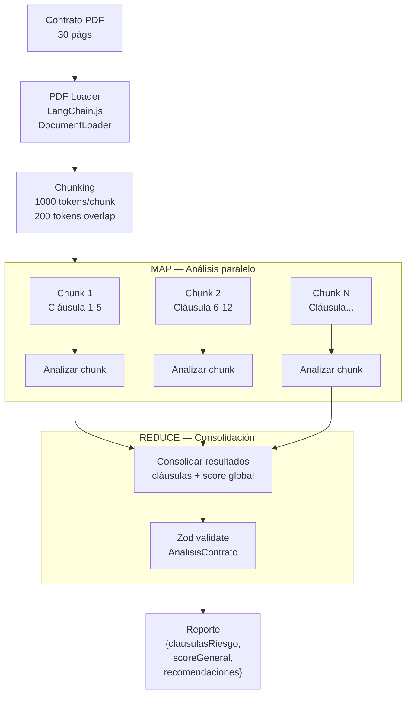

# UC-06 — Análisis Inteligente de Contratos

> **Concepto GenAI:** Document Processing + RAG sobre documentos legales
> **Rol beneficiado:** Agente — Federico Alzate / Comprador — Valentina Alzate
> **Prerrequisito:** UC-02 (RAG), UC-04 (structured outputs con Zod)

---

## El problema

Federico recibe una promesa de compraventa de 30 páginas en PDF. Leerla completa y entender las implicaciones legales toma 2–3 horas y requiere formación legal que la mayoría de agentes no tiene.

> *"He firmado cláusulas que no entendí bien"* — Federico Alzate

```
Sin análisis IA:                   Con análisis PropIA:
──────────────────────────────     ──────────────────────────────────────
30 págs PDF                    →   Reporte en < 30 segundos
2–3 horas de lectura               5 cláusulas de riesgo identificadas
Requiere abogado externo           Nivel de riesgo: ALTO / MEDIO / BAJO
Sin registro de lo revisado        JSON estructurado y trazable
```

> **Nota legal:** este sistema es una herramienta de asistencia, no un reemplazo del concepto jurídico. Todo análisis debe ser revisado por un abogado antes de tomar decisiones.

---

## La solución

Pipeline de **document processing con map-reduce**: divide el contrato en chunks manejables, analiza cada cláusula independientemente y consolida en un reporte estructurado validado con Zod.



---

## Diseño de referencia

Antes de implementar el Paso 1, revisa estos artefactos para tener el panorama completo del UC. Cada uno responde una pregunta distinta:

| Referencia | Qué responde | Cuándo consultarla |
|---|---|---|
| [Wireframes de UI](wireframes/analisis-contratos.md) | **Qué ven los usuarios** — 5 pantallas: upload del PDF, procesamiento en curso (chunks analizándose), reporte con cláusulas y score global, detalle de cláusula de riesgo, historial de análisis previos | Antes del Paso 3: define el contrato del API que vas a construir y los campos que el frontend espera |
| [Diagrama de secuencia](../docs/diagrams/uc-06-secuencia.md) | **Cómo fluyen las llamadas entre componentes** — el pipeline map-reduce: PDF → loader → chunking → análisis paralelo de chunks (haiku) → consolidación (sonnet con tool_use) | Cuando diseñes los handlers: muestra qué llama a qué y en qué orden |
| [Arquitectura del UC](arquitectura/) | **Tus propios diagramas y decisiones de diseño** mientras implementas | Espacio tuyo para agregar `componentes.md` o ADRs cuando tomes decisiones |

---

## Qué aprenderás

| Concepto | Qué es | Cómo se aplica |
|---|---|---|
| **Document Loaders** | Extractores de texto limpio desde archivos (PDF, DOCX, etc.) | `PDFLoader` de LangChain.js extrae el texto del contrato |
| **Chunking estratégico** | División de documentos respetando su estructura lógica | Contratos se dividen por cláusulas, no por caracteres arbitrarios |
| **Map-Reduce** | Procesar fragmentos en paralelo y consolidar resultados | Cada chunk analizado independientemente, luego resultado global |
| **Long context** | Claude soporta 200K tokens — cuándo chunking vs. contexto completo | Contratos < 50 págs: contexto completo. > 50 págs: map-reduce |
| **Extracción de entidades** | Identificar partes, fechas, valores en texto legal no estructurado | Extraer: vendedor, comprador, valor, fecha de entrega, penalidades |

---

## Recursos de formación para este UC

Estudia estos recursos **antes de escribir código**:

| Recurso | Tipo | Tiempo est. | Por qué |
|---|---|---|---|
| [LangChain.js — Document Loaders](https://js.langchain.com/docs/integrations/document_loaders/file_loaders/pdf/) | Docs · Gratuito | 20 min | PDFLoader, TextSplitter — los componentes base del pipeline |
| [Long context prompting — Anthropic Docs](https://docs.anthropic.com/en/docs/build-with-claude/long-context-tips) | Docs · Gratuito | 20 min | Estrategias para documentos largos con Claude 200K tokens |
| [Document Q&A con LangChain — DeepLearning.AI](https://www.deeplearning.ai/short-courses/langchain-chat-with-your-data/) | Curso · Gratuito | 1h | Document loaders, splitting y Q&A sobre documentos propios |
| [LangChain Framework: Build AI Systems + RAG — Udemy](https://www.udemy.com/course/langchain-framework-for-beginners-build-ai-systems-rag/) | Udemy | ~6.5h | Document loaders, RAG pipelines y procesamiento de documentos en TypeScript |

**Preguntas que debes poder responder antes del Paso 3:**
- ¿Por qué usar map-reduce en lugar de meter todo el contrato en el contexto?
- ¿Cuál es el riesgo de usar overlap en el chunking? ¿Por qué es necesario?
- ¿Cuándo `claude-haiku` para los chunks y `claude-sonnet` para el reduce?

---

## Pasos de implementación

### Paso 0 — Setup global (ya hecho)

Si seguiste el bootstrap en [`SETUP.md`](../SETUP.md):

- **`data/seeds/contrato-ejemplo.pdf`** ya generado (3 páginas, contiene cláusulas problemáticas a propósito)
- **`@propia/shared`** con tipos `Contrato`, `ClausulaContrato`, `AnalisisContrato`, `NivelRiesgo`, `TipoContrato`
- **`ANTHROPIC_API_KEY`** configurada

Verifica:
```bash
ls -lh data/seeds/contrato-ejemplo.pdf   # debe existir
npm run verify
```

Dependencias adicionales para este UC:
```bash
# IMPORTANTE: --legacy-peer-deps es necesario por conflictos transitivos
# en el ecosistema LangChain 1.x (peer deps de @browserbasehq/stagehand y zod versions).
npm install langchain @langchain/community @langchain/core @langchain/textsplitters \
  pdf-parse multer --legacy-peer-deps
npm install --save-dev @types/multer
```

> **Heads-up sobre los módulos de LangChain**: la versión actual movió el `RecursiveCharacterTextSplitter` a un paquete propio `@langchain/textsplitters`. Si copias tutoriales viejos que importan desde `@langchain/core/text_splitter`, ese path ya no existe y te dará `Cannot find module`.
>
> **Heads-up sobre Zod**: `@langchain/community` arrastra `@browserbasehq/stagehand` que requiere `zod@^3`. Si tienes zod 4 instalado para otros UCs, vas a tener conflicto de peer deps — usa `--legacy-peer-deps` o haz downgrade de zod a `^3.23.0`.

> **Inspecciona el contrato** antes de procesarlo:
> ```bash
> cat data/seeds/contrato-ejemplo.txt | head -40
> ```
> Las **cláusulas séptima y novena** tienen sesgo intencional (renuncia a lesión enorme y a vicios ocultos) — son las que tu análisis debería marcar como `ALTO` riesgo.

### Paso 1 — PDF Loader y chunking

`src/document/pdfProcessor.ts`:

```typescript
import { PDFLoader } from '@langchain/community/document_loaders/fs/pdf';
import { RecursiveCharacterTextSplitter } from '@langchain/textsplitters';

export interface DocumentChunk {
  text: string;
  chunkIndex: number;
  pageNumberAprox: number;
}

export async function loadAndChunkPDF(filePath: string): Promise<DocumentChunk[]> {
  const loader = new PDFLoader(filePath);
  const pages = await loader.load();
  const fullText = pages.map((p) => p.pageContent).join('\n');

  // Splitter que respeta estructura de cláusulas colombianas.
  // Si el PDF viene sin tildes (typical de generadores tipo pdfkit), incluye
  // las variantes sin acento — sino el splitter no encuentra los separadores.
  const splitter = new RecursiveCharacterTextSplitter({
    chunkSize: 1500, // ~1000 tokens — deja espacio para el system prompt
    chunkOverlap: 200, // overlap para no perder contexto entre cláusulas
    separators: [
      '\nCLAUSULA',
      '\nCLÁUSULA',
      '\nARTÍCULO',
      '\nARTICULO',
      '\nPÁRRAFO',
      '\nPARRAFO',
      '\n\n',
      '\n',
      ' ',
      '',
    ],
  });

  const chunks = await splitter.createDocuments([fullText]);
  const chunksPerPage = Math.max(1, Math.ceil(chunks.length / pages.length));

  return chunks.map((chunk, i) => ({
    text: chunk.pageContent,
    chunkIndex: i,
    pageNumberAprox: Math.floor(i / chunksPerPage) + 1,
  }));
}
```

> **Tip sobre los separadores**: `RecursiveCharacterTextSplitter` aplica los separadores **en orden de prioridad**. Pone primero los más específicos (`\nCLÁUSULA`, `\nARTÍCULO`) para que el chunking respete la estructura legal — y deja `'\n'` y `' '` al final como fallback. Si un PDF viene sin acentos (típico de generadores que no preservan UTF-8), incluye también las variantes sin tilde.

### Paso 2 — Schema Zod + Tool definition

En el mismo archivo defines **dos cosas**: el schema Zod que valida en runtime y el `Anthropic.Tool` que fuerza al LLM a devolver JSON estructurado en el REDUCE. Mantenerlos juntos hace evidente la simetría — si un campo es `required` en Zod, también lo es en el tool, y viceversa.

`src/schemas/contratoSchema.ts`:

```typescript
import type Anthropic from '@anthropic-ai/sdk';
import type { AnalisisContrato } from '@propia/shared';
import { z } from 'zod';

export const NivelRiesgoSchema = z.enum(['ALTO', 'MEDIO', 'BAJO', 'INFORMATIVO']);

export const ClausulaContratoSchema = z.object({
  numero: z.number().int(),
  titulo: z.string(),
  contenido: z.string(),
  tipoRiesgo: NivelRiesgoSchema.optional(),
  notaRiesgo: z.string().optional(),
});

export const TipoContratoSchema = z.enum([
  'PROMESA_COMPRAVENTA',
  'COMPRAVENTA',
  'ARRENDAMIENTO',
  'OPCION_COMPRA',
]);

export const AnalisisContratoSchema = z.object({
  tipo: TipoContratoSchema,
  partes: z.object({
    vendedor: z.string(),
    comprador: z.string(),
    agente: z.string().optional(),
    notaria: z.string().optional(),
  }),
  valorTotal: z.number().positive(),
  arras: z.number().optional(),
  fechaFirma: z.string().optional(),
  fechaEntrega: z.string().optional(),
  clausulasRiesgo: z.array(ClausulaContratoSchema),
  scoreRiesgoGeneral: NivelRiesgoSchema,
  resumenEjecutivo: z.string().min(50),
  recomendaciones: z.array(z.string()).min(1),
  limitacionLegal: z.string(),
  fechaAnalisis: z.string().datetime(),
}) satisfies z.ZodType<AnalisisContrato>;

/**
 * Tool definition para el LLM en la fase REDUCE — fuerza JSON estructurado.
 * fechaAnalisis la pone el servidor (no se pide al LLM).
 */
export const REPORT_TOOL: Anthropic.Tool = {
  name: 'report_contract_analysis',
  description: 'Reporta el análisis consolidado del contrato como JSON estructurado',
  input_schema: {
    type: 'object',
    properties: {
      tipo: {
        type: 'string',
        enum: ['PROMESA_COMPRAVENTA', 'COMPRAVENTA', 'ARRENDAMIENTO', 'OPCION_COMPRA'],
      },
      partes: {
        type: 'object',
        properties: {
          vendedor: { type: 'string' },
          comprador: { type: 'string' },
          agente: { type: 'string' },
          notaria: { type: 'string' },
        },
        required: ['vendedor', 'comprador'],
      },
      valorTotal: { type: 'number', description: 'Valor total del contrato en COP' },
      arras: { type: 'number', description: 'Valor de arras en COP (opcional)' },
      fechaFirma: { type: 'string', description: 'Fecha de firma o "no especificada"' },
      fechaEntrega: { type: 'string', description: 'Fecha de entrega o "no especificada"' },
      clausulasRiesgo: {
        type: 'array',
        items: {
          type: 'object',
          properties: {
            numero: { type: 'integer' },
            titulo: { type: 'string' },
            contenido: { type: 'string', description: 'Resumen de la cláusula' },
            tipoRiesgo: { type: 'string', enum: ['ALTO', 'MEDIO', 'BAJO', 'INFORMATIVO'] },
            notaRiesgo: { type: 'string', description: 'Por qué es riesgosa' },
          },
          required: ['numero', 'titulo', 'contenido', 'tipoRiesgo'],
        },
      },
      scoreRiesgoGeneral: { type: 'string', enum: ['ALTO', 'MEDIO', 'BAJO', 'INFORMATIVO'] },
      resumenEjecutivo: { type: 'string', description: '2-3 párrafos resumiendo el contrato' },
      recomendaciones: { type: 'array', items: { type: 'string' } },
      limitacionLegal: {
        type: 'string',
        description: 'DEBE incluir: "Este análisis es orientativo y no reemplaza el concepto de un abogado."',
      },
    },
    required: [
      'tipo',
      'partes',
      'valorTotal',
      'clausulasRiesgo',
      'scoreRiesgoGeneral',
      'resumenEjecutivo',
      'recomendaciones',
      'limitacionLegal',
    ],
  },
};
```

> El tipo `AnalisisContrato` vive en [`@propia/shared`](../packages/shared/src/contrato.ts) (consistente con el resto del path). El schema Zod arriba lo valida en runtime sin redefinirlo. El `satisfies z.ZodType<AnalisisContrato>` te avisa en compile-time si el schema se desfasa del tipo.
>
> **Heads-up sobre `required` y LLMs**: aunque el tool schema marca `recomendaciones` y `limitacionLegal` como `required`, hay casos donde el LLM **igual los omite** (más sobre esto en el Paso 4). El `required` es una señal fuerte pero no garantiza el output — siempre valida con Zod después.

### Paso 3 — MAP: analizar cada chunk

`src/analysis/mapAnalyzer.ts`:

```typescript
import Anthropic from '@anthropic-ai/sdk';

const anthropic = new Anthropic();

export interface ChunkAnalysis {
  clausulas: Array<{
    numero?: number;
    titulo: string;
    contenido: string;
    riesgo: 'ALTO' | 'MEDIO' | 'BAJO' | 'INFORMATIVO';
    nota?: string;
  }>;
  entidades: {
    partes?: string[];
    valores?: string[];
    fechas?: string[];
    penalidades?: string[];
  };
}

const MAP_SYSTEM_PROMPT = `Eres un asistente de análisis de contratos inmobiliarios colombianos.
Analizas un fragmento del contrato (no el contrato completo) y extraes:
1. Cláusulas presentes en este fragmento, cada una con su nivel de riesgo:
   - ALTO: cláusulas que pueden perjudicar gravemente al comprador o arrendatario
     (renuncia a derechos, cláusulas penales excesivas > 25%, renuncia a vicios ocultos,
      renuncia a lesión enorme, jurisdicción inusual, etc.)
   - MEDIO: cláusulas que merecen atención y negociación
   - BAJO: cláusulas estándar sin riesgo especial
   - INFORMATIVO: datos del contrato sin implicación de riesgo
2. Entidades mencionadas: partes (nombres), valores en COP, fechas, penalidades

Retorna SOLO JSON válido con la estructura:
{
  "clausulas": [{ "numero": N, "titulo": "...", "contenido": "...", "riesgo": "ALTO|MEDIO|BAJO|INFORMATIVO", "nota": "..." }],
  "entidades": { "partes": [], "valores": [], "fechas": [], "penalidades": [] }
}

Sin texto antes ni después del JSON, sin code fences.`;

export async function analyzeChunk(chunkText: string, chunkIndex: number): Promise<ChunkAnalysis> {
  const response = await anthropic.messages.create({
    model: 'claude-haiku-4-5-20251001', // modelo rápido y económico para chunks individuales
    max_tokens: 1500,
    temperature: 0.1, // baja temperatura para extracción de datos
    system: MAP_SYSTEM_PROMPT,
    messages: [{
      role: 'user',
      content: `Analiza este fragmento (chunk ${chunkIndex + 1}) del contrato:\n\n---\n${chunkText}\n---\n\nRetorna el JSON con clausulas y entidades.`,
    }],
  });

  const block = response.content[0];
  const text = block.type === 'text' ? block.text : '{}';

  const match = text.match(/\{[\s\S]*\}/);
  if (!match) return { clausulas: [], entidades: {} };

  try {
    return JSON.parse(match[0]) as ChunkAnalysis;
  } catch {
    return { clausulas: [], entidades: {} };
  }
}
```

> **Tip sobre temperature**: `0.1` para extracción de datos estructurados. Temperatura más alta introduce variabilidad que no quieres aquí — necesitas que el JSON salga consistente para que el REDUCE pueda parsearlo sin errores.
>
> **Tip sobre el `try/catch` final**: el LLM a veces devuelve JSON malformado (comillas escapadas mal, texto basura colado entre llaves). En lugar de hacer fallar todo el pipeline por un chunk, devolvemos `{ clausulas: [], entidades: {} }` y el REDUCE lo ignora — los demás chunks compensan.

### Paso 4 — REDUCE: consolidar resultados

`src/analysis/reduceAnalyzer.ts`:

```typescript
import Anthropic from '@anthropic-ai/sdk';
import type { AnalisisContrato } from '@propia/shared';
import { AnalisisContratoSchema, REPORT_TOOL } from '../schemas/contratoSchema.js';
import type { ChunkAnalysis } from './mapAnalyzer.js';

const anthropic = new Anthropic();

const REDUCE_SYSTEM_PROMPT = `Eres un experto en análisis de contratos inmobiliarios colombianos.
Recibes los análisis parciales de varios chunks de un contrato y consolidas un reporte final.

REGLAS DE CONSOLIDACIÓN:
- Deduplica cláusulas que aparezcan en múltiples chunks (por overlap del splitter).
- scoreRiesgoGeneral se asigna así:
  - Si hay 1 o más cláusulas ALTO → scoreRiesgoGeneral = ALTO
  - Si hay 2 o más cláusulas MEDIO sin ALTO → scoreRiesgoGeneral = MEDIO
  - En otro caso → BAJO

CAMPOS OBLIGATORIOS DEL REPORTE (NO los omitas, son requeridos):
- tipo, partes (vendedor y comprador), valorTotal
- clausulasRiesgo: array (puede ser vacío si todo es BAJO)
- scoreRiesgoGeneral
- resumenEjecutivo: 2-3 párrafos
- **recomendaciones**: array de strings con al menos 1 recomendación accionable
  (por ejemplo: "Negociar reducción de la cláusula penal del 30% al 10-15%")
- **limitacionLegal**: string que DEBE incluir literalmente la frase:
  "Este análisis es orientativo y no reemplaza el concepto de un abogado."

USA la herramienta report_contract_analysis con TODOS los campos requeridos completos.`;

export async function reduceAnalysis(chunkResults: ChunkAnalysis[]): Promise<AnalisisContrato> {
  const consolidated = JSON.stringify(chunkResults, null, 2);

  const response = await anthropic.messages.create({
    model: 'claude-sonnet-4-6',
    max_tokens: 4096,
    temperature: 0.2,
    system: REDUCE_SYSTEM_PROMPT,
    tools: [REPORT_TOOL],
    tool_choice: { type: 'tool', name: 'report_contract_analysis' },
    messages: [
      {
        role: 'user',
        content:
          `Consolida los análisis parciales de los chunks de este contrato y reporta vía la herramienta. ` +
          `Asegúrate de incluir TODOS los campos requeridos (recomendaciones, limitacionLegal, resumenEjecutivo).\n\n` +
          `Análisis de chunks:\n${consolidated}`,
      },
    ],
  });

  const toolUse = response.content.find((b) => b.type === 'tool_use');
  if (!toolUse || toolUse.type !== 'tool_use') {
    throw new Error('El LLM no usó la herramienta de análisis');
  }

  const raw = toolUse.input as Record<string, unknown>;

  // Defensa adicional: si el LLM ignoró limitacionLegal a pesar de ser required,
  // la inyectamos nosotros con el texto canónico.
  if (typeof raw.limitacionLegal !== 'string' || raw.limitacionLegal.length === 0) {
    raw.limitacionLegal = 'Este análisis es orientativo y no reemplaza el concepto de un abogado.';
  }
  if (!Array.isArray(raw.recomendaciones) || raw.recomendaciones.length === 0) {
    raw.recomendaciones = ['Revise este contrato con un abogado especializado antes de firmar.'];
  }

  return AnalisisContratoSchema.parse({
    ...raw,
    fechaAnalisis: new Date().toISOString(),
  });
}
```

> **Por qué `tool_choice: { type: 'tool', name: 'report_contract_analysis' }`** y no `{ type: 'any' }`: forzar la tool específica garantiza que el LLM siempre devuelva la estructura que esperas. `'any'` deja al modelo elegir entre las tools disponibles, lo que es útil cuando hay varias — aquí solo tienes una y la quieres siempre.
>
> **El fallback defensivo (las dos `if` después del `toolUse`)** es la parte que te va a salvar en producción. Probablemente vas a observarlo: a veces el LLM "olvida" `recomendaciones` o `limitacionLegal` aunque están marcados como `required` en el tool schema. Si dejas que Zod falle, el usuario obtiene un 422; mejor inyectar valores canónicos y aprovechar que `limitacionLegal` es texto fijo de cumplimiento legal. **No uses esto para campos donde el contenido importe** (ej: no inventes `valorTotal`) — solo para los que tienen un default sensato.
>
> **Tip sobre dedup**: el splitter usa overlap de 200 caracteres → vas a recibir la misma cláusula en dos chunks consecutivos. Por eso el system prompt incluye la regla explícita de deduplicar. Si ves cláusulas duplicadas en el resultado, refuerza la instrucción con un ejemplo en el prompt.

### Paso 5 — API con upload de PDF

`src/api.ts`:

```typescript
import 'dotenv/config'; // CRITICO -- primer import para que el SDK encuentre ANTHROPIC_API_KEY
import express, { type Request, type Response } from 'express';
import multer from 'multer';
import os from 'node:os';
import path from 'node:path';
import { ZodError } from 'zod';
import { loadAndChunkPDF } from './document/pdfProcessor.js';
import { analyzeChunk } from './analysis/mapAnalyzer.js';
import { reduceAnalysis } from './analysis/reduceAnalyzer.js';

const app = express();
const upload = multer({
  dest: path.join(os.tmpdir(), 'propia-contratos'), // Usa el directorio temporal del SO (cross-platform)
  limits: { fileSize: 10 * 1024 * 1024 }, // 10 MB maximo
});

app.post('/api/contratos/analizar', upload.single('contrato'), async (req: Request, res: Response) => {
  if (!req.file) {
    return res.status(400).json({ error: 'PDF requerido en el campo "contrato"' });
  }

  try {
    // 1. Cargar y chunkear
    const chunks = await loadAndChunkPDF(req.file.path);

    // 2. MAP: analizar chunks en paralelo (limitado a evitar rate limits)
    const chunkResults = await Promise.all(chunks.map((c) => analyzeChunk(c.text, c.chunkIndex)));

    // 3. REDUCE: consolidar
    const analisis = await reduceAnalysis(chunkResults);

    return res.json({
      analisis,
      meta: {
        chunksAnalizados: chunks.length,
        clausulasDetectadas: analisis.clausulasRiesgo.length,
        scoreRiesgoGeneral: analisis.scoreRiesgoGeneral,
      },
    });
  } catch (err) {
    if (err instanceof ZodError) {
      return res.status(422).json({
        error: 'Análisis devuelto por el LLM no cumple el schema',
        details: err.issues,
      });
    }
    console.error('Error analizando contrato:', err);
    return res.status(500).json({ error: 'Error al analizar el contrato' });
  }
});

const PORT = Number(process.env.PORT ?? 3000);
app.listen(PORT, () => {
  console.log(`PropIA Contratos API en http://localhost:${PORT}`);
});
```

> **Por qué `import 'dotenv/config'` es el primer import**: el SDK de Anthropic resuelve `ANTHROPIC_API_KEY` en el módulo top-level, **al momento del `import`** — no al primer request. Si pones `dotenv` después de cualquier import que cargue el SDK (directa o transitivamente), el SDK ve la variable `undefined` y falla con `Could not resolve authentication method`. Este patrón te va a aparecer en varios UCs; conviene memorizarlo.
>
> **Por qué `Request` y `Response` tipados**: Express 5 es más estricto con los tipos. Si dejas `(req, res) =>` sin tipos, TypeScript puede inferirlos mal en algunos contextos.
>
> **Por qué el límite de 10 MB en multer**: sin `limits`, un cliente puede subir un PDF de 500 MB y matar el servidor antes de que llegues a procesarlo. 10 MB cubre contratos de 50+ páginas con margen.
>
> **Por qué el branch `err instanceof ZodError`**: si el LLM devuelve algo que el schema rechaza, quieres un 422 con detalles de validación (útil para debugging) en lugar de un 500 genérico. Para todo lo demás (red, API key, OOM) → 500.

### Paso 6 — Probar end-to-end

Con el servidor corriendo (`npm run dev` desde el folder de UC-06), prueba con el PDF semilla:

```bash
curl -X POST \
  -F "contrato=@data/seeds/contrato-ejemplo.pdf" \
  http://localhost:3000/api/contratos/analizar | jq
```

Lo que **deberías esperar** del análisis:

- `scoreRiesgoGeneral`: `"ALTO"` — el contrato semilla tiene cláusulas problemáticas a propósito.
- `clausulasRiesgo`: al menos 2-3 cláusulas marcadas como `ALTO`:
  - **Cláusula séptima**: renuncia a la acción de lesión enorme (`Art. 1946 CC`) → ALTO.
  - **Cláusula novena**: renuncia a vicios ocultos → ALTO.
  - **Cláusula sexta** (bonus): cláusula penal del 30% del valor — bastante por encima del 10-15% típico → ALTO o MEDIO.
- `partes.vendedor`, `partes.comprador`, `partes.notaria`: extraídos del PDF.
- `valorTotal`: ~1.180.000.000 COP, `arras`: ~118.000.000 COP.
- `recomendaciones`: array con consejos accionables como "negociar reducción de cláusula penal" o "consultar abogado sobre renuncia a lesión enorme".
- `limitacionLegal`: incluye literalmente *"Este análisis es orientativo y no reemplaza el concepto de un abogado."*

**Si algún campo falta o algún ALTO no aparece**:
- Revisa los chunks que produjo el splitter (`chunks.length` debe ser ~7 para este PDF). Si es 1 solo, los separadores no coinciden con el PDF → revisa Paso 1.
- Loggea el `toolUse.input` antes de `AnalisisContratoSchema.parse(...)` para ver qué está devolviendo el LLM. Es la única forma de saber si el problema es de prompt o de validación.

---

## Estructura de archivos

```
uc-06-analisis-contratos/
├── README.md
├── package.json                       ← deps: langchain, @langchain/community, @langchain/textsplitters, multer, zod@^3
├── tsconfig.json
├── wireframes/
│   └── analisis-contratos.md          ← 5 pantallas: upload, procesando, reporte
├── arquitectura/
│   └── diagrama.md                    ← Pipeline Map-Reduce con Mermaid
├── prompts/
│   └── system-prompts.md              ← System prompts para MAP y REDUCE
└── src/
    ├── schemas/
    │   └── contratoSchema.ts          ← Zod + REPORT_TOOL (tool definition para REDUCE)
    ├── document/
    │   └── pdfProcessor.ts            ← PDFLoader + RecursiveCharacterTextSplitter
    ├── analysis/
    │   ├── mapAnalyzer.ts             ← Análisis de chunk individual (haiku, JSON puro)
    │   └── reduceAnalyzer.ts          ← Consolidación final (sonnet + tool_use + fallback defensivo)
    └── api.ts                         ← POST /api/contratos/analizar (multipart, límite 10 MB)
```

---

## Criterios de éxito

- [ ] Extrae correctamente: vendedor, comprador, valor total, fecha de entrega, penalidades en > 90% de los contratos de prueba
- [ ] Identifica cláusulas ALTO riesgo con > 80% de precisión vs. revisión manual de un abogado
- [ ] El reporte siempre incluye el `limitacionLegal` con disclaimer — 100% de los casos
- [ ] Funciona con contratos de hasta 50 páginas sin degradación de calidad
- [ ] El JSON pasa `AnalisisContratoSchema.parse()` en el 100% de los análisis
- [ ] Tiempo de respuesta < 30 segundos para un contrato de 20 páginas

---

## Errores comunes (léelos antes de empezar)

| Error | Por qué pasa | Cómo evitarlo |
|---|---|---|
| `Cannot find module '@langchain/core/text_splitter'` | LangChain movió el splitter a un paquete propio (`@langchain/textsplitters`) | Importa desde `@langchain/textsplitters`. Si copias snippets viejos, vas a chocar con esto |
| Conflicto de peer deps al instalar (`zod@^4` vs `zod@^3`) | `@langchain/community` arrastra `@browserbasehq/stagehand` que requiere zod 3 | Usa `--legacy-peer-deps` o haz downgrade a `zod@^3.23.0`. Aplica a todos los UCs que usen LangChain |
| `Could not resolve authentication method` al iniciar | `dotenv` se cargó después de que el SDK ya leyó `process.env` | `import 'dotenv/config'` debe ser el **primer** import del entry point, antes de cualquier cosa que cargue el SDK transitivamente |
| El LLM omite `recomendaciones` o `limitacionLegal` a pesar de `required` | El `required` del tool schema es señal fuerte pero no garantía absoluta | Defensa en dos capas: instrucción explícita en system prompt + fallback con texto canónico antes del `.parse(...)` |
| Chunk overlap = 0 | Cláusulas que cruzan chunks se pierden parcialmente | Usa overlap de ~200 caracteres. Refuerza en el REDUCE la regla de deduplicar |
| El splitter genera 1 solo chunk para un PDF de 3 páginas | Los separadores no coinciden — el PDF viene sin tildes y tu lista solo tiene `\nCLÁUSULA` con tilde | Incluye variantes con y sin acento: `\nCLAUSULA`, `\nCLÁUSULA`, `\nARTICULO`, `\nARTÍCULO` |
| MAP con `claude-sonnet` para cada chunk | Lento y caro con 15+ chunks | `claude-haiku-4-5-20251001` para MAP, `claude-sonnet-4-6` solo para REDUCE |
| `PDFLoader` devuelve string vacío para tu PDF | Probablemente es un PDF escaneado (imagen, no texto) | Necesitas OCR previo (Tesseract, Azure Document Intelligence). Está fuera del alcance de este UC |
| El LLM confunde `arras` con `valorTotal` | Pasan en el mismo párrafo y el LLM colapsa los conceptos | Refuerza en el system prompt la distinción + valida en Zod que `valorTotal > arras` |

---

## Ejercicio de validacion (hazlo al terminar)

1. **Busca un contrato de arriendo real** (puedes encontrar plantillas en Google: "modelo contrato arrendamiento Colombia PDF"). Cargalo al sistema. Verifica que extrae: arrendador, arrendatario, canon, deposito.

2. **Test de clausula peligrosa**: Agrega manualmente al PDF una clausula que diga "El arrendatario renuncia a cualquier reclamacion por vicios ocultos". El sistema debe clasificarla como riesgo ALTO.

3. **Compara MAP-REDUCE vs contexto completo**: Para un contrato de 10 paginas, prueba ambos metodos. Compara calidad del reporte. Documenta cuando el contexto completo (Claude 200K) es suficiente.

4. **Verifica el disclaimer**: En 5 analisis consecutivos, el campo `limitacionLegal` SIEMPRE debe aparecer. Si falta en uno, tu Zod schema necesita `.min(1)` en ese campo.

---

## Siguiente UC

[UC-07 — MCP Server para Brokers](../uc-07-mcp-server-brokers/README.md) expone PropIA como un servidor MCP para que Federico consulte su cartera desde Claude Desktop, Cursor o cualquier cliente MCP.
