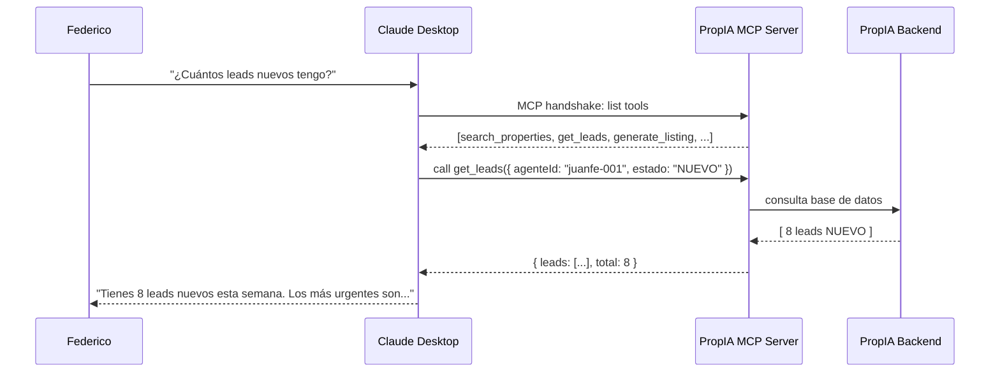

# UC-07 — MCP Server para Brokers

> **Concepto GenAI:** Model Context Protocol (MCP)
> **Rol beneficiado:** Agente / Broker — Federico Alzate
> **Prerrequisito:** UC-05 (herramientas del agente definidas y funcionando)

---

## El problema

Federico ya usa Claude Desktop como asistente en su día a día. Pero para consultar su cartera tiene que:

1. Abrir PropIA en el navegador
2. Navegar hasta sus leads
3. Copiar la información manualmente al chat de Claude

Quiere poder escribir directamente en Claude Desktop:

> *"¿Cuántos leads nuevos tengo esta semana?"*
> *"Genera la ficha del apartamento prop-mde-041"*
> *"¿Cuál es el precio de mercado para un apto de 90m² en El Poblado?"*

Y que Claude consulte PropIA directamente, sin salir de la conversación.

```
Sin MCP Server:                    Con MCP Server PropIA:
──────────────────────────────     ──────────────────────────────────────
1. Abrir PropIA en navegador   →   Federico escribe en Claude Desktop
2. Navegar a mis leads             Claude invoca PropIA MCP automáticamente
3. Copiar datos manualmente        Respuesta en < 3 segundos
4. Pegar en Claude                 PropIA integrada como herramienta nativa
```

---

## La solución

**MCP** (Model Context Protocol) es el estándar abierto de Anthropic para conectar LLMs con herramientas y fuentes de datos externas. Es como una API, pero diseñada específicamente para que los modelos de IA la descubran y usen automáticamente.



---

## Diseño de referencia

Antes de implementar el Paso 1, revisa estos artefactos para tener el panorama completo del UC. Cada uno responde una pregunta distinta:

| Referencia | Qué responde | Cuándo consultarla |
|---|---|---|
| [Wireframes de UI](wireframes/mcp-server-brokers.md) | **Qué ven los usuarios** — 5 pantallas: Claude Desktop con PropIA conectado, Claude invocando get_leads desde conversación natural, Claude generando ficha vía generate_listing, panel de herramientas MCP disponibles, configuración del config JSON | Antes del Paso 3: define el contrato del API que vas a construir y los campos que el frontend espera |
| [Diagrama de secuencia](../docs/diagrams/uc-07-secuencia.md) | **Cómo fluyen las llamadas entre componentes** — handshake MCP: Claude Desktop como Host descubre tools del Server, invoca CallTool, recibe respuesta, la usa en la conversación | Cuando diseñes los handlers: muestra qué llama a qué y en qué orden |
| [Arquitectura del UC](arquitectura/) | **Tus propios diagramas y decisiones de diseño** mientras implementas | Espacio tuyo para agregar `componentes.md` o ADRs cuando tomes decisiones |

---

## Qué aprenderás

| Concepto | Qué es | Cómo se aplica |
|---|---|---|
| **Arquitectura MCP** | Hosts, Clients, Servers, Resources, Tools, Prompts | PropIA es el Server. Claude Desktop es el Client. Federico es el Host |
| **MCP TypeScript SDK** | SDK oficial para construir MCP Servers | `@modelcontextprotocol/sdk` — define tools y resources con tipos TypeScript |
| **Tool definitions MCP** | Cómo exponer funciones para que los LLMs las invoquen | Cada herramienta PropIA se registra con nombre, descripción e input_schema |
| **Resources MCP** | Datos navegables expuestos como URIs | `propiedad://prop-mde-041`, `leads://juanfe-001/activos` |
| **Prompts MCP** | Templates de conversación predefinidos para tareas comunes | `generate_listing_prompt(propiedadId)` — prompt listo para generar la ficha |
| **Claude Desktop config** | Archivo de configuración que conecta el servidor MCP | `claude_desktop_config.json` con la ruta al servidor y sus argumentos |

---

## Recursos de formación para este UC

Estudia estos recursos **antes de escribir código**:

| Recurso | Tipo | Tiempo est. | Por qué |
|---|---|---|---|
| [MCP — Documentación oficial Anthropic](https://docs.anthropic.com/en/docs/build-with-claude/mcp) | Docs · Gratuito | 1h | Arquitectura completa: qué son hosts, clients, servers, tools, resources, prompts |
| [MCP TypeScript SDK — GitHub](https://github.com/modelcontextprotocol/typescript-sdk) | GitHub · Gratuito | 1h | El SDK que usarás: ejemplos, tipos, `Server`, `ListToolsRequest`, `CallToolRequest` |
| [Build an MCP Server — Anthropic Tutorial](https://docs.anthropic.com/en/docs/build-with-claude/mcp/building-mcp-servers) | Docs · Gratuito | 30 min | Tutorial paso a paso del hello-world MCP hasta tools y resources |
| [Build Your Own MCP Servers with TypeScript — Udemy](https://www.udemy.com/course/build-mcp-server-with-typescript-beginners-guide/) | Udemy | ~5h | MCP Server completo en TypeScript: tools, resources, prompts, sampling y deployment |

**Preguntas que debes poder responder antes del Paso 3:**
- ¿En qué se diferencia un MCP Tool de una REST API?
- ¿Cuándo usar `Resources` vs. `Tools` en un MCP Server?
- ¿Cómo sabe Claude Desktop qué herramientas tiene disponibles?

---

## Herramientas a implementar

| Tool MCP | Descripción | Reutiliza de |
|---|---|---|
| `search_properties` | Búsqueda semántica de propiedades | UC-01 `semanticSearch()` |
| `get_leads` | Consultar leads filtrados por agente/estado | UC-05 `get_leads` executor |
| `update_lead_status` | Actualizar estado de un lead | UC-05 `update_lead_status` executor |
| `generate_listing` | Generar ficha de una propiedad | UC-03 `generarFicha()` |
| `get_valuation` | Valoración asistida de una propiedad | UC-04 `valorarPropiedad()` |
| `analyze_contract` | Análisis de contrato desde ruta a PDF | UC-06 `loadAndChunkPDF` + `analyzeChunk` + `reduceAnalysis` |

Y dos `Resources` (datos navegables, no acciones):

| Resource URI | Qué expone |
|---|---|
| `propiedades://catalogo` | Snapshot del catálogo completo (lee `data/seeds/propiedades.json`) |
| `leads://agente-juanfe-001/activos` | Todos los leads del agente Juan Fernando |

---

## Pasos de implementación

### Paso 0 — Setup global (ya hecho)

Este UC es el "techo" del path: integra UC-01 a UC-06 a través de un MCP server. Necesitas todo el setup del repo y los UCs 01, 03, 04, 05 y 06 implementados (no compilados, basta con que el código en `src/` exista y exporte sus funciones públicas).

- **ChromaDB** corriendo con propiedades indexadas (UC-01)
- **Leads** en `data/seeds/leads.json` (UC-05)
- **`@propia/shared`**, **`@propia/embeddings`**, **`@propia/db`** disponibles
- **`ANTHROPIC_API_KEY`** configurada (solo necesaria para `generate_listing`, `get_valuation`, `analyze_contract`)

Verifica:
```bash
npm run verify
```

Dependencias adicionales para este UC:
```bash
npm install @modelcontextprotocol/sdk --legacy-peer-deps
```

> **Heads-up del SDK**: el paquete `@modelcontextprotocol/sdk` 1.29+ expone **dos APIs**: la low-level (`Server` con `setRequestHandler(SchemaX, ...)`) y la high-level (`McpServer` con `.tool()` y `.resource()` métodos). Vamos a usar la low-level porque mapea 1:1 con la spec MCP — entiendes mejor qué pasa por debajo. Si vienes de tutoriales de versiones < 1.x verás `McpServer.tool()` directo; ambas APIs coexisten.

### Paso 1 — Estructura del servidor

Vamos a partir el servidor en tres archivos para que cada pieza tenga una responsabilidad:

| Archivo | Qué hace |
|---|---|
| `src/server.ts` | Entry point: carga env, registra handlers en el `Server`, conecta al `StdioServerTransport` |
| `src/tools/toolHandlers.ts` | Catálogo de tools (`TOOLS: Tool[]`) + dispatcher (`callTool(name, args)`). Importa funciones de UC-01, 03, 04, 05, 06 |
| `src/resources/resourceHandlers.ts` | Catálogo de resources + lector. Importa del propio `toolHandlers` para reutilizar el catálogo cargado |

La razón de la división: el `server.ts` queda pequeño y leíble (handshake puro), mientras que toda la lógica que conecta con los otros UCs vive donde un test puede atacarla sin levantar transporte stdio.

### Paso 2 — Servidor MCP (entry point)

`src/server.ts`:

```typescript
import 'dotenv/config'; // PRIMER import — los SDKs leen process.env al importarse
import { Server } from '@modelcontextprotocol/sdk/server/index.js';
import { StdioServerTransport } from '@modelcontextprotocol/sdk/server/stdio.js';
import {
  CallToolRequestSchema,
  ListResourcesRequestSchema,
  ListToolsRequestSchema,
  ReadResourceRequestSchema,
} from '@modelcontextprotocol/sdk/types.js';
import { callTool, TOOLS } from './tools/toolHandlers.js';
import { readResource, RESOURCES } from './resources/resourceHandlers.js';

const server = new Server(
  {
    name: 'propia-broker-server',
    version: '1.0.0',
  },
  {
    capabilities: {
      tools: {},
      resources: {},
    },
  },
);

server.setRequestHandler(ListToolsRequestSchema, async () => ({ tools: TOOLS }));

server.setRequestHandler(CallToolRequestSchema, async (req) => {
  const { name, arguments: args } = req.params;
  return callTool(name, (args ?? {}) as Record<string, unknown>);
});

server.setRequestHandler(ListResourcesRequestSchema, async () => ({ resources: RESOURCES }));

server.setRequestHandler(ReadResourceRequestSchema, async (req) => readResource(req.params.uri));

// IMPORTANTE: usar console.error (stderr). stdout es el canal MCP — un log ahí rompe el handshake.
async function main(): Promise<void> {
  const transport = new StdioServerTransport();
  await server.connect(transport);
  console.error('[propIA-mcp] Servidor MCP corriendo en stdio');
}

main().catch((err) => {
  console.error('[propIA-mcp] Error fatal:', err);
  process.exit(1);
});
```

> **Por qué `console.error` y no `console.log`**: el transporte stdio del MCP usa `stdin`/`stdout` como canal de mensajes JSON-RPC. Cualquier byte que escribas a stdout corrompe el frame y Claude Desktop te tira un error críptico tipo `Unexpected token in JSON`. Logs van a stderr — siempre.
>
> **Por qué `dotenv/config` es el primer import**: igual que en UC-06. Los SDKs de Anthropic y ChromaDB leen `process.env` al momento del `import`. Si lo cargas después se vienen sin credenciales.

### Paso 3 — Tool handlers: catálogo + dispatcher

`src/tools/toolHandlers.ts` es donde vive la lógica real: la lista de tools que Claude verá y el dispatcher que conecta cada nombre con la función real de UC-01/03/04/05/06.

```typescript
import { readFileSync } from 'node:fs';
import { resolve } from 'node:path';
import type { CallToolResult, Tool } from '@modelcontextprotocol/sdk/types.js';
import type { Propiedad } from '@propia/shared';
import { semanticSearch } from '../../../uc-01-busqueda-semantica/src/search.js';
import { executeTool as executeLeadTool } from '../../../uc-05-agente-leads/src/tools/toolExecutors.js';
import { generarFicha } from '../../../uc-03-generador-fichas/src/generator/fichaGenerator.js';
import { valorarPropiedad } from '../../../uc-04-valoracion-asistida/src/valuation/valuationEngine.js';
import { loadAndChunkPDF } from '../../../uc-06-analisis-contratos/src/document/pdfProcessor.js';
import { analyzeChunk } from '../../../uc-06-analisis-contratos/src/analysis/mapAnalyzer.js';
import { reduceAnalysis } from '../../../uc-06-analisis-contratos/src/analysis/reduceAnalyzer.js';

const PROPIEDADES_PATH = resolve(process.cwd(), 'data/seeds/propiedades.json');
const PROPIEDADES: Propiedad[] = JSON.parse(readFileSync(PROPIEDADES_PATH, 'utf-8'));

function getPropertyById(id: string): Propiedad {
  const p = PROPIEDADES.find((x) => x.id === id);
  if (!p) throw new Error(`Propiedad no encontrada: ${id}`);
  return p;
}

export const TOOLS: Tool[] = [
  {
    name: 'search_properties',
    description:
      'Busca propiedades del catálogo PropIA usando lenguaje natural. ' +
      'Usa esto cuando Federico pregunta por propiedades con características específicas ' +
      '(ej: "aptos de 3 hab en El Poblado bajo $700M").',
    inputSchema: {
      type: 'object',
      properties: {
        query: { type: 'string', description: 'Descripción en lenguaje natural de lo que busca' },
        ciudad: { type: 'string', description: 'Ciudad (opcional)' },
        precioMax: { type: 'number', description: 'Precio máximo en COP (opcional)' },
      },
      required: ['query'],
    },
  },
  {
    name: 'get_leads',
    description:
      'Consulta los leads del agente inmobiliario. Usa esto cuando Federico pregunta por ' +
      'sus clientes, prospectos o leads.',
    inputSchema: {
      type: 'object',
      properties: {
        agenteId: { type: 'string', description: 'ID del agente (ej: "agente-juanfe-001")' },
        estado: {
          type: 'string',
          enum: ['NUEVO', 'CONTACTADO', 'EN_VISITA', 'EN_NEGOCIACION', 'INACTIVO', 'CERRADO'],
        },
        diasSinContacto: { type: 'number' },
      },
      required: ['agenteId'],
    },
  },
  // ... update_lead_status, generate_listing, get_valuation, analyze_contract
  // (omitidos por brevedad — sigue el mismo patrón)
];

export async function callTool(name: string, args: Record<string, unknown>): Promise<CallToolResult> {
  try {
    switch (name) {
      case 'search_properties': {
        const results = await semanticSearch(args.query as string, {
          ciudad: args.ciudad as string | undefined,
          precioMax: args.precioMax as number | undefined,
        });
        return ok({ total: results.length, results });
      }

      case 'get_leads': {
        const leads = await executeLeadTool('get_leads', args);
        return ok(leads);
      }

      case 'update_lead_status': {
        const updated = await executeLeadTool('update_lead_status', args);
        return ok(updated);
      }

      case 'generate_listing': {
        const propiedad = getPropertyById(args.propiedadId as string);
        const tone = (args.tone as 'familiar' | 'lujo' | 'inversor' | undefined) ?? 'familiar';
        const ficha = await generarFicha(propiedad, tone);
        return ok(ficha);
      }

      case 'get_valuation': {
        const propiedad = getPropertyById(args.propiedadId as string);
        const valuacion = await valorarPropiedad(propiedad);
        return ok(valuacion);
      }

      case 'analyze_contract': {
        const pdfPath = args.pdfPath as string;
        const chunks = await loadAndChunkPDF(pdfPath);
        const chunkResults = await Promise.all(chunks.map((c) => analyzeChunk(c.text, c.chunkIndex)));
        const analisis = await reduceAnalysis(chunkResults);
        return ok({ analisis, meta: { chunksAnalizados: chunks.length } });
      }

      default:
        return { content: [{ type: 'text', text: `Tool desconocida: ${name}` }], isError: true };
    }
  } catch (err) {
    const message = err instanceof Error ? err.message : 'Error desconocido';
    return { content: [{ type: 'text', text: `Error en ${name}: ${message}` }], isError: true };
  }
}

function ok(payload: unknown): CallToolResult {
  return { content: [{ type: 'text', text: JSON.stringify(payload, null, 2) }] };
}

export function getCatalog(): Propiedad[] {
  return PROPIEDADES;
}
```

> **Por qué `CallToolResult` se importa del SDK** y no se declara un tipo local: el SDK 1.29 expandió el tipo `ServerResult` para incluir respuestas "task-based" (responses asíncronas largas). Si declaras un `interface { content: [...] }` propio, TypeScript ve que **no** matchea ninguna rama de la unión y rechaza el `setRequestHandler`. Importar el tipo oficial resuelve esto y te alinea con el contrato real del protocolo.
>
> **Por qué cada tool tiene un "Usa esto cuando…" en la descripción**: las descripciones son el principal mecanismo que tiene Claude para decidir qué tool invocar. Si dices solo *"Busca propiedades"*, Claude puede confundirse entre `search_properties` y `get_leads` cuando la pregunta es ambigua. Anclar la descripción a un ejemplo de uso real (*"cuando Federico pregunta por…"*) reduce drásticamente las invocaciones equivocadas. Es la misma técnica del UC-05.
>
> **Por qué el `try/catch` envuelve todo el dispatcher**: una excepción no atrapada **mata el proceso del servidor** y Claude Desktop pierde la conexión. Mejor convertir todo error en `{ isError: true, content: [{type:'text', text:'...'}] }` — Claude lo recibe, lo muestra al usuario y la conversación sigue.
>
> **Por qué los imports usan rutas relativas (`../../../uc-01-...`)** y no un alias `@propia/uc-01`: los UCs en este path no son packages publicables, son ejercicios. Mantener la importación cruda hace explícito quién depende de quién — útil para entender el grafo en este UC final. En producción real probablemente convertirías cada UC en un workspace package.

### Paso 4 — Resources (datos navegables)

`src/resources/resourceHandlers.ts`:

```typescript
import type { ReadResourceResult, Resource } from '@modelcontextprotocol/sdk/types.js';
import { executeTool as executeLeadTool } from '../../../uc-05-agente-leads/src/tools/toolExecutors.js';
import { getCatalog } from '../tools/toolHandlers.js';

export const RESOURCES: Resource[] = [
  {
    uri: 'propiedades://catalogo',
    name: 'Catálogo de propiedades',
    description: 'Snapshot del seed actual (20 propiedades de Medellín y Bogotá).',
    mimeType: 'application/json',
  },
  {
    uri: 'leads://agente-juanfe-001/activos',
    name: 'Leads activos del agente Juan Fernando',
    description: 'Todos los leads del agente agente-juanfe-001 (todos los estados).',
    mimeType: 'application/json',
  },
];

export async function readResource(uri: string): Promise<ReadResourceResult> {
  if (uri === 'propiedades://catalogo') {
    const catalogo = getCatalog();
    return {
      contents: [{
        uri,
        mimeType: 'application/json',
        text: JSON.stringify({ total: catalogo.length, propiedades: catalogo }, null, 2),
      }],
    };
  }

  if (uri === 'leads://agente-juanfe-001/activos') {
    const leads = await executeLeadTool('get_leads', { agenteId: 'agente-juanfe-001' });
    return {
      contents: [{
        uri,
        mimeType: 'application/json',
        text: JSON.stringify(leads, null, 2),
      }],
    };
  }

  throw new Error(`Resource no encontrado: ${uri}`);
}
```

> **Tools vs Resources — cuándo cada uno**:
> - **Tool** = acción con efectos / parámetros (search, generate, update). Claude la **decide invocar**.
> - **Resource** = dato navegable identificado por URI, sin parámetros. El usuario o Claude lo **referencia explícitamente** (en Claude Desktop aparecen en el menú de "@-mention").
>
> Si te preguntas "¿es esto un tool o un resource?", la regla práctica: si el output cambia según parámetros que pasas → tool. Si es un endpoint fijo cuyo contenido cambia con el tiempo → resource.
>
> **Heads-up sobre los IDs del seed**: probablemente vas a usar `juanfe-001` o `federico-001` por reflejo y descubrir que `get_leads` te devuelve `[]`. Los IDs reales en `data/seeds/leads.json` están prefijados: `agente-juanfe-001`, `agente-federico-001`. Verifica con `grep -o '"agenteId": *"[^"]*"' data/seeds/leads.json | sort -u`.

### Paso 5 — Probar antes de conectar a Claude Desktop

Antes de configurar Claude Desktop conviene verificar el handshake con un cliente MCP en proceso. El SDK trae `Client` + `StdioClientTransport` justamente para esto — actúan como el "lado Claude Desktop" pero los controlas tú.

`scripts/test-mcp-client.ts`:

```typescript
import 'dotenv/config';
import { Client } from '@modelcontextprotocol/sdk/client/index.js';
import { StdioClientTransport } from '@modelcontextprotocol/sdk/client/stdio.js';
import { resolve } from 'node:path';

async function main(): Promise<void> {
  const repoRoot = resolve(import.meta.dirname, '../..');
  const serverPath = resolve(repoRoot, 'uc-07-mcp-server-brokers/src/server.ts');

  const transport = new StdioClientTransport({
    command: 'npx',
    args: ['tsx', serverPath],
    cwd: repoRoot, // CRÍTICO: replica lo que hará Claude Desktop
    env: { ...(process.env as Record<string, string>) },
  });

  const client = new Client({ name: 'propia-test-client', version: '0.0.1' });
  await client.connect(transport);

  const tools = await client.listTools();
  console.log(`✓ ${tools.tools.length} tools: ${tools.tools.map((t) => t.name).join(', ')}`);

  const leads = await client.callTool({
    name: 'get_leads',
    arguments: { agenteId: 'agente-juanfe-001' },
  });
  const parsed = JSON.parse((leads.content as Array<{ text: string }>)[0].text) as unknown[];
  console.log(`✓ get_leads: ${parsed.length} leads`);

  const bad = await client.callTool({ name: 'nonexistent_tool', arguments: {} });
  console.log(`✓ tool inválida → isError=${bad.isError === true}`);

  await client.close();
}

main().catch((err) => {
  console.error('✗', err);
  process.exit(1);
});
```

Corres:
```bash
npx tsx uc-07-mcp-server-brokers/scripts/test-mcp-client.ts
```

Lo que esperas ver:
- `✓ 6 tools: search_properties, get_leads, update_lead_status, generate_listing, get_valuation, analyze_contract`
- `✓ get_leads: 5 leads` (los leads de Juan Fernando en el seed)
- `✓ tool inválida → isError=true` (no crashea, devuelve error como mensaje)

Si esto pasa, sabes que el handshake MCP funciona y los UCs anteriores están bien cableados. Ahora ya puedes conectar Claude Desktop con confianza.

**Alternativa visual con MCP Inspector**: el inspector oficial te da una UI para probar las tools manualmente:
```bash
npx @modelcontextprotocol/inspector npx tsx uc-07-mcp-server-brokers/src/server.ts
```

### Paso 6 — Configurar Claude Desktop

`~/Library/Application Support/Claude/claude_desktop_config.json` (macOS) o `%APPDATA%\Claude\claude_desktop_config.json` (Windows):

```json
{
  "mcpServers": {
    "propIA": {
      "command": "npx",
      "args": [
        "tsx",
        "<RUTA-ABSOLUTA-AL-REPO>/uc-07-mcp-server-brokers/src/server.ts"
      ],
      "cwd": "<RUTA-ABSOLUTA-AL-REPO>",
      "env": {
        "ANTHROPIC_API_KEY": "sk-ant-...",
        "CHROMA_HOST": "localhost",
        "CHROMA_PORT": "8000"
      }
    }
  }
}
```

Para obtener `<RUTA-ABSOLUTA-AL-REPO>` ejecuta desde la raíz:
```bash
pwd
```

> **Por qué `cwd` es obligatorio**: tanto `toolHandlers.ts` (`data/seeds/propiedades.json`) como `toolExecutors.ts` de UC-05 (`data/seeds/leads.json`) leen con `resolve(process.cwd(), ...)`. Sin `cwd` apuntando a la raíz del repo el script no encuentra los seeds y vas a ver `ENOENT` en los logs.
>
> **Por qué `ANTHROPIC_API_KEY` también va en `env`**: Claude Desktop **no** hereda automáticamente las variables de tu shell — el subproceso del MCP server se lanza con un entorno mínimo. Si no la pones aquí, las tools que invocan al SDK de Anthropic (generate_listing, get_valuation, analyze_contract) fallan con `Could not resolve authentication method`.

Reinicia Claude Desktop. Debe aparecer un icono indicando que el MCP Server `propIA` esta conectado. Si no aparece, revisa los logs del servidor:

- **macOS**: `~/Library/Logs/Claude/mcp-server-propIA.log`
- **Windows**: `%APPDATA%\Claude\logs\mcp-server-propIA.log`

Ahi van todos los `console.error` del servidor.

---

## Estructura de archivos

```
uc-07-mcp-server-brokers/
├── README.md
├── tsconfig.json                       ← extiende tsconfig.base.json + incluye los src de UC-01/03/04/05/06
├── wireframes/
│   └── mcp-server-brokers.md           ← 5 pantallas: Claude Desktop + herramientas
├── arquitectura/
│   └── diagrama.md                     ← Diagrama MCP: Host-Client-Server
├── prompts/
│   └── (no aplica — prompts viven en los UCs anteriores)
├── scripts/
│   └── test-mcp-client.ts              ← Cliente MCP en proceso para probar handshake sin Claude Desktop
└── src/
    ├── server.ts                       ← Entry: dotenv, registers handlers, stdio transport
    ├── tools/
    │   └── toolHandlers.ts             ← TOOLS[] + dispatcher; importa UC-01/03/04/05/06
    └── resources/
        └── resourceHandlers.ts         ← RESOURCES[] + reader (propiedades://catalogo, leads://...)
```

---

## Criterios de éxito

- [ ] Claude Desktop muestra PropIA en la lista de MCP Servers conectados
- [ ] `search_properties` retorna resultados relevantes en < 3 segundos desde Claude Desktop
- [ ] `get_leads` retorna el estado actual de los leads de Federico correctamente
- [ ] `generate_listing` genera una ficha completa para un `propiedadId` real
- [ ] Los errores de herramienta se comunican al usuario de forma util (no stacktrace)
- [ ] El servidor maneja el shutdown limpio sin logs de error

---

## Errores comunes (léelos antes de empezar)

| Error | Por qué pasa | Cómo evitarlo |
|---|---|---|
| `console.log()` en el server stdio rompe el handshake | stdout es el canal MCP JSON-RPC — un byte fuera de protocolo y Claude Desktop muestra `Unexpected token` | Usa `console.error()` para logs (va a stderr, no interfiere). Aplica a cualquier `console` y a dependencias verbosas (Anthropic SDK puede ser ruidoso) |
| TS rechaza tu handler con error de `task` faltante | El tipo `ServerResult` del SDK 1.29 incluye una rama task-based — un `{ content: [...] }` propio no matchea la unión | Importa `CallToolResult` y `ReadResourceResult` directo del SDK y úsalos como return type |
| Conflicto de peer deps al instalar el SDK | El path tiene zod 3 + langchain peer constraints | Instala con `--legacy-peer-deps` (mismo patrón que UC-06) |
| `dotenv` cargado después del SDK | Los SDKs resuelven `process.env` al momento del `import` top-level | `import 'dotenv/config'` debe ser el **primer** import en `server.ts` |
| `get_leads` devuelve `[]` con un `agenteId` que parece correcto | Los IDs reales en `data/seeds/leads.json` están prefijados (`agente-juanfe-001`, no `juanfe-001`) | `grep -o '"agenteId": *"[^"]*"' data/seeds/leads.json` para ver los IDs reales |
| `ENOENT: no such file or directory data/seeds/...` cuando Claude Desktop lanza el server | Sin `cwd` en `claude_desktop_config.json`, el proceso arranca en `$HOME` y los `resolve(process.cwd(), ...)` apuntan al lugar equivocado | El campo `cwd` debe apuntar a la raíz del repo |
| `Could not resolve authentication method` en tools que llaman al LLM | Claude Desktop no hereda el `ANTHROPIC_API_KEY` de tu shell | Pásalo explícito en `env` del `claude_desktop_config.json` |
| Una excepción en una tool crashea el server | El handler `setRequestHandler(CallToolRequestSchema, …)` no atrapa lo que lanza tu lógica | Envuelve **todo** el dispatcher en un `try/catch` que devuelva `{ isError: true, content: [...] }` |
| Claude invoca la tool equivocada | Descripción genérica → Claude adivina | Cada `description` debe llevar un *"Usa esto cuando Federico…"* con un ejemplo concreto |

---

## Ejercicio de validación (hazlo al terminar)

1. **Test con el cliente in-process**: corre `npx tsx uc-07-mcp-server-brokers/scripts/test-mcp-client.ts`. Debe listar 6 tools, 2 resources, y los casos negativos (`tool inválida`, `propiedadId inexistente`) deben retornar `isError=true` sin tumbar el server.

2. **Test con MCP Inspector**: `npx @modelcontextprotocol/inspector npx tsx uc-07-mcp-server-brokers/src/server.ts`. Verifica visualmente cada tool con inputs reales.

3. **Test de error en cada tool**: invoca `get_valuation` y `generate_listing` con un `propiedadId` que no existe. Ambas deben devolver un mensaje de error legible vía `isError: true`, no un stacktrace ni un proceso muerto.

4. **Test end-to-end en Claude Desktop**: configura `claude_desktop_config.json`, reinicia Claude Desktop, y pregunta cosas como:
   - *"¿Cuántos leads nuevos tiene el agente agente-juanfe-001?"* → debe invocar `get_leads`.
   - *"Genera una ficha en tono lujo para la propiedad prop-mde-002"* → debe invocar `generate_listing`.
   - *"¿Cuál es el precio justo de prop-mde-005?"* → debe invocar `get_valuation`.
   - *"Analiza este contrato: /ruta/al/contrato.pdf"* → debe invocar `analyze_contract`.

5. **Test de "Claude elige bien"**: pregunta cosas ambiguas como *"muéstrame lo que tienes en El Poblado"*. ¿Invoca `search_properties` o `readResource('propiedades://catalogo')`? Si elige mal de forma sistemática, las descripciones de las tools necesitan ajuste.

---

## Siguiente UC

[UC-08 — Evaluación y Testing](../uc-08-evaluacion-testing/README.md) cierra el ciclo: evalúa sistemáticamente todos los UCs construidos con RAGAS, DeepEval y Promptfoo — el UC más relevante para tu perfil de Test Architect.
